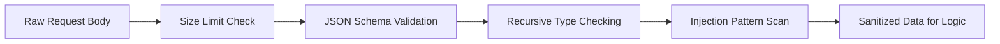

# Input Sanitization

This security layer validates and sanitizes untrusted input before business logic handles it.

## Input Sanitization & Validation

**File**: `hierachain/security/sanitization.py`

Defense layer against data-level attacks:

*   **Injection Protection**: Sanitizes input data to prevent SQL Injection, NoSQL Injection, and Command Injection.
*   **Nested Bomb Protection**: Limits JSON payload depth to prevent denial-of-service attacks through complex nested data structures.
*   **Type Strictness**: Ensures input data fully matches the defined schema, rejecting any redundant or malformed fields.

## Sanitization Flow

---

## Related

*   [Audit logging](../modules/risk-management.md)
*   [Alert system](../modules/monitoring.md)
