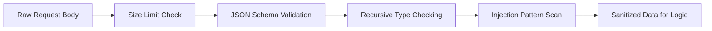

# Risk Analyzer

This security layer acts as the "brain" analyzing suspicious behavior and the "filter" preventing data-level attacks.

## 1. Risk Analyzer (Behavioral Analysis)

**File**: `hierachain/risk_management/risk_analyzer.py`

Risk analysis system based on operational data:

*   **Anomaly Detection**: Uses Z-score algorithm to detect sudden changes in request frequency or error rates.
*   **Threat Intelligence**: Identifies common attack patterns (such as Brute force API key, Replay attack).
*   **Scoring System**: Evaluates Risk Score for each Peer or API Key to apply corresponding countermeasures.

## 2. Input Sanitization & Validation

**File**: `hierachain/security/sanitization.py`

Defense layer against data-level attacks:

*   **Injection Protection**: Sanitizes input data to prevent SQL Injection, NoSQL Injection, and Command Injection.
*   **Nested Bomb Protection**: Limits JSON payload depth to prevent denial-of-service attacks through complex nested data structures.
*   **Type Strictness**: Ensures input data fully matches the defined schema, rejecting any redundant or malformed fields.

---

## Risk Response Matrix

The system automatically executes actions based on risk score:

| Risk Score | Level | Automatic Action |
| :--- | :--- | :--- |
| **0.0 - 0.3** | Low | Normal logging only. |
| **0.3 - 0.7** | Medium | Increase authentication (Challenge) or apply stricter Rate Limit. |
| **0.7 - 1.0** | High | Temporarily blacklist the risk entity and send urgent alerts. |

---

## Sanitization Flow

---

## Related

*   [Risk management](../modules/risk-management.md)
*   [Alert system](../modules/monitoring.md)
