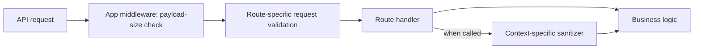

# Input Sanitization

This module provides context-specific value transformations, not a request-wide validation pipeline. `sanitize_string()` supports HTML/general, log, and filename contexts; `sanitize_dict()` and `sanitize_list()` apply the selected transformation recursively. `is_safe_input()` checks string length and a short list of script, JavaScript URI, and template patterns. These helpers do not validate an application schema or provide SQL, NoSQL, or command-injection protection. Request-size and route-schema/depth checks are separate, and handlers call sanitizers where needed.

## Input Sanitization & Validation

**File**: `hierachain/security/sanitization.py`

The API uses separate request-size and route-model checks where configured. Sanitizer helpers run only where a route calls them.

## Sanitization Flow

```mermaid
graph LR
    A[API request] --> B[App middleware: payload-size check]
    B --> C[Route-specific request validation]
    C --> D[Route handler]
    D -->|when called| E[Context-specific sanitizer]
    D --> F[Business logic]
    E --> F
```

---

## Related

*   [Audit logging](../modules/risk-management.md)
*   [Alert system](../modules/monitoring.md)
