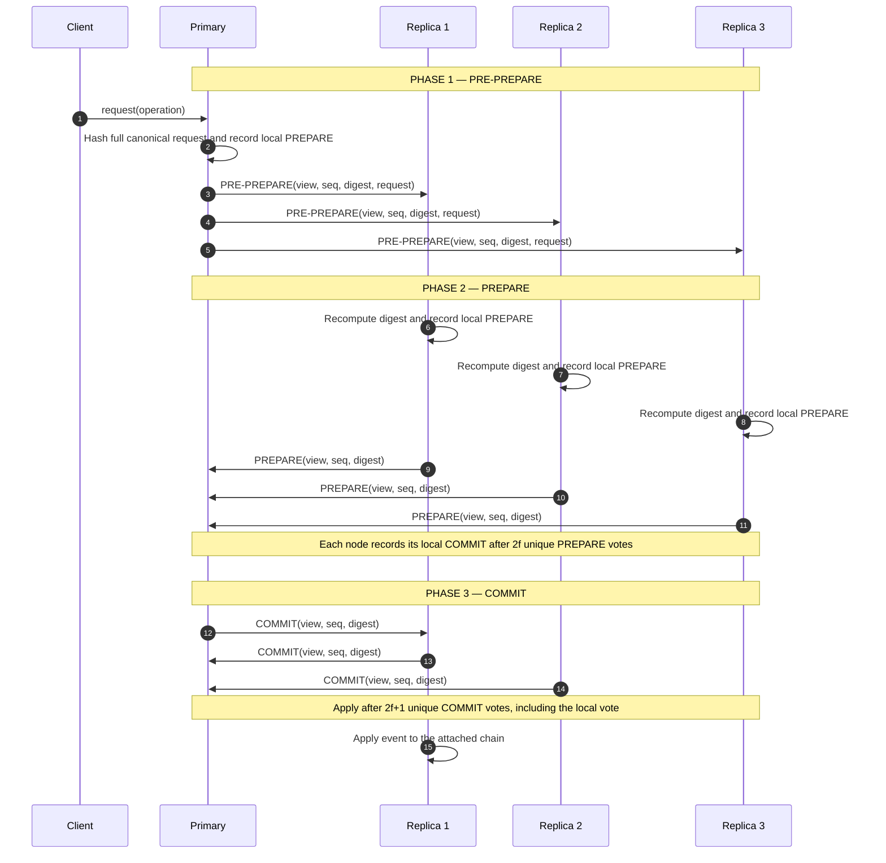
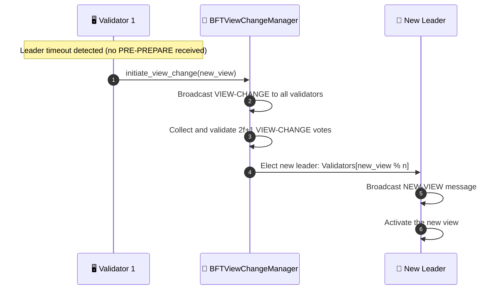

# BFT consensus

## Overview

The exported BFT library component and its standalone demo use 3-phase PBFT. It needs `n >= 3f + 1` nodes to tolerate `f` faulty or malicious nodes. The current MainChain and SubChain runtime paths do not instantiate BFT; callers use `BFTConsensus.request()` explicitly.

For PoA and PoF flows, see [Consensus Mechanisms](./consensus_mechanisms.md).

You need at least 4 nodes to tolerate 1 Byzantine failure (n=4, f=1: 3×1+1=4).

---

## Flow diagram: 3-phase PBFT

The primary and replicas count their own signed phase vote once. A PRE-PREPARE is rejected if its request body does not match the signed digest. If an attached chain write raises an error or returns `False`, the node keeps the quorum messages and the same event in memory; a repeated valid COMMIT can retry the write. It marks the sequence committed only after the write succeeds.

Without an attached application chain, the component runs in protocol-only mode and records consensus status without writing an event, as in the standalone demo.

---

## Flow diagram: view change (leader failure)

---

## Step-by-step breakdown

| Step | Description |
|:-----|:------------|
| **PRE-PREPARE** | Primary assigns a sequence number, hashes the complete canonical request, signs the digest, and broadcasts the request |
| **PREPARE** | Each node recomputes the digest and records its own PREPARE once. Each node moves to COMMIT after `2f` unique PREPARE votes, including its own |
| **COMMIT** | Each prepared node records and broadcasts its own COMMIT once. A node applies the event after `2f + 1` unique COMMIT votes, including its own |
| **View Change** | If the leader is silent past the timeout, the manager collects `2f + 1` signed VIEW-CHANGE votes before accepting the new view |

---

## Consensus comparison

| Algorithm | Mechanism | Fault Tolerance | Use Case |
|:----------|:----------|:----------------|:---------|
| **PoA** | Identity-based, authority signs | Validator reputation | Private / internal networks |
| **PoF** | Rotating leader, quorum `height % n` | Distributed trust | Consortium / multi-org |
| **BFT** | 3-phase PBFT library component | Up to `f` Byzantine nodes in `3f+1` | Explicit callers and the standalone demo |

---

## Error handling

| Condition | Behavior |
|:----------|:---------|
| Leader timeout | View Change triggered; the new primary is `all_nodes[new_view % n]` |
| Validator sends invalid digest | Vote discarded, not counted toward quorum |
| Network partition < f nodes | Protocol continues if quorum (2f+1) still reachable |
| Network partition ≥ f+1 nodes | Protocol halts until partition heals (safety over liveness) |
| Attached chain write fails | Keep the current commit quorum and retry the same event when a valid COMMIT is repeated |

---

## Key classes and methods

| Step | Class / Method | File |
|:-----|:--------------|:-----|
| Request and PRE-PREPARE | `BFTConsensus.request()` | `consensus/bft/consensus.py` |
| PRE-PREPARE validation and local PREPARE | `BFTConsensusEngine.handle_pre_prepare()` | `consensus/bft/engine.py` |
| PREPARE quorum and local COMMIT | `BFTConsensusEngine.handle_prepare()` | `consensus/bft/engine.py` |
| COMMIT quorum and event apply | `BFTConsensusEngine.process_commit_quorum()` | `consensus/bft/engine.py` |
| View Change | `BFTViewChangeManager.initiate_view_change()` | `consensus/bft/view_change.py` |
| Transport | `BFTMessageDispatcher.broadcast_msg()` | `consensus/bft/dispatcher.py` |

---

## Related

- [Consensus Mechanisms](./consensus_mechanisms.md): PoA and PoF details
- [Event Submission](./event-submission.md): MainChain and SubChain submission flow
- [Error Mitigation](./error-recovery.md): handles leader failure recovery at system level
