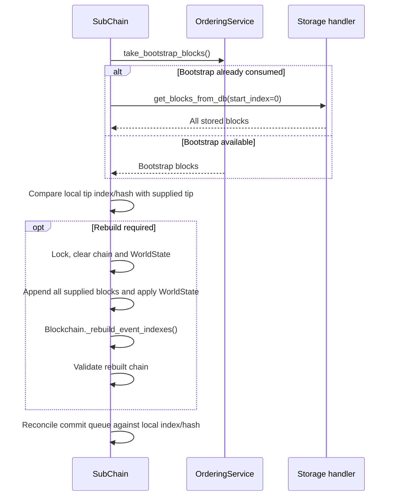

# Chain rehydration

## Overview

`SubChain.sync_chain()` rebuilds the local ledger from blocks supplied by its ordering service. Startup runs this synchronization before registering the chain or starting the commit consumer. There is no periodic `auto_sync` timer in this workflow; applications that call `sync_chain()` later must coordinate with active writers.

The orderer supplies its bootstrap block list once. After that, synchronization reads all blocks through `storage_handler.get_blocks_from_db(start_index=0)`. It compares the local tip with the last supplied block before deciding whether to rebuild. It does not fetch only the missing delta.

## Flow diagram

## Comparison and rebuild

| State | Behavior |
|:------|:---------|
| No supplied blocks | Rehydration returns without clearing the local chain |
| Local tip behind supplied tip | Rebuild from the complete supplied block list |
| Same index and same hash | Keep the local chain |
| Same index with different hash | Rebuild from supplied blocks |
| Local index ahead, different tip hash | Log divergence and rebuild |
| Local index ahead, same tip hash | Keep the local chain |

`_apply_rehydrated_blocks()` holds the chain lock while clearing and rebuilding the chain, WorldState and event indexes. It then calls `is_chain_valid()` and raises `ValueError` if validation fails. It does not reset an active orderer's block counters.

Startup reconciliation drops queued blocks whose index and hash already match the rebuilt chain. Blocks absent from the chain remain queued. A queued block with a conflicting hash is retained and causes `ValueError`, preventing startup from accepting conflicting history.

## Errors and operational limits

Storage read errors propagate to the caller. Invalid rebuilt history and queue conflicts also raise errors. This path has no scheduled retry, lock-timeout alert or automatic read-only fallback. Restore storage access and the approved identity/trust configuration before restarting; inspect the failure before submitting more events.

## Key classes and methods

| Operation | Method | File |
|:----------|:-------|:-----|
| Public entry | `SubChain.sync_chain()` | `hierachain/hierarchical/sub_chain/base.py` |
| Synchronization | `_sync_chain_for_sub_chain()` | `hierachain/hierarchical/sub_chain/ordering.py` |
| Load and compare | `_rehydrate_chain_from_ordering_service()` | `hierachain/hierarchical/sub_chain/ordering.py` |
| Rebuild | `_apply_rehydrated_blocks()` | `hierachain/hierarchical/sub_chain/ordering.py` |
| Queue reconciliation | `_discard_rehydrated_blocks_from_queue()` | `hierachain/hierarchical/sub_chain/ordering.py` |
| Event indexes | `Blockchain._rebuild_event_indexes()` | `hierachain/core/blockchain.py` |

## Related

- [Error Mitigation](./error-recovery.md): separate recovery mechanisms
- [System Integrity Validation](./integrity-validation.md): caller-initiated integrity reports
