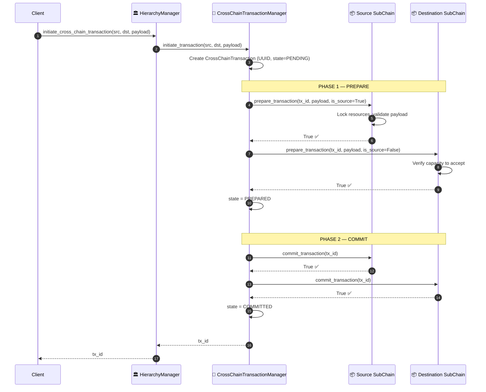
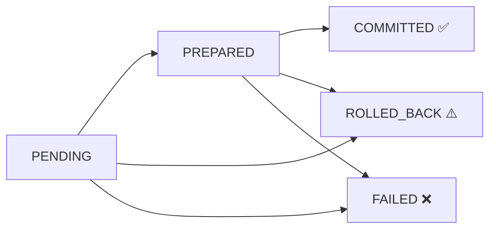

# Cross-chain operation (2PC)

## Overview

Two-Phase Commit prepares both Sub-Chains, then commits the source followed by the destination. If a commit fails, the transaction manager marks the transaction as failed and attempts to roll back the source. The rollback can return `False` or raise an exception; the manager ignores `False` and logs an exception. For example, an asset transfer may involve the `logistics` and `finance` chains.

A typical trigger is an inventory transfer between departments. The source chain records a `deduct` event and the destination chain records a `receive` event. The intended outcome is for both commits to succeed; if the destination commit fails after the source commits, the operation may be partially applied and require manual reconciliation.

---

## Flow diagram: happy path



---

## Flow diagram: failure paths

```mermaid
sequenceDiagram
    autonumber
    participant TM as 🔄 CrossChainTransactionManager
    participant SRC as 📦 Source SubChain
    participant DST as 📦 Destination SubChain

    rect rgb(0, 0, 0, 0)
        Note over TM,DST: SCENARIO A — Phase 1 Prepare Fails
        TM->>SRC: prepare_transaction(tx_id, payload, is_source=True)
        SRC-->>TM: True ✅
        TM->>DST: prepare_transaction(tx_id, payload, is_source=False)
        DST-->>TM: False ❌  (capacity / validation fail)
        TM->>TM: state = ROLLED_BACK
        TM->>SRC: rollback_transaction(tx_id)
        TM->>DST: rollback_transaction(tx_id)
        Note over TM,DST: False rollback results are ignored; an exception stops later calls and may prevent tx_id from returning
    end

    rect rgb(0, 0, 0, 0)
        Note over TM,DST: SCENARIO B — Phase 2 Partial Commit Fails
        TM->>SRC: commit_transaction(tx_id)
        SRC-->>TM: True ✅
        TM->>DST: commit_transaction(tx_id)
        DST-->>TM: Exception ❌
        TM->>TM: state = FAILED ❌
        TM->>SRC: rollback_transaction(tx_id)
        SRC-->>TM: True, False, or exception
        Note over TM,SRC: The manager ignores False and logs exceptions; inspect chain state to confirm rollback
    end
```

---

## Operation state machine



---

## Step-by-step breakdown

| Step | Description |
|:-----|:------------|
| **1. Initiate** | `HierarchyManager.initiate_cross_chain_transaction()` calls `CrossChainTransactionManager.initiate_transaction()`, which creates a `CrossChainTransaction` with a UUID and `state=PENDING`. |
| **2. Phase 1: Prepare SRC** | Source chain locks resources, validates payload schema |
| **3. Phase 1: Prepare DST** | Destination chain checks capacity and constraints |
| **4. Phase 1 result** | If both return `True`, state becomes `PREPARED`. If either fails, the manager sets `ROLLED_BACK` and calls `rollback_transaction()` on source, then destination. It ignores `False` results; an exception stops later calls and may prevent `tx_id` from returning. |
| **5. Phase 2: Commit SRC** | The manager calls `DomainChain.commit_transaction()` on the source chain. |
| **6. Phase 2: Commit DST** | If the source commit succeeds, the manager calls `DomainChain.commit_transaction()` on the destination chain. |
| **7. Result** | If the call returns normally, it returns `tx_id`. The state is `COMMITTED` on success, `ROLLED_BACK` after a Phase 1 failure, or `FAILED` if a chain is missing or Phase 2 fails. `ROLLED_BACK` does not confirm that rollback succeeded because `False` results are ignored. |

---

## Error handling

| Condition | State | Recovery |
|:----------|:------|:---------|
| Phase 1 fails on either chain | `ROLLED_BACK` | The manager attempts source rollback, then destination rollback. It ignores `False` results; if one raises, later calls are skipped and initiation may raise before returning `tx_id`. |
| Source or destination chain is missing | `FAILED` | The manager stops before prepare or rollback. |
| Phase 2 commit fails | `FAILED` | The manager attempts to roll back the source. It ignores a `False` result and logs an exception, so inspect the source-chain state and reconcile manually if needed. |
| Network timeout during Phase 2 | `FAILED` | The final commit outcome may be unknown. Inspect both chain states; `FAILED` alone does not show whether the destination committed. Reconcile manually if needed. |

---

## Key classes and methods

| Step | Class / Method | File |
|:-----|:--------------|:-----|
| Initiate | `HierarchyManager.initiate_cross_chain_transaction()` | `hierachain/hierarchical/hierarchy_manager/base.py` |
| Create transaction | `CrossChainTransactionManager.initiate_transaction()` | `hierachain/hierarchical/transaction_manager.py` |
| Prepare | `DomainChain.prepare_transaction()` | `hierachain/domains/chains/domain_chain.py` |
| Commit | `DomainChain.commit_transaction()` | `hierachain/domains/chains/domain_chain.py` |
| Rollback | `DomainChain.rollback_transaction()` | `hierachain/domains/chains/domain_chain.py` |

---

## Related

- [Event Submission](./event-submission.md): each `commit_transaction()` internally calls `add_event()`
- [Error Mitigation](./error-recovery.md): handles state rollback at the system level
