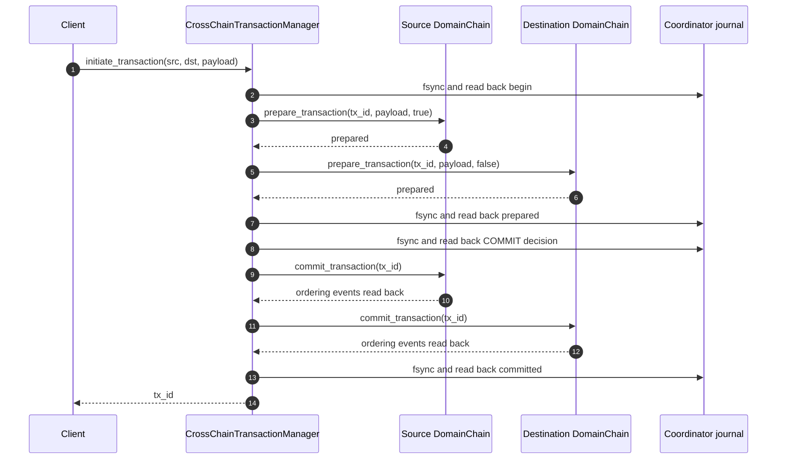
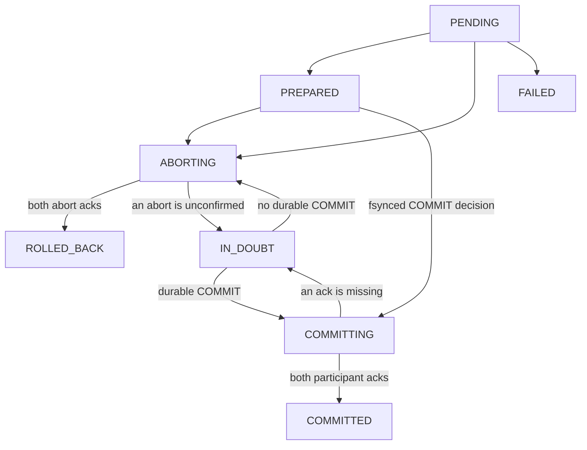

# Cross-chain operation (2PC)

## Overview

The coordinator prepares both `DomainChain` participants, then fsyncs and reads back a COMMIT decision from its own journal before asking either participant to commit. A participant acknowledges only after both transaction-tagged operation events can be read back from that chain's ordering journal; block finalization remains asynchronous. The terminal `committed` record must also be read back before reporting `COMMITTED`. Once COMMIT is durable, recovery always retries forward and never rolls a participant back.

Before COMMIT is durable, the coordinator asks both participants to abort. It reports `ROLLED_BACK` only when both acknowledge. If either abort cannot be confirmed, the transaction remains `IN_DOUBT` and the coordinator retries the abort when both participants are available.

On startup, unresolved coordinator records identify which persisted chains need `DomainChain` participants. Other persisted chains remain generic `SubChain` instances. A generic placeholder can also be explicitly rebound by calling `create_sub_chain()` with the same name and domain type; the old chain is shut down only after the replacement connects.

## Successful flow

## Failure and recovery

| Condition | State | Recovery |
|:----------|:------|:---------|
| A participant fails to prepare | `ROLLED_BACK` only after both abort acknowledgments; otherwise `IN_DOUBT` | Retry both aborts after the participants are available. |
| A chain is missing or does not support 2PC before prepare | `FAILED` | Register the required `DomainChain` participants, then start a new transaction. |
| Writing the COMMIT decision has an ambiguous result | `IN_DOUBT` | Read the coordinator journal before taking action. A durable COMMIT retries forward; no COMMIT retries abort. |
| A participant commit fails after durable COMMIT | `IN_DOUBT` | Never roll back. The durable `prepared` record confirms both participants validated the payload; restore missing participant state from that payload and journal markers, then retry only missing events. |
| The process restarts with unresolved records | `IN_DOUBT` until participants are available | Restore the named participants as `DomainChain` and retry. |

## Guarantees and limits

- The coordinator journal is stored separately from OrderingService event journals, so its records are not replayed as ledger events.
- A `COMMITTED` transaction means both participant event pairs and the coordinator's terminal record were read back from durable journals. It does not mean the blocks have already been finalized.
- Participant event markers include the transaction ID and operation step. A retry skips a start or completion event already accepted by that participant, including after restart.
- After durable COMMIT, participant recovery uses the previously validated coordinator payload and accepted event markers; it does not rerun business validation against volatile entity registries.
- `IN_DOUBT` is recoverable state, not a terminal failure. Call `transaction_manager.retry_pending()` to retry after a runtime participant failure; startup and participant registration also trigger retries.
- Recovery claims each transaction while its coordinator path is active. A concurrent `retry_pending()` skips that transaction and can retry it after the active path releases it. The coordinator also refuses abort after a durable or ambiguous COMMIT decision.

## Key methods

| Action | Method | File |
|:-------|:-------|:-----|
| Initiate | `HierarchyManager.initiate_cross_chain_transaction()` | `hierachain/hierarchical/hierarchy_manager/base.py` |
| Coordinate and recover | `CrossChainTransactionManager.initiate_transaction()` / `retry_pending()` | `hierachain/hierarchical/transaction_manager.py` |
| Prepare, commit, or abort | `DomainChain.prepare_transaction()` / `commit_transaction()` / `rollback_transaction()` | `hierachain/domains/chains/domain_chain.py` |

## Related

- [Event Submission](./event-submission.md): operation events enter each chain's ordering journal before asynchronous block finalization.
- [Error Mitigation](./error-recovery.md): system-level error handling and journal recovery.
