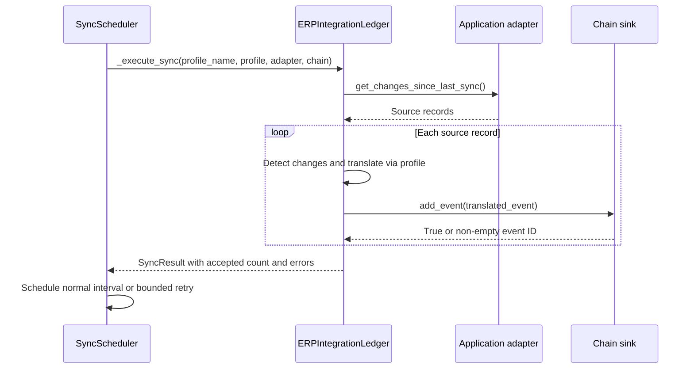

# ERP integration sync

## Runtime scope

`ERPIntegrationLedger` (`hierachain/integration/erp_ledger.py`, backed by `erp/base.py`) provides mapping, translation and scheduling. Applications register an adapter implementing `get_changes_since_last_sync()` and a chain sink implementing `add_event()`. The API server does not automatically start ERP synchronization.

`SAPIntegration`, `OracleIntegration` and `DynamicsIntegration` in `enterprise.py` are synthetic fixtures gated by `simulation_mode=True`. They are separate from application-provided adapters and do not contact SAP, Oracle or Dynamics. No built-in `SAPAdapter`, `OracleAdapter`, `DynamicsAdapter` or `GenericERPAdapter` transport is supplied.

## Execution flow

## Acceptance and retry

A missing sink fails before querying the adapter. Translation/delivery errors make the run `failed`. `events_processed` counts only sink-acknowledged records; a Sub-Chain event ID means journal/queue acceptance, not final block persistence. Read finalized blocks to verify commitment.

Retries default to 30, 60 and 120 seconds, capped at 300 seconds. After three retries beyond the initial attempt, the task reports `retry_exhausted` and stops scheduling. There is no built-in Risk Alerts escalation from this scheduler; applications must monitor status and errors. Scheduler and change-detector state are in memory.

A partial batch retry can resubmit records already accepted. Provide delivery cursors and deduplication/reconciliation in the application; this module does not guarantee exactly-once delivery. Stopping a task cancels future timers, but cannot cancel an adapter call already running.

## Mapping

`ERPIntegrationLedger` shares its `MappingEngine` with `EventTranslator`. Custom transformers receive `(value, params)`. Dotted destination paths create nested event fields. Missing or failing transformers omit the affected field and log a warning; validate required event fields before delivery. Change detection uses configured `key_fields`; missing/null/empty identity values fail, while numeric zero is valid.

## Related

* [Integration module and adapter example](../modules/integration.md)
* [Event submission](event-submission.md)
* [Entity tracing](entity-tracing.md)
