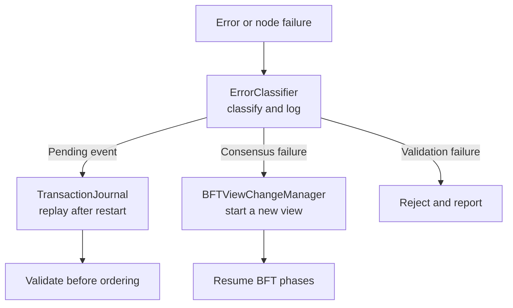

# Error handling and recovery

HieraChain keeps recovery responsibilities close to the component that owns the
state: `ErrorClassifier` records and classifies failures, `TransactionJournal`
protects pending events, and the BFT consensus implementation handles view
changes when a leader becomes unavailable. Snapshot and infrastructure recovery
are deployment responsibilities, not automatic services in this package.

## Runtime flow



## Consensus recovery

`BFTConsensus` owns leader failure handling through `BFTViewChangeManager`.
The manager broadcasts view-change messages, collects the quorum, and installs
the new view. This path is part of the consensus runtime and does not depend on
a separate recovery engine.

## Event durability

`TransactionJournal` writes pending events before ordering. After a restart,
the ordering service can replay journal entries and validate them before they
re-enter the event pipeline.

```python
from hierachain.error_mitigation.journal import TransactionJournal

journal = TransactionJournal(storage_dir="data/journal")
journal.log_event(event_dict)
```

## Operational recovery

Database backups, filesystem snapshots, key recovery, and infrastructure
scaling must be provided by the deployment environment. The repository does not
claim automatic rollback, backup restoration, redundant network transport, or
node autoscaling through `error_mitigation` classes.

## Related

- [BFT Consensus](./bft-consensus.md): View Change detail
- [Chain Rehydration](./chain-rehydration.md): full chain reload from DB
- [Error Mitigation Module](../modules/error-mitigation.md): validation and journaling
