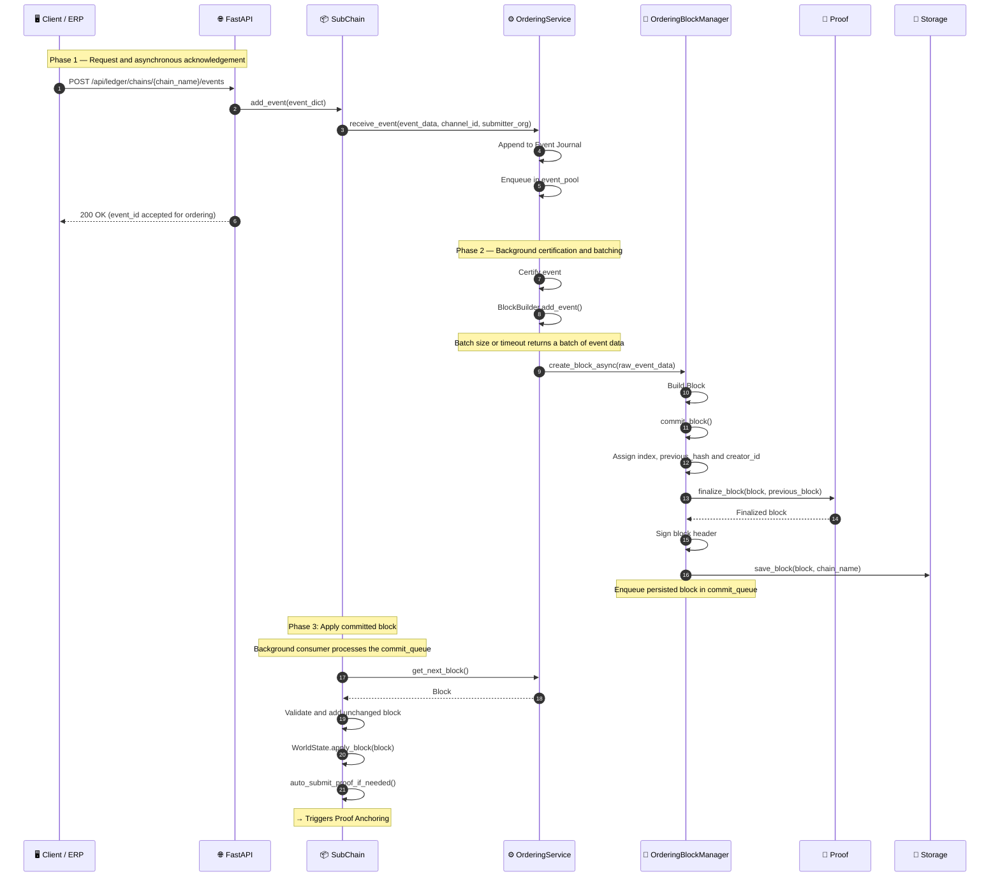

# Event submission

## Overview

The Ledger API validates each event request. `SubChain.add_event()` then sends the event to `OrderingService`, which journals and queues it before returning `event_id`. The ID confirms acceptance for ordering; block commitment happens later. A background processor certifies and batches events. The orderer builds each block, assigns its index and previous hash, runs the configured consensus finalizer, signs the header, and persists the block before placing it in the commit queue. The Sub-Chain consumer applies that block unchanged to the local chain and WorldState. By default, Sub-Chain batches 50 events and waits 1.0 second before creating a block. Configure Main-Chain consensus separately with `HRC_MAINCHAIN_CONSENSUS`.

For PoA and PoF diagrams, see [Consensus Mechanisms](./consensus_mechanisms.md).

## Flow diagram



## Step-by-step breakdown

| Step | Description |
|:-----|:------------|
| 1. API receive | `POST /api/ledger/chains/{chain_name}/events` validates the request schema and passes the event to the Sub-Chain |
| 2. Enqueue | `SubChain.add_event()` supplies missing internal defaults and validates the event structure before calling `OrderingService.receive_event()`; the orderer journals the event before queueing it and returns an `event_id` |
| 3. Background certification | The Ordering Service processes queued events through its certifier; this occurs after the API acknowledgement |
| 4. Batch | `BlockBuilder.add_event()` adds certified events to a batch; size, timeout, or an explicit flush returns the batch data |
| 5. Build | `OrderingBlockManager.create_block_async()` builds a `Block` |
| 6. Finalize and persist | `commit_block()` assigns index/link/creator, calls the consensus finalizer, signs the header and saves the block before queueing it |
| 7. Apply | The consumer validates and adds the unchanged block, then updates WorldState; it does not persist the block again |
| 8. Proof trigger | `auto_submit_proof_if_needed()` may submit a proof to the Main Chain when its configured threshold is met |

## Event structure

```python
event = {
    "entity_id": "product-SKU-001",    # Domain entity identifier
    "event_type": "quality_check",      # Event type (domain-specific)
    "timestamp": 1714000000.0,
    "details": {                        # Domain-specific payload
        "check_type": "visual",
        "check_result": "passed",
        "inspector": "station-7"
    }
}
```

> The Ledger API requires `entity_id` and `event_type`, and maps `event_type` to the internal `event` field. Defaults in `SubChain.add_event()` apply to internal calls and do not make those API fields optional. `SubChain.add_event()` rejects malformed events and forbidden terminology before enqueueing. The returned `event_id` acknowledges acceptance for ordering, not block finalization.

## Error handling

| Condition | Behavior |
|:----------|:---------|
| Request body is invalid | FastAPI rejects it during request-model validation before calling `SubChain.add_event()` |
| Event structure is invalid | `SubChain.add_event()` raises `ValueError` before journaling; the Ledger API returns HTTP 422 |
| Journal write fails | `OrderingService.receive_event()` raises before adding the event to its in-memory queue |
| Event fails background certification | The processor marks the event rejected; it is not added to a block |
| Ordering block persistence fails | The error is logged and the Ordering Service enters `MAINTENANCE`; the block is not added to `commit_queue` |
| Consensus finalization or signing fails | The orderer enters `MAINTENANCE` unless already in a terminal/restricted status; the block is not added to the commit queue |
| Consumer rejects the committed block | `add_block()` failure sets the orderer to `MAINTENANCE`, sets `should_stop`, and logs the rejected block |

## Key classes and methods

| Step | Class / Method | File |
|:-----|:--------------|:-----|
| Receive event | `SubChain.add_event()` | `hierachain/hierarchical/sub_chain/base.py` |
| Journal, queue, and order | `OrderingService.receive_event()` | `hierachain/consensus/ordering/service.py` |
| Certify and batch events | `OrderingProcessor` and `BlockBuilder.add_event()` | `hierachain/consensus/ordering/processor.py`, `hierachain/consensus/ordering/block_builder.py` |
| Build and commit ordering block | `OrderingBlockManager.create_block_async()` / `commit_block()` | `hierachain/consensus/ordering/block_manager.py` |
| Apply persisted Sub-Chain block | `_process_and_finalize_single_block()` | `hierachain/hierarchical/sub_chain/block.py` |
| Storage adapters | Database adapters | `hierachain/adapters/database/` |

## Related

- [Consensus Mechanisms](./consensus_mechanisms.md): PoA and PoF sub-diagrams
- [Proof Anchoring](./proof-anchoring.md): triggered after block finalized
- [BFT Consensus](./bft-consensus.md): full 3-phase PBFT flow
- [Policy Enforcement](./policy-enforcement.md): policy checks for operations explicitly routed through `PolicyEngine`
- [MSP Identity](./msp-identity.md): membership checks for callers using `HierarchicalMSP`
