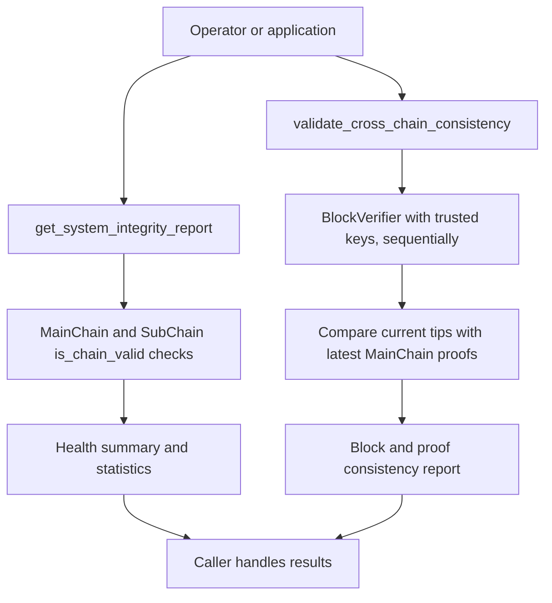

# System integrity validation

## Overview

`HierarchyManager` exposes two Python methods with different results. `get_system_integrity_report()` summarizes chain validity and system statistics. `validate_cross_chain_consistency()` verifies blocks with trusted signing keys and compares each Sub-Chain tip with its latest MainChain proof.

Both methods inspect registered chains sequentially. The caller decides when to run them and how to handle failures. Neither method invokes `CrossChainValidator`, schedules recovery or sends Risk Alerts. The API has no `/api/ledger/system/integrity` endpoint.

## Flow diagram



## Health report

`get_system_integrity_report()` returns:

| Field | Meaning |
|:------|:--------|
| `timestamp` | Report time |
| `overall_status`, `integrity_status` | `HEALTHY` or `DEGRADED` based on chain validity |
| `system_overview` | Sub-Chain totals and system uptime |
| `main_chain` | MainChain validity and height |
| `sub_chains` | Per-chain validity and height |
| `sub_chain_details` | Domain type, blocks, events, entities, operations and validity |
| `issues` | Chain validation failure descriptions |

This result has no `proof_consistency` field. A healthy chain report does not establish that every current Sub-Chain tip has a matching MainChain anchor.

## Cross-chain consistency report

`validate_cross_chain_consistency()` returns `timestamp`, `main_chain_valid`, `overall_consistent`, `sub_chain_validation`, `block_verification` and `proof_consistency`. Block verification uses `BlockVerifier.verify_chain(chain.chain, chain.trusted_public_keys)` for the MainChain and each registered Sub-Chain.

Each proof result contains `consistent`, `pending`, `reason`, `chain_height` and `last_block_index`. When a proof exists, it also reports `latest_proof_hash`, `latest_block_hash` and `latest_proof_block_index`. Consistency means the stored proof hash equals the current Sub-Chain tip hash.

`pending=True` explains a missing or older anchor when the next submission is not due under the chain's configured proof schedule. It still sets `consistent=False` and makes `overall_consistent=False`. A scheduled delay is not, by itself, evidence of tampering.

```python
# manager is the application's configured HierarchyManager.
health = manager.get_system_integrity_report()
consistency = manager.validate_cross_chain_consistency()

for chain_name, proof in consistency["proof_consistency"].items():
    if not proof["consistent"]:
        print(chain_name, proof["pending"], proof["reason"])
```

## Caller responsibilities

Run domain terminology checks separately through `CrossChainValidator` if the application needs them. Connect report handling to `AlertManager` or operational recovery explicitly. There is no built-in report-to-alert or report-to-rehydration hook.

## Key classes and methods

| Operation | Method | File |
|:----------|:-------|:-----|
| Public methods | `HierarchyManager.get_system_integrity_report()` / `validate_cross_chain_consistency()` | `hierachain/hierarchical/hierarchy_manager/base.py` |
| Report implementation | `_compute_system_integrity_report()` | `hierachain/hierarchical/hierarchy_manager/validation.py` |
| Consistency implementation | `_validate_cross_chain_consistency()` | `hierachain/hierarchical/hierarchy_manager/validation.py` |
| Signature/hash verification | `BlockVerifier.verify_chain()` | `hierachain/security/verify/block_verifier.py` |
| Separate domain checks | `CrossChainValidator.validate_system_integrity()` | `hierachain/domains/utils/cross_chain_validator.py` |

## Related

- [Proof Anchoring](./proof-anchoring.md): creates the stored anchors
- [Chain Rehydration](./chain-rehydration.md): explicit chain synchronization
- [Risk Analysis & Alerts](./risk-alerts.md): caller-managed alert dispatch
