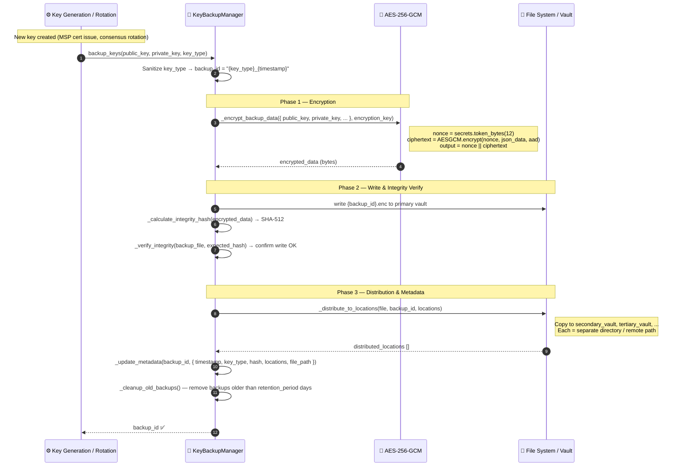
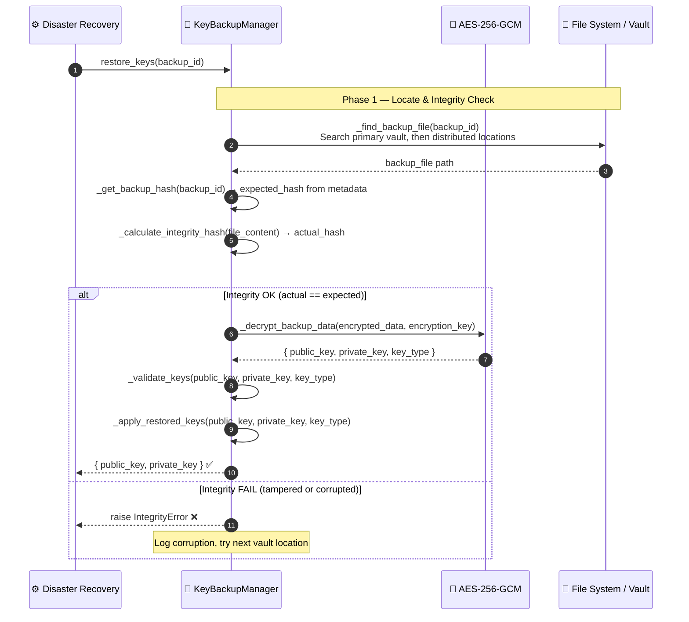
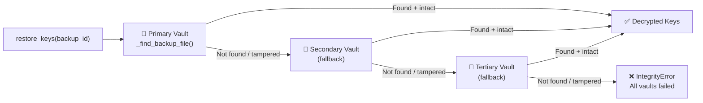

# Key Backup & Restoration

## Overview

Cryptographic keys (consensus keys, identity keys, encryption keys) are backed up automatically after each generation or rotation event. Each backup is **AES-256-GCM encrypted** and distributed to multiple vault locations. When restoring, `restore_keys()` verifies **SHA-512 integrity** before decrypting and applying keys to the system.

**Key property**: Even if one vault is compromised, the plaintext keys are protected by AES-256-GCM. Even if the ciphertext is tampered, the SHA-512 integrity check prevents decryption of corrupted data.

---

## Flow Diagram — Backup

---

## Flow Diagram — Restoration

---

## Multi-Vault Failover

---

## Step-by-Step Breakdown

| Step | Description |
|:-----|:------------|
| **1. Trigger** | Key generated (MSP cert issue) or rotated (scheduled rotation) |
| **2. Backup ID** | `backup_id = "{sanitized_key_type}_{unix_timestamp}"` |
| **3. Encrypt** | AES-256-GCM with random 96-bit nonce. Output = `nonce \|\| ciphertext` |
| **4. Write + verify** | Write to primary vault; SHA-512 hash of file verified immediately |
| **5. Distribute** | Copy to all configured vault locations |
| **6. Metadata** | `metadata.json` updated: backup_id, key_type, hash, locations, timestamp |
| **7. Cleanup** | Backups older than `retention_period` (default 365 days) deleted |
| **8. Restore** | Find file → verify SHA-512 → decrypt → validate key pair → apply |

---

## Backup Configuration

| Parameter | Default | Description |
|:----------|:--------|:------------|
| `frequency` | `daily` | Backup schedule |
| `encryption_algorithm` | `AES-256-GCM` | Cipher |
| `integrity_check` | `sha512` | Hash algorithm for write verification |
| `retention_period` | `365` days | Auto-cleanup threshold |
| `locations` | `[primary_vault]` | Distribution targets |
| `auto_restore_threshold` | `1` | Min available copies before auto-restore triggered |

---

## Error Handling

| Condition | Behavior |
|:----------|:---------|
| Integrity check fails immediately after write | `ValueError` raised; backup aborted, retried |
| All vault locations unreachable | `IOError` raised; critical alert via Risk Alerts |
| SHA-512 mismatch on restore | `IntegrityError` raised; next vault location tried |
| Decryption fails (wrong key) | `CryptographyError` raised; process aborted |
| `_apply_restored_keys()` fails | System remains on existing keys; error logged and alerted |

---

## Key Classes & Methods

| Step | Class / Method | File |
|:-----|:--------------|:-----|
| Backup entry | `KeyBackupManager.backup_keys()` | `security/key_backup_manager.py` |
| Encrypt | `_encrypt_backup_data()` | `security/key_backup_manager.py` |
| Integrity hash | `_calculate_integrity_hash()` | `security/key_backup_manager.py` |
| Verify write | `_verify_integrity()` | `security/key_backup_manager.py` |
| Distribute | `_distribute_to_locations()` | `security/key_backup_manager.py` |
| Restore entry | `KeyBackupManager.restore_keys()` | `security/key_backup_manager.py` |
| Find file | `_find_backup_file()` | `security/key_backup_manager.py` |
| Decrypt | `_decrypt_backup_data()` | `security/key_backup_manager.py` |
| Validate keys | `_validate_keys()` | `security/key_backup_manager.py` |
| Master key | `MasterKeyProvider.get_master_key()` | `security/master_key_provider.py` |

---

## Related

- [MSP Identity](./msp-identity.md) — certificate issuance triggers key backup
- [Cluster Lockdown](./cluster-lockdown.md) — lockdown may require key rotation, triggering this workflow
- [IPFS Storage](./ipfs-storage.md) — uses the same AES-256-GCM encryption pattern
