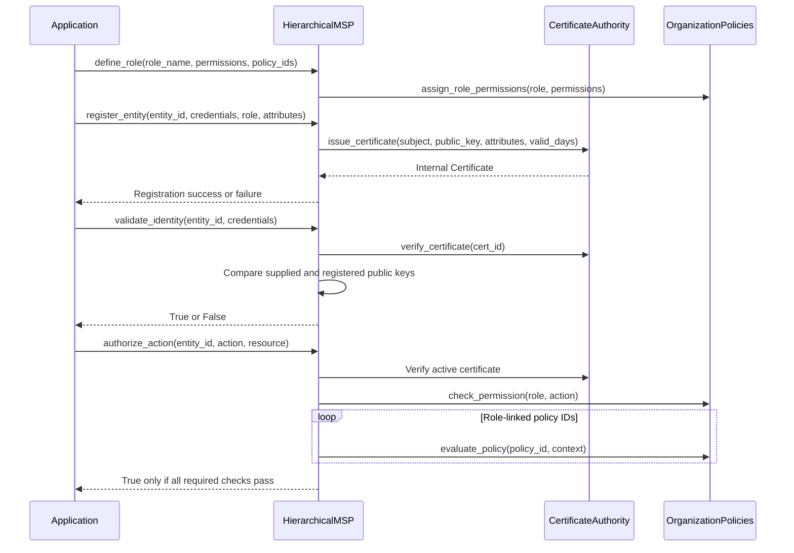

# MSP identity and authorization

## Scope

`IdentityManager` in `hierachain/security/identity.py` provides user registration, role permissions and signature helpers. `HierarchicalMSP` in `hierachain/security/msp.py` manages organization entities, internal certificates and role-linked `OrganizationPolicies`.

The MSP certificate is a Python `Certificate` dataclass, not an X.509 certificate. Its CA creates an Ed25519 signature over certificate ID, subject and public key. `verify_certificate()` checks the stored certificate's status and validity window; it does not validate an X.509 chain or establish possession of the entity's private key. CA keys, registrations and revocations are held in memory.

Generic Ledger event routes check API-key scopes and submit to the Sub-Chain. They do not automatically call MSP or `PolicyEngine`. Channel paths apply their own membership and role checks. Applications using the Python interfaces must call the checks required for their operation.

## Enrollment and authorization

`credentials` must include `public_key`. Registration returns `False` on failure, including an undefined role. `validate_identity()` checks registration, certificate validity and the supplied public key; it does not verify a fresh challenge signature. Use a separate signature verification flow when proof of key possession is required.

`authorize_action()` requires an active entity and valid stored certificate, checks role permissions, then evaluates every linked organization policy. These are `OrganizationPolicies`, whose evaluation checks configured required context attributes. They are separate from the typed rules in `security/policy_engine.py`.

## Default roles

| Role | Permissions |
|:-----|:------------|
| `admin` | manage_entities, view_audit_log, define_policies, create_channels, manage_certificates, submit_events, view_channels, query_data, view_data |
| `operator` | submit_events, view_channels, query_data |
| `viewer` | view_data, query_data |

## Revocation and failures

`revoke_entity(entity_id, reason)` revokes the stored certificate and marks the entity revoked. Later identity validation and action authorization fail. Expired or revoked certificates, unknown entities, mismatched public keys and missing permissions also fail their respective checks.

This lifecycle has no CRL distribution, persistent certificate registry, mTLS or automatic key-backup hook. Provision transport security at the reverse proxy and manage identity backups separately.

## Key classes and methods

| Operation | Method | File |
|:----------|:-------|:-----|
| User registration | `IdentityManager.register_user()` | `hierachain/security/identity.py` |
| User validation | `IdentityManager.validate_identity()` | `hierachain/security/identity.py` |
| User signature verification | `IdentityManager.verify_user_signature()` | `hierachain/security/identity.py` |
| Entity registration | `HierarchicalMSP.register_entity()` | `hierachain/security/msp.py` |
| Certificate issue/verify/revoke | `CertificateAuthority` methods | `hierachain/security/msp.py` |
| Entity authorization | `HierarchicalMSP.authorize_action()` | `hierachain/security/msp.py` |

## Related

- [Policy Enforcement](./policy-enforcement.md): separate typed ABAC policies
- [Event Submission](./event-submission.md): generic ledger ingestion
- [Key Backup](./key-backup.md): operator-managed identity backups
