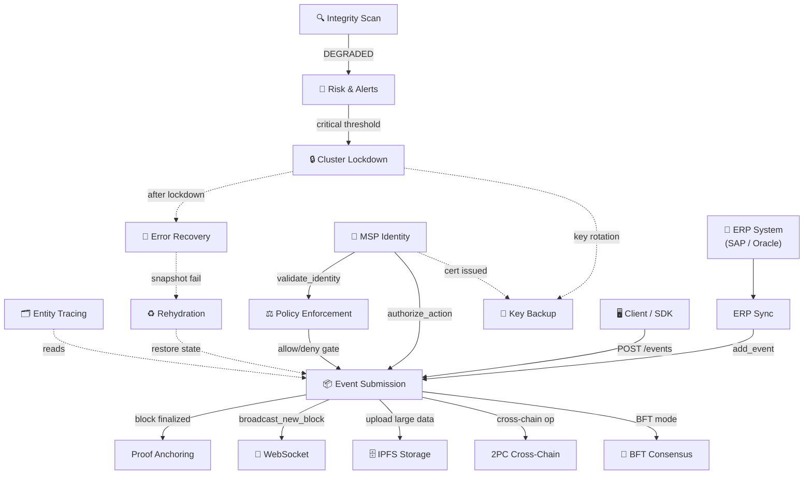

# Workflows Overview & Developer Guide

HieraChain is an **enterprise-grade, pure Python hierarchical blockchain ledger** designed as a **Plugin Layer** for existing Web2 infrastructure. Instead of replacing the enterprise network stack (which already handles TLS/SSL, firewalls, and WAF at the API Gateway level), HieraChain focuses exclusively on providing **Immutability, Distributed Trust, Tamper Evidence, and Non-repudiation**.

This document serves as the central developer reference for HieraChain's **16 system workflows**, organized into 6 functional groups. It details the runtime interaction model, quick-reference lookups, and developer guidelines for reading, maintaining, or adding new system workflows.

---

## 1. Core Development Guardrails

When working on HieraChain workflows, developers **must** strictly adhere to the following architectural guardrails defined in the project's consensus rules:

* **Strict Term Censorship**: HieraChain is designed for business-process ledger tracking, **not cryptocurrency**. Do not use crypto terms in event payloads, variable names, database keys, or comments.

    * ❌ **Forbidden terms**: `transaction`, `mining`, `coin`, `token`, `wallet`, `address`, `sender`, `receiver`, `amount`, `fee`.
    *  **Required terms**: `event` (for ledger entries), `node` (for peers), `msp_id` (for identity), `entity_id` (for domain assets).
    * *Note*: The `CrossChainValidator` automatically scans commits and rejects any code containing forbidden terms.

* **Minimal Latency Constraint**: HieraChain enforces a **10-20ms base latency**. Keep workflow code minimal, fast, and highly optimized. Avoid adding transport-level encryption or nested wrappers that cause unnecessary CPU overhead.
* **No Direct Storage Access**: Workflows must never make direct SQL or Redis queries. All data access must use storage adapters under the `adapters/storage/` namespace.

---

## 2. All Workflows: Quick Reference

This table provides a comprehensive overview of HieraChain's workflows for quick developer lookup:

| Workflow | Group | Trigger | Output | Key Module |
|:---------|:------|:--------|:-------|:-----------|
| [Event Submission](./event-submission.md) | A | `POST /ledger/chains/{name}/events` | Block appended to Sub-Chain | `hierarchical/sub_chain.py` |
| [Proof Anchoring](./proof-anchoring.md) | A | Block finalized on Sub-Chain | Proof hash on Main Chain | `hierarchical/main_chain.py` |
| [Cross-Chain 2PC](./cross-chain-2pc.md) | A | `initiate_cross_chain_transaction()` | `COMMITTED` or `ROLLED_BACK` | `hierarchical/hierarchy_manager.py` |
| [BFT Consensus](./bft-consensus.md) | B | `HRC_MAINCHAIN_CONSENSUS=byzantine_fault_tolerant` | Block committed by 2f+1 validators | `consensus/bft/consensus.py` |
| [Cluster Lockdown](./cluster-lockdown.md) | C | Anomaly exceeds risk threshold | All nodes frozen / resumed | `cluster/lockdown_protocol.py` |
| [Error Mitigation](./error-recovery.md) | C | Network fail / leader timeout / integrity error | State restored from snapshot | `error_mitigation/recovery_engine.py` |
| [Entity Tracing](./entity-tracing.md) | D | `trace_entity_across_chains(entity_id)` | Complete cross-chain audit trail | `domains/generic/utils/entity_tracer.py` |
| [Chain Rehydration](./chain-rehydration.md) | D | Node restart or hash divergence | In-memory chain synced to DB | `hierarchical/sub_chain.py` |
| [Integrity Validation](./integrity-validation.md) | D | Periodic / manual / Risk Alerts anomaly | `IntegrityReport` (HEALTHY / DEGRADED) | `security/verify/block_verifier.py` |
| [Policy Enforcement](./policy-enforcement.md) | E | Any access-sensitive operation | `allow` or `deny` with decision path | `security/policy_engine.py` |
| [WebSocket Streaming](./websocket-streaming.md) | E | Client connects to `/ws/{chain_name}` | Real-time block/event push | `api/websocket/manager.py` |
| [IPFS Encrypted Storage](./ipfs-storage.md) | E | `IPFSClient.upload_json()` | CID returned; ciphertext on IPFS | `api/storage/ipfs_client.py` |
| [Risk Analysis & Alerts](./risk-alerts.md) | E | `PerformanceMonitor` schedule | Alerts dispatched; escalation on no-ack | `monitoring/alert_system.py` |
| [ERP Integration Sync](./erp-integration.md) | E | `SyncScheduler` timer | ERP events submitted to Sub-Chain | `integration/erp_ledger.py` |
| [MSP Identity & Auth](./msp-identity.md) | F | Entity registration / API auth | Identity confirmed + action authorized | `security/msp.py` |
| [Key Backup & Restoration](./key-backup.md) | F | Key generation / rotation / disaster recovery | Encrypted backup distributed; keys restored | `security/key_backup_manager.py` |

---

## 3. Functional Groups & Subsystems

To streamline architectural understanding, workflows are organized into six functional areas. Developers can use the dashboard below to navigate to the respective group when debugging or modifying core subsystems:

<div class="grid cards" markdown>

* :material-sitemap:{ .lg .middle } __Group A: Core Chain Operations__

    ---

    Handles the fundamental ingestion, cryptographic validation, and persistence data paths.

    * [Event Submission](./event-submission.md)
    * [Proof Anchoring](./proof-anchoring.md)
    * [Cross-Chain Operation (2PC)](./cross-chain-2pc.md)

* :material-shield-key:{ .lg .middle } __Group B: Consensus Finalization__

    ---

    Block finalization mechanisms. For PoA/PoF alternatives, see [Consensus Mechanisms](./consensus_mechanisms.md).

    * [BFT Consensus (3-Phase PBFT)](./bft-consensus.md)

* :material-server-security:{ .lg .middle } __Group C: Cluster Management__

    ---

    Automated governance, state lockdown triggers, and disaster recovery processes.

    * [Cluster Lockdown & Recovery](./cluster-lockdown.md)
    * [Error Mitigation & Recovery](./error-recovery.md)

* :material-shield-check:{ .lg .middle } __Group D: Integrity & Traceability__

    ---

    Lifecycle auditing tools, cold-start rehydration, and system integrity verification.

    * [Entity Tracing](./entity-tracing.md)
    * [Chain Rehydration](./chain-rehydration.md)
    * [System Integrity Validation](./integrity-validation.md)

* :material-connection:{ .lg .middle } __Group E: Operational & Integration__

    ---

    Security policy gates, real-time WebSocket push, encrypted IPFS offloading, and ERP sync.

    * [Policy Enforcement](./policy-enforcement.md)
    * [WebSocket Real-Time Streaming](./websocket-streaming.md)
    * [IPFS Encrypted Storage](./ipfs-storage.md)
    * [Risk Analysis & Alert Lifecycle](./risk-alerts.md)
    * [ERP Integration Sync](./erp-integration.md)

* :material-key-chain:{ .lg .middle } __Group F: Identity & Key Management__

    ---

    X.509 lifecycle enrolment, participant authorization, and encrypted validator key backups.

    * [MSP Identity & Authorization](./msp-identity.md)
    * [Key Backup & Restoration](./key-backup.md)

</div>

---

## 4. How Workflows Interact

The diagram below shows the runtime relationships and event triggers between all system workflows. Solid lines indicate synchronous/blocking operations, while dashed lines represent asynchronous or event-driven triggers.



### Core Developer Integration Paths

| Ingestion & Security Chain | Description |
|:---|:---|
| **ERP → ERP Sync → Event Submission → Proof Anchoring** | Ingestion pipeline: business change → local event → Sub-Chain block → proof hash anchored to root chain. |
| **MSP Identity → Policy Enforcement → Event Submission** | Security validation path: verify X.509 cert → check ABAC policies → accept/reject event. |
| **Integrity Scan → Risk & Alerts → Cluster Lockdown → Error Recovery** | Anomaly detection path: audit fail → alert dispatch → gossip lockdown state freeze → auto-recovery restore. |
| **Cluster Lockdown → Key Backup** | High-security rotation: freeze triggers automated validator private key rotation and encrypted backup. |
| **Error Recovery → Rehydration** | State sync fallback: local snapshot validation fail triggers in-memory chain rebuild from DB journal. |

---

## 5. Developer Guide: How to Maintain Workflows

When implementing new features or correcting system operations, keep HieraChain's workflow documentation synchronous and correct:

### Anatomy of a Workflow Document
Each individual workflow page (e.g., `event-submission.md`) has a strict, highly stylized layout. It **must** contain:

1. **Zensical Front-Matter**: Standard YAML metadata including `title`, `description`, and a descriptive `icon`. (No "WF-number" prefixes allowed).
2. **Clean H1 Header**: `# [Title]` matching the front-matter.
3. **Overview**: Clear description of what the workflow accomplishes, including business context.
4. **Flow Diagram**: High-resolution Mermaid sequence or flowchart visualizing runtime interactions.
5. **Step-by-Step Breakdown**: A detailed Markdown table mapping out sequence numbers to developer-level actions.
6. **Error Handling**: A table mapping failures (e.g., node offline, verification failure) to concrete mitigation steps.
7. **Key Classes & Methods**: Code-level pointers mapping workflow steps directly to implementation code (e.g., `SubChain.add_event()`).
8. **Related**: Links to immediate sibling or downstream workflows.

### Process for Adding or Modifying a Workflow

1. **Write Clean Markdown**: Save new flows under `docs/en/workflows/name.md` using the exact design system.
2. **Register in zensical.toml**: Add your new workflow to the `Workflows` tree in [zensical.toml](../../zensical.toml) using a clean, polished name.
3. **Run Term Scanner**: Ensure that no forbidden cryptocurrency vocabulary is introduced.
4. **Compile and Verify**: Run the Zensical build command in the HieraChain environment to confirm formatting and link integrity:

    ```bash
    zensical build -f zensical.toml
    ```
