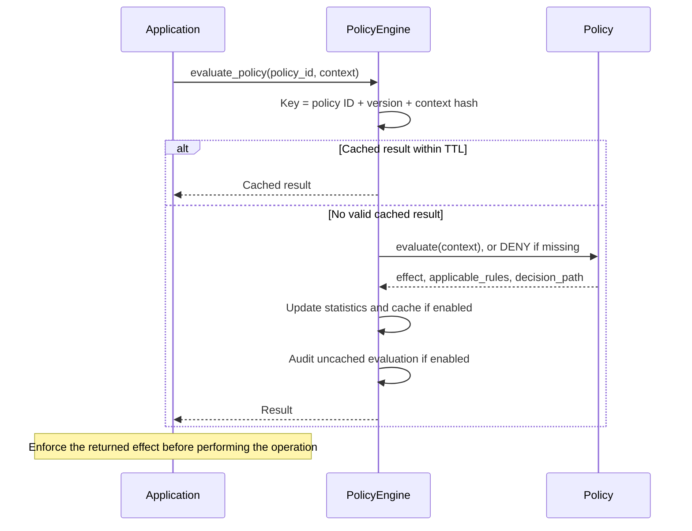

# Policy enforcement

## Scope

`PolicyEngine` evaluates operations that the caller explicitly routes through it. HTTP routes and direct Python calls do not share an automatic ABAC check. `HierarchicalMSP` uses its separate `OrganizationPolicies`; it does not invoke this engine.

A `Policy` contains typed `PolicyRule` objects sorted by descending priority. Each rule combines `PolicyCondition` results with `LogicalOperator.AND`, `OR` or `NOT`. The first applicable rule whose effect differs from the policy default determines the result. If no rule overrides the default, that default remains in effect. Missing or disabled policies return `DENY`.

## Evaluation flow



The cache TTL defaults to 300 seconds with a maximum of 1,000 entries. The key includes policy version and the first eight hexadecimal characters of a SHA-256 hash of canonical context JSON. When full, the cache evicts the entry with the oldest `cached_at` timestamp; a cache hit does not refresh it. Cached evaluations return before writing a new audit entry. Audit records remain in memory.

## Policy example

```python
from hierachain.security.policy_engine import (
    ComparisonOperator,
    LogicalOperator,
    Policy,
    PolicyCondition,
    PolicyEffect,
    PolicyEngine,
    PolicyRule,
    PolicyType,
)

policy = Policy(
    policy_id="event_submission_policy",
    policy_type=PolicyType.ACCESS_CONTROL,
    default_effect=PolicyEffect.DENY,
    rules=[
        PolicyRule(
            rule_id="allow_operators",
            priority=100,
            effect=PolicyEffect.ALLOW,
            conditions=[
                PolicyCondition(
                    attribute="role",
                    operator=ComparisonOperator.IN,
                    value=["admin", "operator"],
                )
            ],
            logical_operator=LogicalOperator.AND,
        )
    ],
)
engine = PolicyEngine()
engine.register_policy(policy)
result = engine.evaluate_policy(policy.policy_id, {"role": "operator"})
assert result["effect"] == PolicyEffect.ALLOW.value
```

Use the returned effect to allow or reject the operation. Creating or evaluating a policy does not automatically protect `SubChain.add_event()`.

## Condition operators

`ComparisonOperator` supports equality/inequality, greater/less comparisons (including inclusive variants), containment, membership and regular-expression matching, including their negated forms. Conditions use `attribute`, `operator` and `value`. A missing context attribute or a failed comparison returns `False`.

## Key classes and methods

| Operation | Method | File |
|:----------|:-------|:-----|
| Single policy | `PolicyEngine.evaluate_policy()` | `hierachain/security/policy_engine.py` |
| Policy set | `PolicyEngine.evaluate_policy_set()` | `hierachain/security/policy_engine.py` |
| Policy evaluation | `Policy.evaluate()` | `hierachain/security/policy_engine.py` |
| Rule and condition evaluation | `PolicyRule.evaluate()` / `PolicyCondition.evaluate()` | `hierachain/security/policy_types.py` |

## Related

- [MSP Identity](./msp-identity.md): organization-specific membership policies
- [Event Submission](./event-submission.md): ingestion and route scope checks
