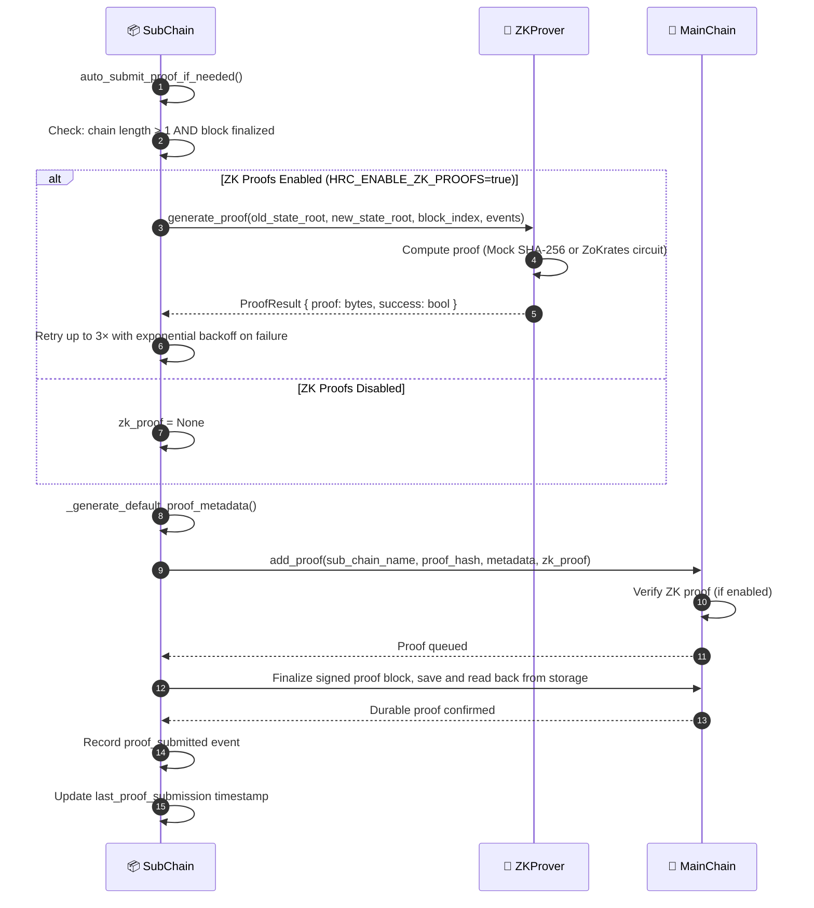

# Proof anchoring

## Overview

After a block is finalized on a Sub-Chain, the Sub-Chain submits a cryptographic proof (hash and optional ZK proof) to the Main Chain. The Main Chain stores only the proof, never raw event data. Submission succeeds only after a signed MainChain block containing the proof is finalized, saved through durable SQL storage, and read back with its hash, Merkle root, and signature verified. SQLite uses WAL with `synchronous=FULL` for these commits. An unavailable or unsupported storage backend causes submission to fail.

Automatic submission runs after a Sub-Chain block is finalized when the configured time interval has elapsed and a newer block has not yet been submitted. The authenticated REST endpoint can also trigger submission.

---

## Flow diagram

---

## Step-by-step breakdown

| Step | Description |
|:-----|:------------|
| **1. Trigger check** | `auto_submit_proof_if_needed()` checks the elapsed interval and whether a newer finalized block exists. |
| **2. ZK generation** | If `HRC_ENABLE_ZK_PROOFS=true`: ZKProver computes over `(old_state_root, new_state_root, events)`. Retries 3× with backoff |
| **3. Proof metadata** | `_generate_default_proof_metadata()` builds summary metadata; MainChain rejects forbidden detail fields inside nested dictionaries or lists and sanitizes accepted containers recursively before recording them |
| **4. Main Chain write** | `MainChain.add_proof()` verifies and queues the proof; the submission path finalizes and reads back the signed block from durable storage. |
| **5. Record** | Only after durable readback, Sub-Chain logs a `proof_submitted` event and updates `last_proof_submission`. |

---

## ZK proof modes

| Mode | Mechanism | Use Case |
|:-----|:----------|:---------|
| `mock` | SHA-256 hash simulation | Development / Testing |
| `production` | ZoKrates ZK-SNARKs circuits | Production deployment |

---

## Configuration

| Setting | Default | Description |
|:--------|:--------|:------------|
| `HRC_ENABLE_ZK_PROOFS` | `false` | Toggle ZK verification |
| `HRC_ZK_MODE` | `mock` | `mock` or `production` |
| `HRC_ZK_REQUIRED_MAINCHAIN` | `false` | Block proof submission if ZK fails |

---

## Error handling

| Condition | Behavior |
|:----------|:---------|
| ZK proof generation fails | Retry up to 3× with exponential backoff; if `HRC_ZK_REQUIRED_MAINCHAIN=true`, abort |
| Main Chain write fails | Exception logged, `last_proof_submission` not updated; retry on next block |
| Durable storage is absent, unsupported, or readback fails | Submission returns `False`; a retry can persist an already queued or finalized proof without adding a duplicate. |
| Required ZK proof is missing or verification fails | `MainChain.add_proof()` returns `False`; no proof is recorded |

---

## Key classes and methods

| Step | Class / Method | File |
|:-----|:--------------|:-----|
| Trigger | `SubChain.auto_submit_proof_if_needed()` | `hierarchical/sub_chain/base.py` |
| ZK generate | `ZKProver.generate_proof()` | `security/zk_prover.py` |
| Proof metadata | `_generate_default_proof_metadata()` | `hierarchical/sub_chain/proof.py` |
| Anchor on Main | `MainChain.add_proof()` | `hierarchical/main_chain/base.py` |
| ZK verify | `ZKVerifier.verify()` | `security/verify/zk_verifier.py` |

---

## Related

- [Event Submission](./event-submission.md): triggers this workflow
- [System Integrity Validation](./integrity-validation.md): checks proof consistency between Sub-Chain and Main Chain
