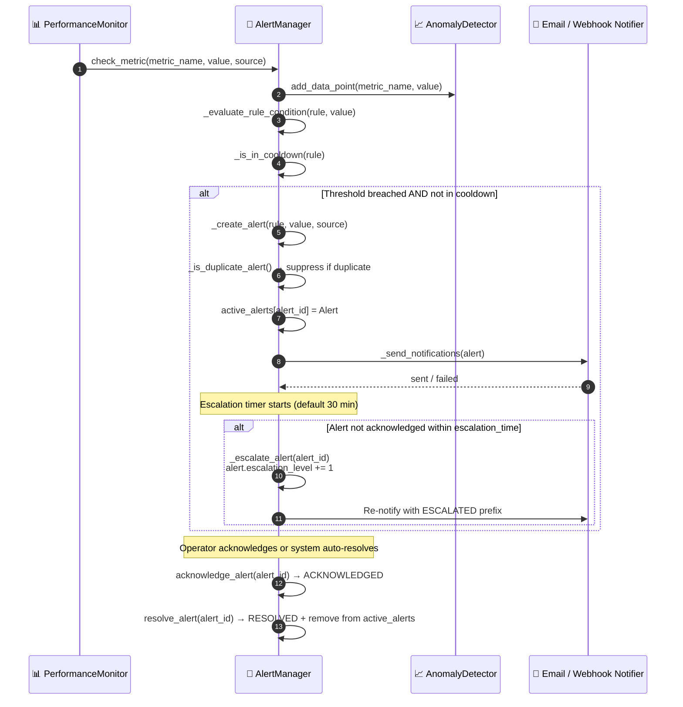

# Risk alerts

## Overview

HieraChain monitors health across four risk domains: consensus, security, performance and storage. When a metric crosses its threshold, `AlertManager` creates an alert, suppresses duplicates during cooldown, sends notifications by email or webhook, and escalates alerts that stay unacknowledged past the timeout.

---

## Flow diagram

---

## Alert severity levels

| Severity | Trigger Example | Auto-Escalate After |
|:---------|:---------------|:--------------------|
| `INFO` | Normal metric fluctuation | Never |
| `WARNING` | CPU > 85%, minor risk detected | 30 minutes |
| `CRITICAL` | CPU > 95%, consensus success < 95% | Immediate (5 min) |
| `EMERGENCY` | Manual declaration or compound failure | Immediate |

---

## Risk domains

| Domain | Key Metrics Checked |
|:-------|:--------------------|
| **Consensus** | `node_count >= 3f+1`, leader election time, message verification rate |
| **Security** | Certificate expiry (days remaining), failed authentication rate, encryption algorithm strength |
| **Performance** | CPU %, memory %, event pool queue size, block finalization latency |
| **Storage** | World state DB size, backup staleness (hours since last backup) |

---

## Step-by-step breakdown

| Step | Description |
|:-----|:------------|
| **1. Metric check** | `AlertManager.check_metric()` evaluates each incoming metric against defined rules |
| **2. Anomaly detection** | `AnomalyDetector` uses statistical baseline to flag outliers |
| **3. Cooldown check** | Rules have configurable cooldown period to suppress alert storms |
| **4. Duplicate check** | `_is_duplicate_alert()` suppresses if same rule + same source already active |
| **5. Notification** | Email and/or Webhook notifiers dispatch concurrently |
| **6. Escalation** | Unacknowledged alerts auto-escalate: `escalation_level += 1`, re-notified |
| **7. Lifecycle end** | Operator acknowledges → `ACKNOWLEDGED`; metric recovers → `RESOLVED` |

---

## Error handling

| Condition | Behavior |
|:----------|:---------|
| Email notification fails | Logged as warning; Webhook notifier still attempted |
| Webhook endpoint unreachable | Retry once; log failure; alert marked `notification_failed` |
| Alert storm (too many duplicates) | Cooldown mechanism suppresses duplicates per rule |

---

## Key classes and methods

| Step | Class / Method | File |
|:-----|:--------------|:-----|
| Metric check | `AlertManager.check_metric()` | `monitoring/alert_system.py` |
| Anomaly detection | `AnomalyDetector.is_anomaly()` | `monitoring/alert_system.py` |
| Create alert | `AlertManager._create_alert()` | `monitoring/alert_system.py` |
| Email notify | `EmailNotifier.send_alert()` | `monitoring/alert_system.py` |
| Webhook notify | `WebhookNotifier.send_alert()` | `monitoring/alert_system.py` |
| Escalate | `AlertManager._escalate_alert()` | `monitoring/alert_system.py` |
| Acknowledge | `AlertManager.acknowledge_alert()` | `monitoring/alert_system.py` |

---

## Related

- [System Integrity Validation](./integrity-validation.md): DEGRADED integrity status triggers alerts here
