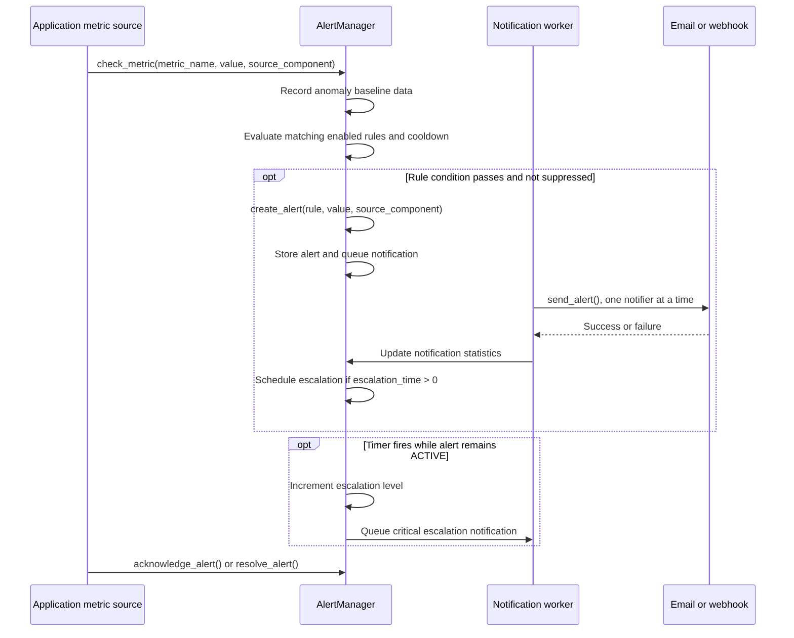

# Risk alerts

## Scope

`AlertManager` in `hierachain/monitoring/alert_system.py` evaluates metric values supplied through `check_metric()`. The host application connects its metric collectors to this method. It does not automatically receive every consensus, certificate, storage or integrity-report failure.

The manager keeps active alerts and bounded history in memory. Rule settings control cooldown, duplicate suppression and escalation. Notifications use one worker with a queue of at most 128 alerts; that worker calls configured notifiers sequentially.

## Flow diagram

```mermaid
sequenceDiagram
    participant App as Application metric source
    participant AM as AlertManager
    participant Worker as Notification worker
    participant Notifier as Email or webhook
    App->>AM: check_metric(metric_name, value, source_component)
    AM->>AM: Record anomaly baseline data
    AM->>AM: Evaluate matching enabled rules and cooldown
    opt Rule condition passes and not suppressed
        AM->>AM: create_alert(rule, value, source_component)
        AM->>AM: Store alert and queue notification
        Worker->>Notifier: send_alert(), one notifier at a time
        Notifier-->>Worker: Success or failure
        Worker->>AM: Update notification statistics
        AM->>AM: Schedule escalation if escalation_time > 0
    end
    opt Timer fires while alert remains ACTIVE
        AM->>AM: Increment escalation level
        AM->>Worker: Queue critical escalation notification
    end
    App->>AM: acknowledge_alert() or resolve_alert()
```

## Default metric rules

| Rule | Condition | Severity |
|:-----|:----------|:---------|
| `CPU_HIGH` | `cpu_usage > 85` | `WARNING` |
| `CPU_CRITICAL` | `cpu_usage > 95` | `CRITICAL` |
| `MEMORY_HIGH` | `memory_usage > 85` | `WARNING` |
| `CONSENSUS_FAILURE` | `consensus_success_rate < 95` | `CRITICAL` |
| `RISK_DETECTED` | `risk_count > 0` | `WARNING` |

These values must be supplied by the application. Add rules for other metrics through `add_alert_rule()`. `check_metric()` records each value as anomaly baseline data before evaluating matching enabled rules and cooldown. Default rules do not use anomaly detection as a trigger. A rule explicitly configured with `condition="anomaly"` can call `AnomalyDetector.is_anomaly()` through `check_metric()` and trigger an alert when its condition passes.

`AlertRule` defaults to a 300-second cooldown, 1,800-second escalation time, duplicate suppression enabled and `auto_resolve=False`. Severity alone does not select a five-minute or immediate escalation. Acknowledgement or resolution cancels the pending timer. Metric recovery does not automatically resolve a default alert.

## Notification failures

Email and webhook operations have a 10-second timeout. The webhook notifier makes one request; there is no built-in retry. A failed notifier increments `notifications_failed`, and the next configured notifier is still attempted. There is no `notification_failed` alert status.

If the notification queue is full, the manager records a failed notification while retaining the alert in history. Call `AlertManager.close()` to stop accepting new notifications and wait for bounded delivery work. Abrupt process exit can lose queued notifications and in-memory alert state.

## Key classes and methods

| Operation | Method | File |
|:----------|:-------|:-----|
| Metric check | `AlertManager.check_metric()` | `hierachain/monitoring/alert_system.py` |
| Baseline query | `AnomalyDetector.is_anomaly()` | `hierachain/monitoring/alert_system.py` |
| Create alert | `AlertManager.create_alert()` | `hierachain/monitoring/alert_system.py` |
| Notification | `EmailNotifier.send_alert()` / `WebhookNotifier.send_alert()` | `hierachain/monitoring/alert_system.py` |
| Escalation | `AlertManager._escalate_alert()` | `hierachain/monitoring/alert_system.py` |
| Rule defaults | `AlertRule` | `hierachain/monitoring/types.py` |

## Related

- [System Integrity Validation](./integrity-validation.md): reports the application can route to alerts
- [Monitoring](../modules/monitoring.md): metric collectors and callback integration
