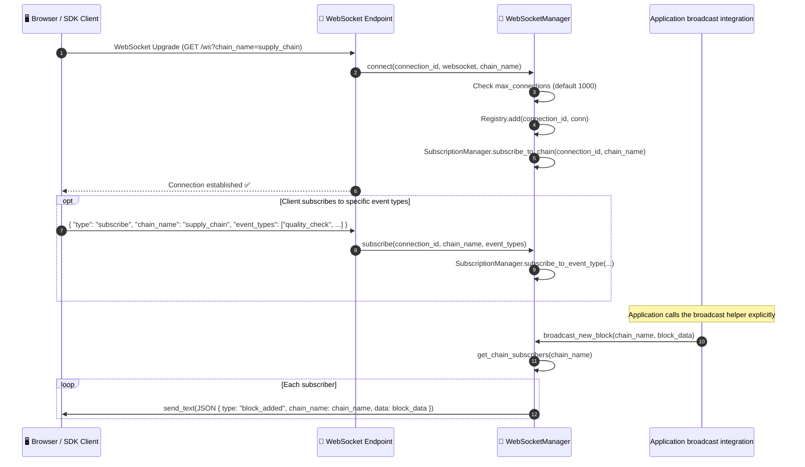

# WebSocket real-time streaming

## Overview

The WebSocket API accepts chain/event subscriptions and provides broadcast helpers. The current ledger commit and event paths do not call `broadcast_new_block()` or `broadcast_event()`. Applications must connect their event source to those helpers before subscribers receive ledger notifications. An asyncio ping task removes connections when a send fails or exceeds its timeout; it does not wait for a client pong.

`WebSocketManager` is a singleton (`ws_manager`) shared by the routes within one API process. Multiple workers have separate connection registries.

## Flow diagram: connection and broadcast lifecycle



## Flow diagram: ping and stale connection cleanup

```mermaid
sequenceDiagram
    autonumber
    participant BG as 🔄 PingLoopRunner (background)
    participant WSM as 📡 WebSocketManager
    participant Client as 🖥️ Client

    Note over BG: Every 30 seconds

    loop Each active connection
        BG->>Client: send_text JSON ping with 10s timeout
        alt Send succeeds
            Note over BG: Keep connection; no pong wait
        else Send failure or timeout
            BG->>WSM: disconnect(connection_id)
            WSM->>WSM: Registry.remove(connection_id)
            WSM->>WSM: SubscriptionManager.unsubscribe_all(connection_id)
        end
    end
```

## Message format

```json
// Block added notification (example payload)
{
    "type": "block_added",
    "chain_name": "supply_chain",
    "data": {
        "index": 42,
        "hash": "a3f8b2c1...",
        "previous_hash": "9d1e4f...",
        "timestamp": 1714000000.0,
        "event_count": 5
    },
    "optimized": true,
    "timestamp": "2026-10-09T12:00:00"
}

// Event notification sent by broadcast_event_type() after event-type filtering (example payload)
{
    "type": "event",
    "chain_name": "supply_chain",
    "data": {
        "entity_id": "product-SKU-001",
        "event": "quality_check",
        "details": { "result": "passed" }
    },
    "optimized": true,
    "timestamp": "2026-10-09T12:00:00",
    "event_type": "quality_check"
}
```

`broadcast_new_block()` wraps the `block_data` supplied by the application. It does not confirm that the block was durably committed; call it after the application establishes the block state it wants to announce.

## Step-by-step breakdown

| Step | Description |
|:-----|:------------|
| 1. Upgrade | Connect to `/ws`, optionally passing `chain_name` as a query parameter |
| 2. Capacity check | Reject if `active_connections >= max_connections` (default 1000) |
| 3. Register | `ConnectionRegistry.add()` stores connection by `connection_id` |
| 4. Subscribe | `SubscriptionManager.subscribe_to_chain()` links connection to chain |
| 5. Optional filter | Only `broadcast_event_type()` applies the event-type subscription; `broadcast_event()` sends to all subscribers of the chain. |
| 6. Broadcast | An application call to `broadcast_new_block()` fans out to subscribers |
| 7. Ping loop | An asyncio task sends JSON pings every 30s; send failures or a 10s send timeout cause disconnection |

## Error handling

| Condition | Behavior |
|:----------|:---------|
| Max connections reached | `WebSocketManager.connect()` raises a generic `Exception`; the endpoint catches and logs it, then runs cleanup. It does not explicitly send close code `1008`. |
| Client disconnects unexpectedly | `ConnectionRegistry.remove()` called on next send failure |
| Send to stale connection fails | Exception caught, `disconnect()` called, connection removed |
| Broadcast to empty subscriber list | No-op, no error |

## Key classes and methods

| Step | Class / Method | File |
|:-----|:--------------|:-----|
| Singleton manager | `ws_manager` | `api/websocket/manager.py` |
| Connect | `WebSocketManager.connect()` | `api/websocket/manager.py` |
| Disconnect | `WebSocketManager.disconnect()` | `api/websocket/manager.py` |
| Subscribe | `WebSocketManager.subscribe()` | `api/websocket/manager.py` |
| Broadcast block | `WebSocketManager.broadcast_new_block()` | `api/websocket/manager.py` |
| Broadcast event | `WebSocketManager.broadcast_event()` | `api/websocket/manager.py` |
| Ping loop | `PingLoopRunner` | `api/websocket/handlers.py` |
| Message builder | `build_block_added()` / `build_event_message()` | `api/websocket/builders.py` |
| Connection store | `ConnectionRegistry` | `api/websocket/registry.py` |

## Related

- [Event Submission](./event-submission.md): ledger pipeline that an application can connect to broadcast helpers
- [Risk Analysis & Alerts](./risk-alerts.md): separate email/webhook notification workflow
