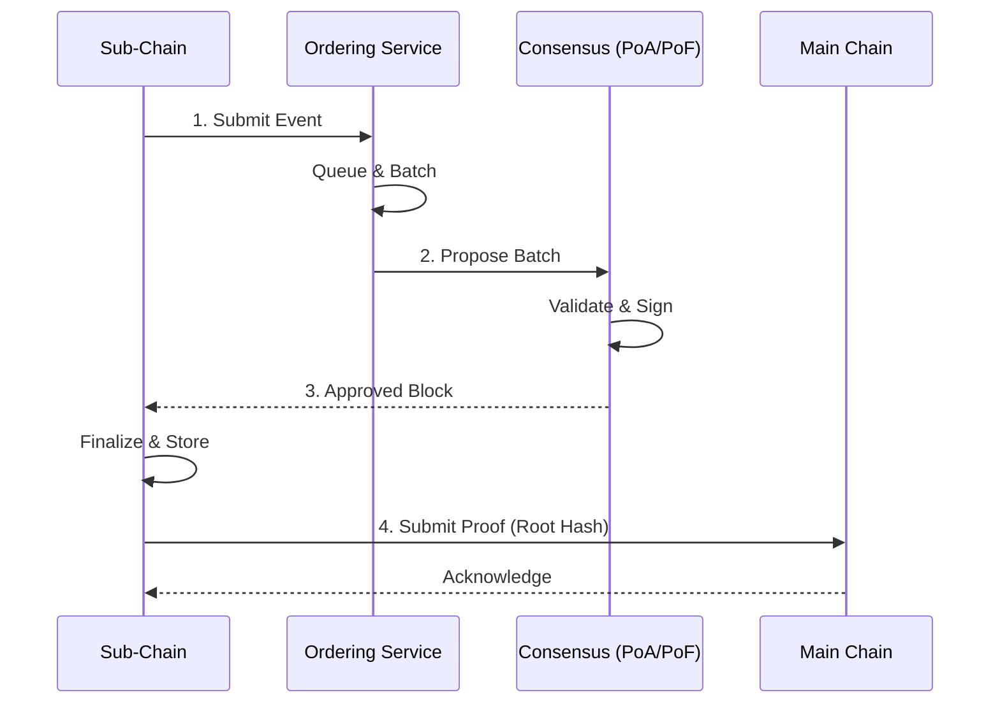

# Đồng thuận & Sắp xếp (Consensus & Ordering)

## Mục đích

Mô tả các cơ chế Consensus và Ordering Service được HieraChain sử dụng để đảm bảo tính toàn vẹn, thứ tự và khả năng xác minh của Block/Event.

## Kiến trúc & khái niệm

* Base Consensus: `hierachain/consensus/base_consensus.py` — Giao diện/khung cơ bản cho các thuật toán đồng thuận.
* Proof of Authority (PoA): `hierachain/consensus/proof_of_authority.py` — Đồng thuận Nội bộ Tổ chức (1 MainChain quản lý các Sub-Chains thuộc phân khu nội bộ).
* Proof of Federation (PoF): `hierachain/consensus/proof_of_federation.py` — Đồng thuận Liên minh Ngang hàng giữa các MainChain độc lập (Consortium không cần RootChain trung tâm).
* BFT Consensus: `hierachain/consensus/bft/` — Chống lỗi Byzantine ở lớp phân cấp.
* Ordering Service: `hierachain/consensus/ordering/` — Sắp xếp Event trước khi đóng Block; kiến trúc đa thành phần (Processor, Certifier, BlockBuilder).

### Luồng điển hình



1. Sub‑Chain nhận Event → đẩy vào hàng đợi của Ordering Service.
2. Ordering Service tạo batch theo chính sách (kích thước/ngưỡng thời gian) → gửi cho cơ chế Consensus đã chọn.
3. Cơ chế Consensus (PoA/PoF hoặc BFT) xác nhận batch/Block → Sub‑Chain đóng Block.
4. Nếu bật neo lên Main Chain: Sub‑Chain gửi Proof (Merkle root/hash) để Main Chain ghi nhận.

## Cấu hình

Các biến trong `hierachain/config/settings.py`:

* `CONSENSUS_TYPE`: `proof_of_authority` (mặc định) hoặc `proof_of_federation`.
* `BFT_ENABLED`: Bật/tắt lớp BFT cho kịch bản cần chống Byzantine.
* `VALIDATOR_TIMEOUT`: Thời gian timeout giữa các validator.
* `CONSENSUS_FEDERATION_CONFIG`: tham số liên minh (ví dụ `min_validators`, `block_interval`).

Ví dụ môi trường:

```dotenv
HRC_CONSENSUS_TYPE=proof_of_authority
HRC_ZK_REQUIRED_MAINCHAIN=false
```

## Tính năng & hạn chế

* PoA: triển khai đơn giản, độ trễ thấp; phụ thuộc niềm tin vào validator tập trung.
* PoF: cân bằng giữa tin cậy và phân tán; cần quản trị thành viên liên minh.
* BFT: chịu lỗi Byzantine tốt; đổi lại phức tạp/chi phí thông điệp cao hơn.
* Ordering: đảm bảo thứ tự/nhóm sự kiện ổn định trước khi đóng block.

## Liên quan

* Kiến trúc tổng quan: [Tổng quan](overview.md)
* Hierarchical module: [Hierarchical](../modules/hierarchical.md)
* Data Models: [Data Models](../reference/data-models.md)
* Config: [Config](../reference/config.md)
