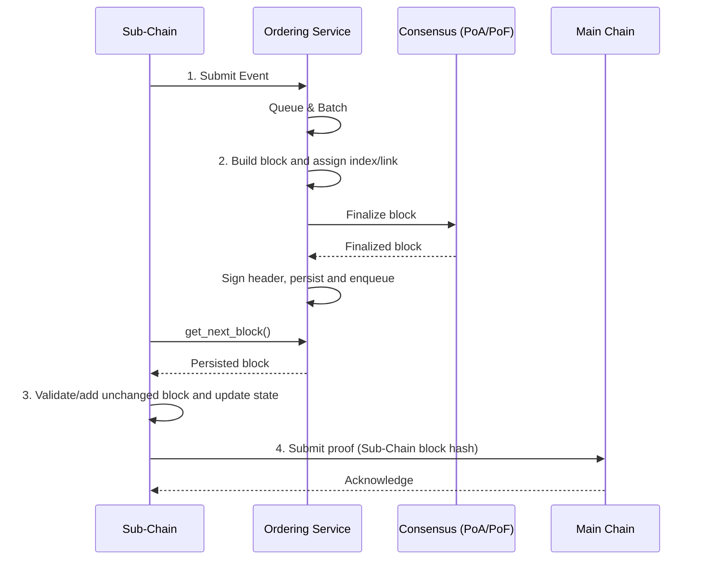

# Đồng thuận và sắp thứ tự

## Mục đích

Phần này mô tả cơ chế consensus và Ordering Service mà HieraChain dùng để giữ block và event được sắp xếp, toàn vẹn và có thể xác minh.

## Kiến trúc & khái niệm

* Base Consensus: `hierachain/consensus/base_consensus.py` định nghĩa giao diện cơ sở cho PoA và PoF; BFT dùng API riêng.
* Proof of Authority (PoA): `hierachain/consensus/proof_of_authority.py` xử lý đồng thuận trong một organization, một MainChain quản lý các Sub-Chain nội bộ.
* Proof of Federation (PoF): `hierachain/consensus/proof_of_federation.py` triển khai thành viên liên minh, xác thực leader luân phiên và chữ ký leader để tích hợp trong consortium; xác thực khối thông thường không thu thập phiếu quorum nhiều bên.
* BFT Consensus: `hierachain/consensus/bft/` chứa triển khai riêng. Luồng runtime của MainChain và SubChain dùng PoA hoặc PoF.
* Ordering Service: `hierachain/consensus/ordering/` sắp xếp event trước khi tạo block và gồm nhiều thành phần (Processor, Certifier, BlockBuilder).

### Luồng điển hình


```mermaid
sequenceDiagram
    participant SC as Sub-Chain
    participant OS as Ordering Service
    participant C as Consensus (PoA/PoF)
    participant MC as Main Chain

    SC->>OS: 1. Submit Event
    OS->>OS: Queue & Batch
    OS->>OS: 2. Build block and assign index/link
    OS->>C: Finalize block
    C-->>OS: Finalized block
    OS->>OS: Sign header, persist and enqueue
    SC->>OS: get_next_block()
    OS-->>SC: Persisted block
    SC->>SC: 3. Validate/add unchanged block and update state
    SC->>MC: 4. Submit proof (Sub-Chain block hash)
    MC-->>SC: Acknowledge
```

1. Sub-Chain nhận event và đẩy vào hàng đợi của Ordering Service.
2. Ordering Service gom sự kiện theo ngưỡng kích thước và thời gian, tạo block, gọi bộ hoàn tất đồng thuận đã cấu hình, ký header và lưu block trước khi đưa vào hàng đợi.
3. Consumer của Sub-Chain xác minh và áp dụng block đã lưu, giữ nguyên index, hash và chữ ký. Sub-Chain mặc định dùng PoA, hoặc PoF khi được cấu hình.
4. Khi bật neo bằng chứng lên Main Chain, Sub-Chain gửi bằng chứng chứa hash của block mới nhất để Main Chain ghi nhận.

## Cấu hình

Các biến trong `hierachain/config/settings.py`:

* `CONSENSUS_TYPE`: `proof_of_authority` (mặc định) hoặc `proof_of_federation`.
* `BFT_ENABLED`: lớp `Settings` khai báo thuộc tính này, nhưng nó không chọn cơ chế đồng thuận cho MainChain hay SubChain. Đây không phải biến môi trường.
* `VALIDATOR_TIMEOUT`: timeout validator được khai báo và xuất qua helper settings; nó không cấu hình bộ hẹn giờ view change của BFT.
* `CONSENSUS_FEDERATION_CONFIG`: các mặc định liên minh được khai báo; hàm khởi tạo MainChain/SubChain hiện không áp dụng dictionary này vào PoF. Cấu hình instance đồng thuận thực tế nhất quán giữa các nút.

Ví dụ môi trường:

```dotenv
HRC_CONSENSUS_TYPE=proof_of_authority
HRC_ZK_REQUIRED_MAINCHAIN=false
```

## Tính năng & hạn chế

* PoA tin cậy các authority đã đăng ký. Throughput phụ thuộc vào gom lô, đồng bộ journal và storage.
* PoF cân bằng giữa tin cậy và phân tán, nhưng cần quản lý thành viên liên minh.
* Triển khai BFT nằm trong `hierachain/consensus/bft/` và tách khỏi luồng runtime của MainChain và SubChain.
* Ordering giữ thứ tự event và việc gom batch ổn định trước khi đóng block.

## Liên quan

* Kiến trúc tổng quan: [Tổng quan](overview.md)
* Hierarchical module: [Hierarchical](../modules/hierarchical.md)
* Data Models: [Data Models](../reference/data-models.md)
* Config: [Config](../reference/config.md)
