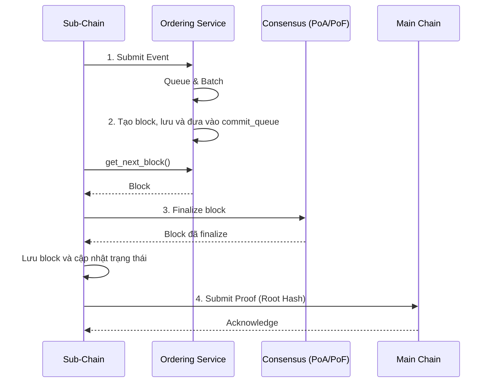

# Đồng thuận & Sắp xếp (Consensus & Ordering)

## Mục đích

Phần này mô tả cơ chế consensus và Ordering Service mà HieraChain dùng để giữ block và event được sắp xếp, toàn vẹn và có thể xác minh.

## Kiến trúc & khái niệm

* Base Consensus: `hierachain/consensus/base_consensus.py` định nghĩa interface và khung chung cho các thuật toán đồng thuận.
* Proof of Authority (PoA): `hierachain/consensus/proof_of_authority.py` xử lý đồng thuận trong một organization, một MainChain quản lý các Sub-Chain nội bộ.
* Proof of Federation (PoF): `hierachain/consensus/proof_of_federation.py` xử lý đồng thuận liên minh P2P giữa các MainChain độc lập, không cần RootChain trung tâm.
* BFT Consensus: `hierachain/consensus/bft/` chứa triển khai riêng. Luồng runtime của MainChain và SubChain dùng PoA hoặc PoF.
* Ordering Service: `hierachain/consensus/ordering/` sắp xếp event trước khi tạo block và gồm nhiều thành phần (Processor, Certifier, BlockBuilder).

### Luồng điển hình


```mermaid
sequenceDiagram
    participant SC as Sub-Chain
    participant OS as Ordering Service
    participant C as Consensus (PoA/PoF)
    participant MC as Main Chain

    SC->>OS: 1. Submit Event
    OS->>OS: Queue & Batch
    OS->>OS: 2. Tạo block, lưu và đưa vào commit_queue
    SC->>OS: get_next_block()
    OS-->>SC: Block
    SC->>C: 3. Finalize block
    C-->>SC: Block đã finalize
    SC->>SC: Lưu block và cập nhật trạng thái
    SC->>MC: 4. Submit Proof (Root Hash)
    MC-->>SC: Acknowledge
```

1. Sub-Chain nhận event và đẩy vào hàng đợi của Ordering Service.
2. Ordering Service gom batch theo ngưỡng kích thước và thời gian, tạo block rồi đưa vào hàng đợi commit.
3. Sub-Chain finalize block bằng PoA mặc định hoặc PoF nếu được cấu hình.
4. Nếu bật neo lên Main Chain, Sub-Chain gửi proof (Merkle root hoặc hash) để Main Chain ghi nhận.

## Cấu hình

Các biến trong `hierachain/config/settings.py`:

* `CONSENSUS_TYPE`: `proof_of_authority` (mặc định) hoặc `proof_of_federation`.
* Lớp `Settings` có thuộc tính `BFT_ENABLED`, nhưng thuộc tính này không chọn consensus cho MainChain hoặc SubChain. Không có biến môi trường `HRC_BFT_ENABLED`.
* `VALIDATOR_TIMEOUT`: timeout giữa các validator.
* `CONSENSUS_FEDERATION_CONFIG`: tham số liên minh (ví dụ `min_validators` và `block_interval`).

Ví dụ môi trường:

```dotenv
HRC_CONSENSUS_TYPE=proof_of_authority
HRC_ZK_REQUIRED_MAINCHAIN=false
```

## Tính năng & hạn chế

* PoA triển khai đơn giản và độ trễ thấp, nhưng phụ thuộc vào validator tập trung để bảo đảm tin cậy.
* PoF cân bằng giữa tin cậy và phân tán, nhưng cần quản lý thành viên liên minh.
* Triển khai BFT nằm trong `hierachain/consensus/bft/` và tách khỏi luồng runtime của MainChain và SubChain.
* Ordering giữ thứ tự event và việc gom batch ổn định trước khi đóng block.

## Liên quan

* Kiến trúc tổng quan: [Tổng quan](overview.md)
* Hierarchical module: [Hierarchical](../modules/hierarchical.md)
* Data Models: [Data Models](../reference/data-models.md)
* Config: [Config](../reference/config.md)
