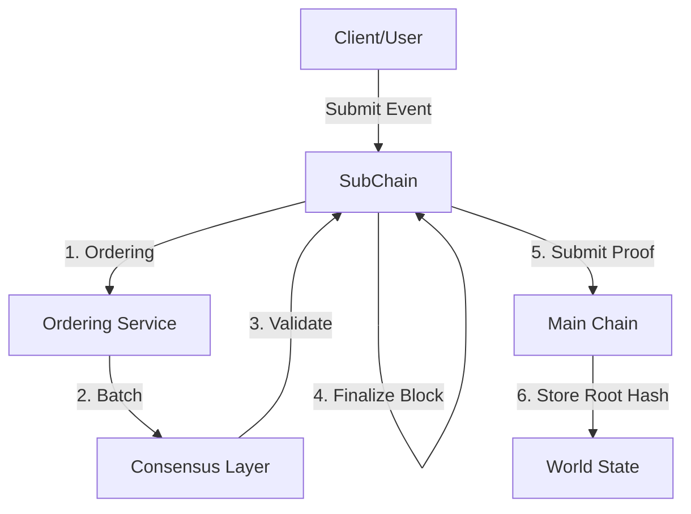

# Kiến trúc phân cấp (chi tiết)

## Mục đích

Diễn giải chi tiết cơ chế phân cấp của HieraChain: cách Sub‑Chain tương tác với Main Chain qua `HierarchyManager`, Channel và mô hình đa tổ chức, dữ liệu riêng tư, giao dịch liên chuỗi (2PC), neo Proof, và tái cân bằng Sub‑Chain.

## Thành phần & khái niệm

* Main Chain: `hierachain/hierarchical/main_chain.py` — Lưu Proof từ các Sub‑Chain; tổng hợp báo cáo toàn vẹn.
* Sub‑Chain (Domain Chain): `hierachain/hierarchical/sub_chain.py` — Xử lý Event domain, Ordering/đóng Block, sinh Proof.
* Hierarchy Manager: `hierachain/hierarchical/hierarchy_manager.py` — Điều phối hệ thống Chain, quản lý vòng đời Sub‑Chain, giao dịch liên chuỗi, thống kê hệ thống.
* Channel (kênh): `hierachain/hierarchical/channel.py` — Không gian giao tiếp riêng cho nhóm tổ chức, thiết lập chính sách tạo kênh.
* Multi‑Org: `hierachain/hierarchical/multi_org.py` — Khởi tạo tổ chức, mạng nhiều tổ chức, quan hệ Channel ↔ Organization.
* Private Data: `hierachain/hierarchical/private_data.py` — Bộ sưu tập dữ liệu riêng tư ở cấp Sub‑Chain.
* Cross‑Chain Transaction Manager: `hierachain/hierarchical/transaction_manager.py` — Điều phối giao dịch 2PC giữa các Sub‑Chain.
* Proof Aggregation: `hierachain/hierarchical/proof_aggregation.py` — Gom nhóm, nén proof trước khi gửi/ghi nhận (tùy cấu hình).
* Rebalancer: `hierachain/hierarchical/rebalancer.py` — Tự động tách/cân bằng Sub‑Chain khi tải cao theo ngưỡng.

### Luồng tiêu biểu

1. Tạo Sub‑Chain: `HierarchyManager.create_sub_chain(name, domain_type, metadata)` → khởi tạo DomainChain, kết nối Main Chain.
2. Ghi Event và đóng Block: `SubChain.add_event()` → Ordering → Consensus → `finalize_block()`.
3. Neo Proof lên Main Chain: `SubChain.submit_proof_to_main(main_chain, ...)` hoặc qua `HierarchyManager.submit_proof_to_main_chain(name)`.
4. Giao dịch liên chuỗi (2PC): `HierarchyManager.transaction_manager.initiate_transaction(src, dst, payload)` → chuẩn bị/commit/rollback.
5. Kênh & Dữ liệu riêng tư: Tạo Channel giữa các organization; private collections lưu tại Sub‑Chain theo chính sách kênh.
6. Tái cân bằng Sub‑Chain: Rebalancer theo dõi EPS/ngưỡng → đề xuất tách nhánh/di chuyển tải.

## Cấu hình liên quan (settings.py)

* Proof: `PROOF_AGGREGATION_ENABLED`, `PROOF_BATCH_SIZE`, `PROOF_BATCH_TIMEOUT`, `PROOF_COMPRESSION_ENABLED`.
* Rebalance: `REBALANCE_ENABLED`, `REBALANCE_THRESHOLD_EPS`, `REBALANCE_CHECK_INTERVAL`, `REBALANCE_MIN_EVENTS_FOR_SPLIT`, `REBALANCE_COOLDOWN`.
* K8s (cô lập Sub‑Chain): `K8S_ENABLED`, `K8S_NAMESPACE_PREFIX`, `K8S_*_LIMIT/REQUEST`, `K8S_CONFIG_PATH`.
* Đồng thuận/Ordering: xem [Consensus & Ordering](consensus.md) và `CONSENSUS_TYPE`, `VALIDATOR_TIMEOUT`.

## Tính năng & hạn chế

* Tính năng: phân tách dữ liệu theo domain, neo proof tập trung ở Main Chain, hỗ trợ 2PC, kênh/đa tổ chức, dữ liệu riêng tư, tái cân bằng.
* Hạn chế: thao tác kênh/đa tổ chức cần chính sách rõ; 2PC yêu cầu đồng bộ tốt; tái cân bằng có thể cần thao tác vận hành ngoài băng.

## Liên quan

* Tổng quan: [Tổng quan](overview.md)
* Đồng thuận & Sắp xếp: [Consensus & Ordering](consensus.md)
* Hierarchical module: [Hierarchical](../modules/hierarchical.md)
* Config: [Config](../reference/config.md)

---

??? info "Thông tin kỹ thuật bổ sung (Metadata)"

    **FACT**

    * Các tệp chính: `hierachain/hierarchical/{main_chain.py, sub_chain.py, hierarchy_manager.py, channel.py, multi_org.py, private_data.py, transaction_manager.py, proof_aggregation.py, rebalancer.py}`.
    * `HierarchyManager` khởi tạo `MainChain`, quản lý `sub_chains`, có `CrossChainTransactionManager`.
    * Neo proof từ Sub‑Chain lên Main Chain (Merkle root/hash) theo luồng đã mô tả.
    * Cấu hình tái cân bằng, gom proof đọc từ `hierachain/config/settings.py`.

    **DECISION**

    * Main Chain chỉ lưu proof/metadata, không lưu dữ liệu domain chi tiết.
    * Luôn áp dụng Ordering trước khi đóng block ở Sub‑Chain để đảm bảo tính xác định.
    * Kênh/đa tổ chức sử dụng chính sách tạo kênh “majority” mặc định (có thể thay đổi qua config).

    **ASSUMPTION**

    * Môi trường mạng ổn định; có cơ chế retry/idempotency khi gửi proof/giao dịch 2PC.
    * Tổ chức/thành viên được quản trị qua mô‑đun Security (MSP/Identity/Policy).

    **INVARIANT**

    * Block đã commit là bất biến; mọi thay đổi đến từ block mới.
    * Quan hệ hash/previous_hash của Chain phải liên tục và hợp lệ.
    * Proof gửi lên Main Chain phải xác minh được và ánh xạ đúng Sub‑Chain nguồn.

    **EDGE CASES**

    * Lỗi giao dịch liên chuỗi (một bên thất bại) → 2PC phải rollback an toàn.
    * Gián đoạn gửi proof → cần retry idempotent, tránh bản ghi trùng.
    * Tái cân bằng trong giờ cao điểm → cần cơ chế “cooldown” để giảm dao động.
