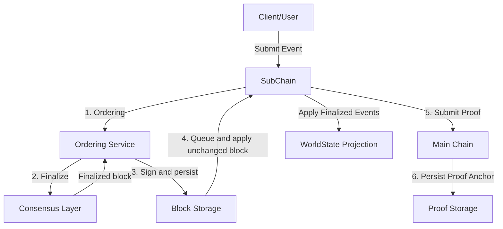

# Kiến trúc phân cấp

## Mục đích

Phần này giải thích cách HieraChain tổ chức phân cấp. Nó bao gồm cách Sub-Chain tương tác với Main Chain qua `HierarchyManager`, cách channel và mô hình multi-org vận hành, cách xử lý private data, cách giao dịch liên chuỗi dùng 2PC, cách neo proof và cách cân bằng lại Sub-Chain.

## Thành phần và khái niệm

* Main Chain: `hierachain/hierarchical/main_chain/base.py` lưu proof từ Sub-Chain và tổng hợp báo cáo toàn vẹn.
* Sub-Chain (Domain Chain): `hierachain/hierarchical/sub_chain/base.py` xử lý event theo domain, sắp xếp và đóng block, tạo proof.
* Hierarchy Manager: `hierachain/hierarchical/hierarchy_manager/base.py` điều phối hệ thống chuỗi, quản lý vòng đời Sub-Chain, giao dịch liên chuỗi và thống kê hệ thống.
* Channel: `hierachain/hierarchical/channel/channel.py` cung cấp không gian giao tiếp riêng cho nhóm organization và giữ policy tạo channel.
* Multi-Org: `hierachain/hierarchical/multi_org.py` xử lý khởi tạo organization, mạng multi-org và quan hệ giữa channel với organization.
* Dữ liệu riêng tư: `hierachain/hierarchical/private_data.py` cung cấp đối tượng collection và kiểm tra truy cập, với kho dữ liệu trong bộ nhớ ở cấp thư viện. Manager không lưu bền các collection này; API REST ghi dữ liệu riêng tư trả HTTP 501.
* Cross-Chain Transaction Manager: `hierachain/hierarchical/transaction_manager.py` điều phối giao dịch 2PC giữa các Sub-Chain.

### Luồng tiêu biểu

```mermaid
graph TD
    User[Client/User] -->|Submit Event| SubChain
    SubChain -->|1. Ordering| Orderer[Ordering Service]
    Orderer -->|2. Finalize| Consensus[Consensus Layer]
    Consensus -->|Finalized block| Orderer
    Orderer -->|3. Sign and persist| Blocks[Block Storage]
    Blocks -->|4. Queue and apply unchanged block| SubChain
    SubChain -->|5. Submit Proof| MainChain[Main Chain]
    MainChain -->|6. Persist Proof Anchor| Storage[Proof Storage]
    SubChain -->|Apply Finalized Events| Projection[WorldState Projection]
```

1. Tạo Sub-Chain bằng `HierarchyManager.create_sub_chain(name, domain_type, metadata)`. Lệnh này khởi tạo DomainChain và nối vào Main Chain.
2. Gửi sự kiện bằng `SubChain.add_event()`. Kết quả xác nhận sự kiện đã được journal/hàng đợi tiếp nhận; orderer sau đó hoàn tất, ký và lưu block trước khi consumer áp dụng nó.
3. Neo proof lên Main Chain bằng `SubChain.submit_proof_to_main(main_chain, ...)` hoặc `HierarchyManager.submit_proof_to_main_chain(name)`.
4. Chạy giao dịch liên chuỗi (2PC) bằng `HierarchyManager.transaction_manager.initiate_transaction(src, dst, payload)`, xử lý prepare, commit và rollback.
5. Channel: tạo channel giữa các tổ chức. Ứng dụng phải quản lý việc lưu bền đối tượng collection dữ liệu riêng tư; API REST ghi dữ liệu riêng tư chưa được triển khai (HTTP 501).

## Cấu hình liên quan (settings.py, thực tế `HRC_*`)

* Consensus/Ordering: xem [Consensus & Ordering](consensus.md) và `HRC_CONSENSUS_TYPE`/`HRC_MAINCHAIN_CONSENSUS`, `VALIDATOR_TIMEOUT`, `HRC_BLOCK_INTERVAL`.

## Tính năng và hạn chế

* Chức năng: tách dữ liệu theo domain, neo bằng chứng có chữ ký, quyết định 2PC được lưu bền trong journal, cùng registry channel/đa tổ chức trên các backend hỗ trợ.
* Giới hạn: lời gọi Python trực tiếp tới channel/dữ liệu riêng tư cần caller đáng tin cậy; API REST không cung cấp kho dữ liệu riêng tư. Xác nhận journal của 2PC tách biệt với việc commit block bất đồng bộ. Xem [Module phân cấp](../modules/hierarchical.md).

## Liên quan

* Tổng quan: [Tổng quan](overview.md)
* Consensus & Ordering: [Consensus & Ordering](consensus.md)
* Mô-đun Hierarchical: [Hierarchical](../modules/hierarchical.md)
* Config: [Config](../reference/config.md)
