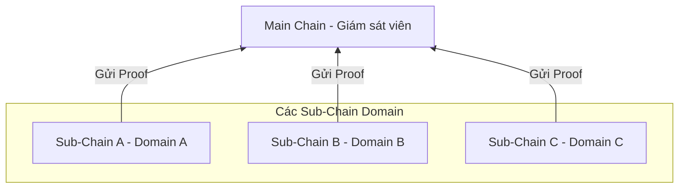
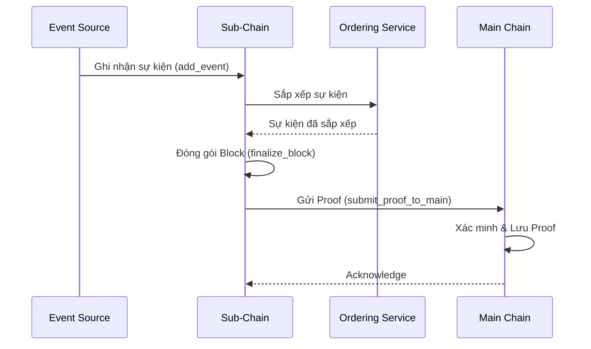

# Kiến trúc tổng quan

## Mục đích

Giới thiệu kiến trúc phân cấp (hierarchical) của HieraChain: Main Chain làm cơ quan gốc chỉ lưu bằng chứng (proof) từ các Sub-Chain; Sub-Chain xử lý dữ liệu nghiệp vụ (events) theo từng domain. Trang này giúp định vị vai trò từng thành phần và các luồng chính.

## Kiến trúc & khái niệm

* Sub-Chain chịu trách nhiệm ghi nhận Event domain, Ordering thành Block và duy trì World State nội bộ.
* Main Chain không lưu dữ liệu domain chi tiết; chỉ lưu Proof mật mã để đảm bảo tính toàn vẹn toàn hệ thống.
* HierarchyManager điều phối tạo/đăng ký Sub-Chain, gửi Proof, và các tác vụ vận hành liên quan đa chuỗi.

### Thành phần chính

* Main Chain: `hierachain/hierarchical/main_chain/base.py` — Lưu và xác minh proof từ Sub-Chain, tổng hợp báo cáo tính toàn vẹn.
* Sub-Chain: `hierachain/hierarchical/sub_chain/base.py` — Ghi nhận event domain, Ordering/đóng block, tạo proof gửi lên Main Chain.
* Hierarchy Manager: `hierachain/hierarchical/hierarchy_manager/base.py` — Điều phối toàn bộ hệ thống đa chuỗi, quản lý vòng đời Sub-Chain, tự động gửi proof, xác minh liên chuỗi.ứng chéo.
* IPFS Storage (Off-chain): `hierachain/api/storage/ipfs_client.py` — Lưu trữ dữ liệu nghiệp vụ lớn hoặc nhạy cảm ngoài chuỗi, chỉ neo mã CID lên Blockchain.
* Ordering Service: `hierachain/consensus/ordering/service.py` — Thành phần sắp xếp sự kiện trước khi tạo block (được Sub-Chain tích hợp khởi tạo).

### Luồng tiêu biểu

1. Ghi Event → Tạo Block (Sub-Chain) — Event được `SubChain.add_event()` tiếp nhận, đưa qua Ordering nội bộ, gom vào Block và `finalize_block()` khi đủ điều kiện.
2. Gửi Proof lên Main Chain — `SubChain.submit_proof_to_main()` sinh Proof (ví dụ từ Merkle root/hash block), gửi `MainChain.add_proof()` để neo mốc.
3. Báo cáo toàn cục — Main Chain tổng hợp `get_main_chain_stats()` và thống kê cho từng Sub-Chain.
4. Điều phối hệ thống — `HierarchyManager` hỗ trợ gửi proof định kỳ (`configure_auto_proof_submission`), đồng bộ, và kiểm tra tính nhất quán liên chuỗi.

## Liên quan

* Bắt đầu nhanh: [Bắt đầu nhanh](../getting-started/quickstart.md)
* Thuật ngữ: [Thuật ngữ](../glossary.md)
* Mô-đun cốt lõi: [Core](../modules/core.md)
