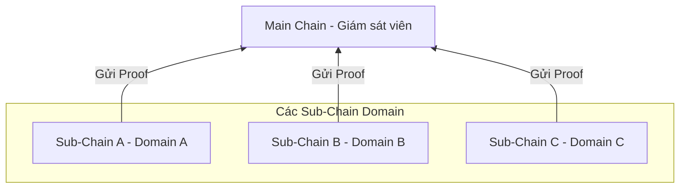
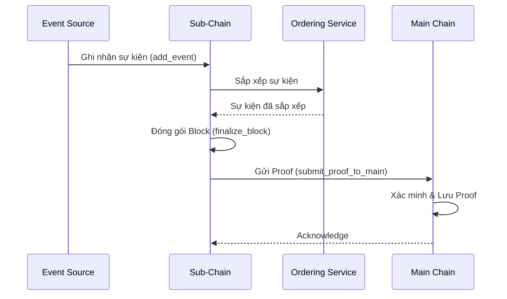

# Kiến trúc tổng quan

## Mục đích

Giới thiệu kiến trúc phân cấp (hierarchical) của HieraChain: Main Chain làm cơ quan gốc chỉ lưu bằng chứng (proof) từ các Sub-Chain; Sub-Chain xử lý dữ liệu nghiệp vụ (events) theo từng domain. Trang này giúp định vị vai trò từng thành phần và các luồng chính.

## Kiến trúc & khái niệm

* Sub-Chain chịu trách nhiệm ghi nhận Event domain, Ordering thành Block và duy trì World State nội bộ.
* Main Chain không lưu dữ liệu domain chi tiết; chỉ lưu Proof mật mã để đảm bảo tính toàn vẹn toàn hệ thống.
* HierarchyManager điều phối tạo/đăng ký Sub-Chain, gửi Proof, và các tác vụ vận hành liên quan đa chuỗi.

### Thành phần chính

* Main Chain: `hierachain/hierarchical/main_chain.py` — Lưu và xác minh proof từ Sub-Chain, tổng hợp báo cáo tính toàn vẹn.
* Sub-Chain: `hierachain/hierarchical/sub_chain.py` — Ghi nhận sự kiện domain, sắp xếp/đóng gói thành block, sinh proof và gửi lên Main Chain.
* Hierarchy Manager: `hierachain/hierarchical/hierarchy_manager.py` — Điều phối hệ thống đa chuỗi, quản lý vòng đời Sub-Chain, gửi proof tự động, kiểm chứng chéo.
* IPFS Storage (Off-chain): `hierachain/api/storage/ipfs_client.py` — Lưu trữ dữ liệu nghiệp vụ lớn hoặc nhạy cảm ngoài chuỗi, chỉ neo mã CID lên Blockchain.
* Ordering Service: `hierachain/consensus/ordering_service.py` — Thành phần sắp xếp sự kiện trước khi tạo block (được Sub-Chain tích hợp khởi tạo).

### Luồng tiêu biểu

1. Ghi Event → Tạo Block (Sub-Chain) — Event được `SubChain.add_event()` tiếp nhận, đưa qua Ordering nội bộ, gom vào Block và `finalize_block()` khi đủ điều kiện.
2. Gửi Proof lên Main Chain — `SubChain.submit_proof_to_main()` sinh Proof (ví dụ từ Merkle root/hash block), gửi `MainChain.add_proof()` để neo mốc.
3. Báo cáo toàn cục — Main Chain tổng hợp `get_main_chain_stats()` và thống kê cho từng Sub-Chain.
4. Điều phối hệ thống — `HierarchyManager` hỗ trợ gửi proof định kỳ (`configure_auto_proof_submission`), đồng bộ, và kiểm tra tính nhất quán liên chuỗi.

## Liên quan

* Bắt đầu nhanh: [Bắt đầu nhanh](../getting-started/quickstart.md)
* Thuật ngữ: [Thuật ngữ](../glossary.md)
* Mô-đun cốt lõi: [Core](../modules/core.md)

---

??? info "Thông tin kỹ thuật bổ sung (Metadata)"

    **FACT**

    * Main Chain: lớp `MainChain(Blockchain)` trong `hierarchical/main_chain.py` với các phương thức tiêu biểu:

        * `register_sub_chain(sub_chain_name, metadata)`
        * `add_proof(sub_chain_name, proof_hash, metadata, zk_proof=None)`
        * `verify_proof(proof_hash, sub_chain_name)`
        * `get_proofs_by_sub_chain(sub_chain_name)`
        * `finalize_main_chain_block()` và `get_hierarchical_integrity_report()`

    * Sub-Chain: lớp `SubChain(Blockchain)` trong `hierarchical/sub_chain.py` với các phương thức tiêu biểu:

        * `add_event(event)` → gom Event, Ordering và đóng Block
        * `submit_proof_to_main(main_chain, metadata_filter=None)`
        * `finalize_block()` và `stop()`
        * `_init_ordering_service()` tích hợp `consensus/ordering_service.py`

    * Điều phối: lớp `HierarchyManager` trong `hierarchical/hierarchy_manager.py`:

        * `create_sub_chain(name, domain_type, metadata=None)`
        * `submit_proof_to_main_chain(sub_chain_name)`
        * `configure_auto_proof_submission(enabled, interval=60.0)`
        * `validate_cross_chain_consistency()`

    **DECISION**

    * Phân tách dữ liệu: chi tiết domain ở Sub-Chain; Main Chain chỉ lưu Proof.
    * Tất cả tài liệu ưu tiên mô tả luồng kỹ thuật, tránh kể chuyện; dùng thuật ngữ nhất quán theo glossary.
    * Sử dụng Ordering Service để đảm bảo thứ tự Event trước khi đóng Block tại Sub-Chain.

    **ASSUMPTION**

    * Mạng và hạ tầng ổn định; có cơ chế retry/idempotency khi gửi proof.
    * Đồng hồ hệ thống đủ đồng bộ để timestamp không gây sai lệch kiểm toán.
    * Cấu hình bảo mật (MSP, API key, policy) được bật trong môi trường sản xuất.

    **INVARIANT**

    * Block đã commit là bất biến; mọi thay đổi phải thông qua block mới.
    * Proof gửi lên Main Chain phải có hash/merkle root xác định (deterministic) và xác minh được.
    * Main Chain không bao giờ lưu dữ liệu domain chi tiết; chỉ lưu proof và metadata liên quan.

    **EDGE CASES**

    * Mất kết nối mạng khi gửi proof: cần retry với idempotency; không tạo trùng bản ghi.
    * Sự kiện đến trễ/out-of-order: Ordering Service phải đảm bảo thứ tự hợp lệ trước khi đóng block.
    * Đồng bộ chéo chuỗi: lỗi consistency giữa Sub-Chain và Main Chain cần quy trình kiểm tra/khắc phục.
