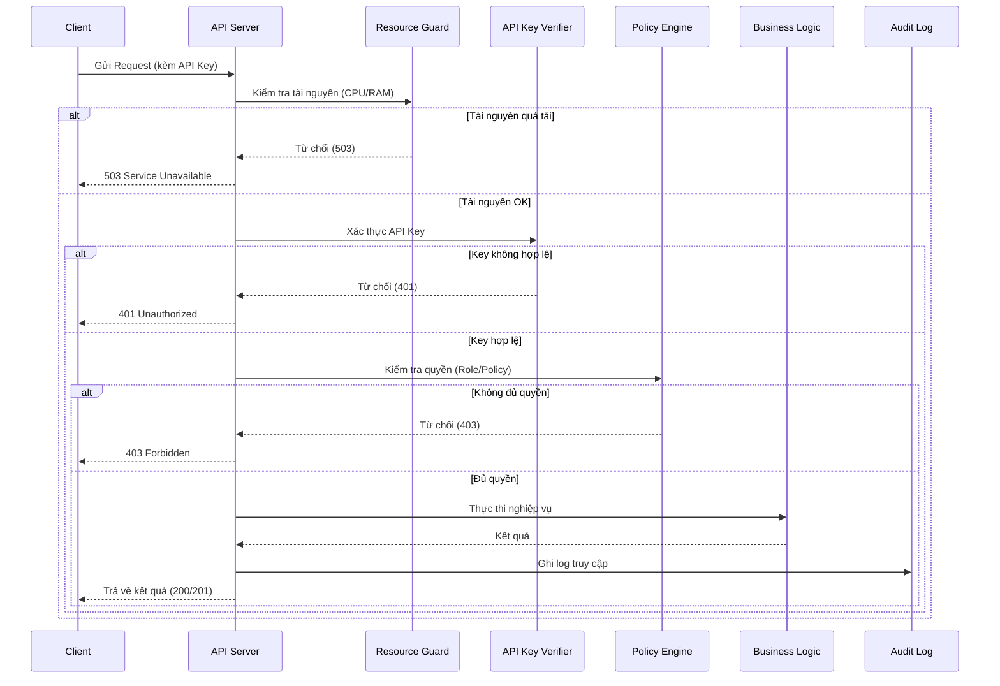

# Kiến trúc bảo mật

Trang này mô tả các cơ chế bảo mật ở tầng kiến trúc và cách chúng tích hợp vào HieraChain. Hệ thống tuân theo chiến lược bảo mật doanh nghiệp ngặt nghèo - một kiến trúc phòng thủ đa tầng vắt ngang qua toàn bộ vòng đời ứng dụng.

## Thành Bảo Mật phần chính

Kiến trúc phòng vệ được cấu thành từ 6 luồng chính phối hợp chặt chẽ:

* **Authorization & Access Control**: 
  * `hierachain/security/{msp.py, identity.py}` — quản lý Organization, User, Role, và PKI Identity.
  * `hierachain/security/policy_engine.py` — kiểm soát quyền (ABAC).
  * `hierachain/security/verify/api_key_verifier.py` — xác thực API key.
* **Lockdown & Logging**: 
  * `hierachain/security/secure_logging.py` — Tamper-evident log, che mờ dữ liệu PII.
  * `hierachain/cluster/cluster_lockdown_manager.py` — Phong tỏa (Lockdown) khẩn cấp bằng Quorum.
* **Fault-tolerance & Integrity**: 
  * `hierachain/security/resource_guard.py` — Lá chắn thép chống DoS/DDoS tải cao.
  * `hierachain/security/integrity.py` — Quét chữ ký checksum các tệp khởi động.
* **Risk Analyzer**: 
  * `hierachain/risk_management/risk_analyzer.py` — Theo dõi chỉ báo dị thường Z-score.
  * `hierachain/security/sanitization.py` — Chống injection đầu vào.
* **Encryption & Keys**: 
  * `hierachain/security/{key_manager.py, key_provider.py, key_backup_manager.py, certificate.py}` — AES-GCM, Ed25519 và vòng đời X.509 cho mTLS.
* **Decentralized Zero-Knowledge Proofs**: 
  * `hierachain/security/zk_prover.py` & `hierachain/security/verify/zk_verifier.py` — Triển khai Zero-Knowledge proofs cho Sub-Chains ẩn danh dữ liệu thật.

Cấu hình bảo mật hệ thống được bật/tắt linh hoạt tại `hierachain/config/settings.py` (AUTH, CORS, HSTS, rate limit…).

## Tích hợp vào hệ thống

* API Server (`hierachain/api/server.py`): chèn middleware (ví dụ `ResourceGuardMiddleware`) và xác thực API key nếu `AUTH_ENABLED=true`.
* Sub-Chain/Main Chain: mọi thao tác thay đổi trạng thái phải qua xác thực (khi bật AUTH) và được ghi vết để audit.
* Logging an toàn: `security/secure_logging.py`, `security/sanitization.py` giảm rò rỉ dữ liệu nhạy cảm.

## Cấu hình liên quan (trích)

Các biến trong `settings.py`:

* `AUTH_ENABLED`, `API_KEY_LOCATION`, `API_KEY_NAME`
* `CORS_ALLOW_ALL`, `CORS_ORIGINS`
* `HSTS_ENABLED`, `HSTS_MAX_AGE`
* `RATE_LIMIT_ENABLED`, `RATE_LIMIT_REQUESTS_PER_MINUTE`

## Luồng tiêu biểu

1. Request tới API → (tuỳ chọn) ResourceGuard kiểm tra CPU/RAM → xác thực API key → kiểm tra policy/role → thực thi → ghi audit.
2. Xử lý chữ ký/ZK: các sự kiện/giao dịch có chữ ký/ZK được xác minh bằng `verify/*` trước khi chấp nhận.

## Liên quan

* Mô‑đun Security: [Security](../modules/security.md)
* Tham chiếu Config: [Config](../reference/config.md)
* API v1: [API v1](../reference/api-v1.md)

---

??? info "Thông tin kỹ thuật bổ sung (Metadata)"

    **FACT**

    * `ResourceGuardMiddleware` từ chối request khi CPU/RAM vượt ngưỡng (503) — xem `security/resource_guard.py`.
    * `IdentityManager` quản lý org/user/role; xác minh chữ ký qua `security/verify/signature_verifier.py`.
    * Biến bảo mật được lấy từ env thông qua `config/settings.py`.

    **DECISION**

    * Bật AUTH/HSTS/CORS/Rate Limit ở môi trường production theo mặc định an toàn.
    * Dùng API key đơn giản (header `X-API-Key`) làm baseline; nâng cấp OAuth/mTLS tùy nhu cầu.

    **ASSUMPTION**

    * Đã có kênh phân phối/luân chuyển API key an toàn (secret manager).
    * Đồng hồ NTP đồng bộ để log/audit có thể đối chiếu chính xác.

    **INVARIANT**

    * Yêu cầu thay đổi trạng thái phải được xác thực/ủy quyền khi bật `AUTH_ENABLED`.
    * Log/audit không ghi lộ dữ liệu bí mật; mọi dữ liệu nhạy cảm được làm sạch (sanitize).

    **EDGE CASES**

    * API key bị lộ → cần cơ chế thu hồi/rotate; log/audit phải truy vết được.
    * DoS về tài nguyên → ResourceGuard chủ động từ chối; khuyến nghị rate limit ở edge/proxy.
