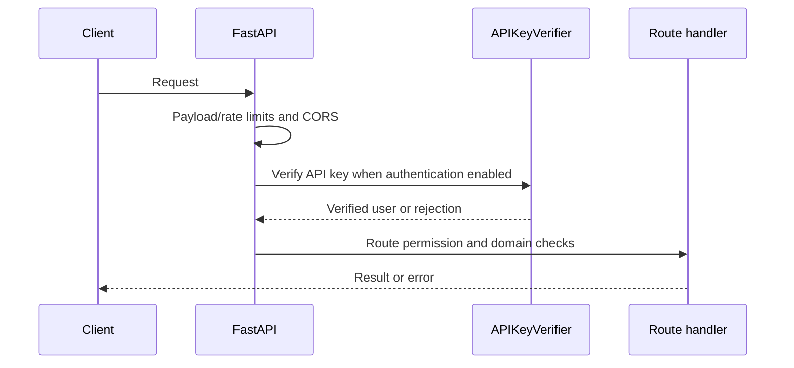

# Kiến trúc bảo mật

Trang này mô tả các cơ chế bảo mật và cách chúng được sử dụng trong kiến trúc HieraChain. Phạm vi của từng kiểm tra phụ thuộc vào luồng thực thi và cách caller tích hợp.

## Các trụ cột bảo mật chính

Phòng thủ được chia thành sáu nhóm phối hợp với nhau:

* Authorization và kiểm soát truy cập:

    * `hierachain/security/{msp.py, identity.py}` quản lý tổ chức, người dùng, vai trò và chứng chỉ nội bộ đơn giản.
    * `hierachain/security/policy_engine.py` xử lý kiểm soát quyền (ABAC).
    * `hierachain/security/verify/api_key_verifier.py` xử lý xác thực API key.

* Logging và tính toàn vẹn:

    * `hierachain/security/secure_logging.py` ghi log JSON có cấu trúc và che các trường nhạy cảm theo tên; nó không có cơ chế xác minh log bị sửa.
    * `hierachain/risk_management/audit_logger.py` ghi sự kiện kiểm toán vận hành và hỗ trợ xác minh bằng manifest đáng tin cậy được lưu riêng.

* Fault tolerance và tính toàn vẹn:

    * `hierachain/error_mitigation/{consensus_validator.py, resource_validator.py}` và `hierachain/cluster/lockdown_types.py` cung cấp validation, kiểm tra tài nguyên và HMAC lockdown. Không có `security/resource_guard.py` hay `security/integrity.py`, các đường dẫn này đã bị xóa hoặc chưa từng tồn tại.

* Làm sạch input:

    * `hierachain/security/sanitization.py` giúp ngăn injection bằng cách trung hòa HTML/template và áp allowlist cho tên file.

* Encryption và khóa:

    * `hierachain/security/{key_manager.py, key_provider.py}` và `hierachain/security/msp.py` (`Certificate`/`CertificateAuthority`) cung cấp hỗ trợ Ed25519 và `FileVaultProvider` (Fernet/PBKDF2, chỉ dùng cho dev). Không có `key_backup_manager.py` hay `certificate.py` và không có mTLS.

* Zero-knowledge proof phi tập trung:

    * `hierachain/security/zk_prover.py` và `hierachain/security/verify/zk_verifier.py` chỉ cung cấp mock phát triển. Tạo/xác minh ZK production chưa triển khai.

Xác thực, CORS và giới hạn tốc độ được cấu hình trong `hierachain/config/settings.py`. HSTS được khai báo ở đó nhưng không thêm HTTP header; hãy cấu hình HSTS tại reverse proxy HTTPS.

## Tích hợp vào hệ thống

* API Server (`hierachain/api/server.py`) dùng payload/rate-limit middleware, `CORSMiddleware` và `APIKeyVerifier` khi bật xác thực. Không có middleware kiểm tra CPU/RAM trên mọi request.
* Xác thực API key và scope áp dụng tại HTTP handler. Lời gọi Python trực tiếp cần caller tin cậy và không tự đi qua middleware HTTP; policy domain/channel được kiểm tra tại từng đường xử lý.
* Logging an toàn: `security/secure_logging.py` và `security/sanitization.py` giúp giảm rò rỉ dữ liệu nhạy cảm.

## Cấu hình liên quan (trích)

Các biến trong `settings.py` (đều dùng tiền tố `HRC_*`):

* `HRC_AUTH_ENABLED`, `HRC_API_KEY_LOCATION`, `HRC_API_KEY_NAME`
* `HRC_CORS_ALLOW_ALL`, `HRC_CORS_ORIGINS`
* `HRC_HSTS_ENABLED`, `HRC_HSTS_MAX_AGE`
* `HRC_RATE_LIMIT`, `HRC_RATE_LIMIT_RPM`, `HRC_RATE_LIMIT_BACKEND`, `HRC_TRUSTED_PROXIES`

## Luồng tiêu biểu

```mermaid
sequenceDiagram
    participant Client
    participant API as FastAPI
    participant Auth as APIKeyVerifier
    participant Handler as Route handler
    Client->>API: Request
    API->>API: Payload/rate limits and CORS
    API->>Auth: Verify API key when authentication enabled
    Auth-->>API: Verified user or rejection
    API->>Handler: Route permission and domain checks
    Handler-->>Client: Result or error
```

1. Giới hạn payload/rate và xác thực API key chạy ở API; kiểm tra scope/role phụ thuộc route. Rate-limit Redis lỗi trả 503 cho request không được miễn.
2. Block có chữ ký được kiểm tra bằng trusted key. ZK chỉ được kiểm tra khi bật cấu hình; mock không chứng minh tính đúng đắn nghiệp vụ.

## Liên quan

* Mô‑đun Security: [Security](../modules/security.md)
* Tham chiếu Config: [Config](../reference/config.md)
* API Ledger: [API Ledger](../reference/api-ledger.md)
