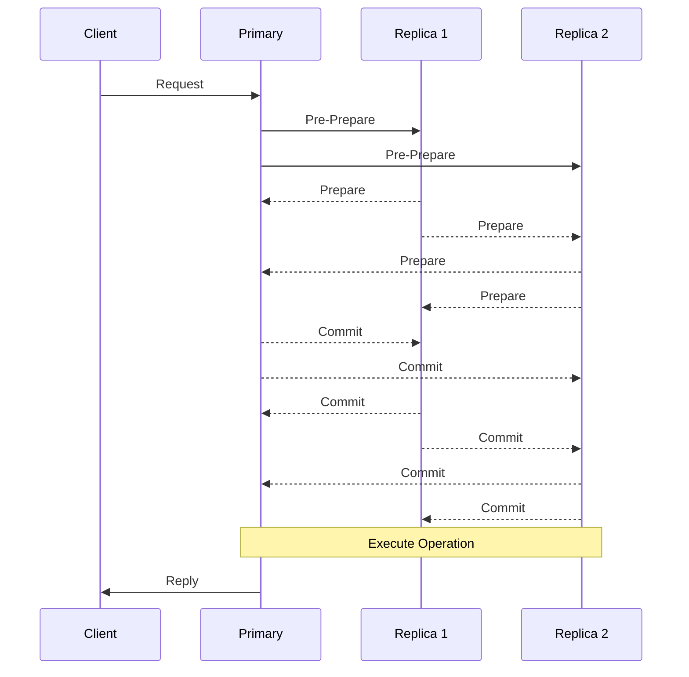

# BFT Consensus (`hierachain/consensus/bft/*`)

## Mục đích

BFT Consensus là cơ chế đồng thuận chịu lỗi Byzantine, cho phép hệ thống HieraChain hoạt động chính xác ngay cả khi có đến `f` nodes bị lỗi hoặc thực hiện hành vi độc hại, trong tổng số `3f + 1` nodes. Đoạn mã này tập trung cung cấp lõi bảo mật đồng thuận mạng ngang hàng.

## Kiến trúc & khái niệm

<div class="grid cards" markdown>

* :material-handshake:{ .lg .middle } __BFT Consensus__

    ---

    __File__: `hierachain/consensus/bft/consensus.py`

  * Lớp giao tiếp chính (`BFTConsensus`) xử lý vòng đời của đồng thuận PBFT.
  * Thực thi các pha: Pre-Prepare, Prepare, và Commit.
  * Đầu mối lưu và tiếp nhận Operation từ hệ thống vào quá trình bỏ phiếu.

* :material-security:{ .lg .middle } __Cryptographic Operations__

    ---

    __File__: `hierachain/consensus/bft/cryptographic.py`

  * Ký và xác minh chữ ký điện tử (`Ed25519`) cho Data payload.
  * Hash thông điệp nhằm tạo Proof xác thực dữ liệu bất biến.
  * Tích hợp thuật toán Zero-Knowledge Proof (ZK).

* :material-network:{ .lg .middle } __Network Transport__

    ---

    __File__: `hierachain/consensus/bft/network.py`

  * Chịu trách nhiệm truyền thông tin sử dụng ZeroMQ (ZMQ).
  * Hỗ trợ quảng bá `broadcast` P2P hoặc định tuyến `forward_to_primary`.

* :material-monitor-eye:{ .lg .middle } __View Manager__

    ---

    __File__: `hierachain/consensus/bft/view_manager.py`

  * Quản lý trạng thái Node và Timeout để kích hoạt luân chuyển Primary Node.
  * Tiến hành xác thực `validate_view_change_proof`.

* :material-code-tags:{ .lg .middle } __Types & Enums__

    ---

    __File__: `hierachain/consensus/bft/types.py`

  * Định nghĩa đối tượng lõi `BFTMessage` và enum trạng thái vòng đời BFT (`ConsensusState`, `MessageType`).

</div>

## Các thành phần chính

### 1. BFTConsensus (Main Class)

__File__: `hierachain/consensus/bft/consensus.py`

Lớp lõi thực thi chu trình BFT:

```python
from hierachain.consensus import BFTConsensus

bft = BFTConsensus(
    node_id="node_1",
    all_nodes=["node_1", "node_2", "node_3", "node_4"],  # 3f+1 = 4 → f=1
    key_pair=key_pair,
    chain=sub_chain,
    f=1,
    view_change_timeout=10.0
)

# Đẩy một operation vào chu trình đồng thuận
operation = {"entity_id": "order_001", "event_type": "CREATE_ORDER"}
bft.submit_operation(operation)
```

BFT chỉ commit operation khi đã thu được đủ `2f + 1` messages hợp lệ cho pha hiện tại.

### 2. BFT Cryptographic Operations

__File__: `hierachain/consensus/bft/cryptographic.py`

```python
from hierachain.consensus.bft.cryptographic import (
    sign_message,
    verify_message_signature,
    hash_request,
    verify_operation_zk_proof
)

# Ký xác nhận thông điệp để gửi ra Network
sign_message(message, key_provider)

# Xác minh lại thông điệp nhận từ Network qua Public Keys
is_valid = verify_message_signature(message, public_keys)
```

### 3. Network Transport

__File__: `hierachain/consensus/bft/network.py`

Giao tiếp với độ trễ cực thấp:

```python
from hierachain.consensus.bft import broadcast

# Quảng bá thông điệp BFT tới toàn bộ Endpoints cấu hình 
broadcast(
    sender_node=zmq_node,
    message=bft_message,
    all_node_endpoints=endpoints
)
```

### 4. View Change Manager

__File__: `hierachain/consensus/bft/view_manager.py`

```python
from hierachain.consensus.bft.view_manager import (
    validate_view_change_proof,
    start_view_change_timer
)

# Hệ thống tự động thiết lập view_change nếu time out xảy ra
# và đòi hỏi Proof bao hàm 2f+1 signatures
is_valid_proof = validate_view_change_proof(view=1, proof=proof_list, f=1, node_public_keys=keys,
                                            verify_sig_func=verify_message_signature)
```

## Luồng xử lý (Protocol Flow)



## Cấu hình

```python
BFT_CONFIG = {
    "f": 1,                          # Hệ số rủi ro chịu đựng được f < n/3
    "view_change_timeout": 10.0,     # Timeout Timeout để đổi Primary
    "message_timeout": 5.0,          # Khoảng chờ độ trễ Node
    "checkpoint_interval": 100,      # Block đánh dấu để giải phóng State
    "strictness": "high",            
    "enable_zk_proofs": False,       # Zero-Knowledge
}
```

## FAQ

!!! question "Làm sao để tích hợp BFT vào một Sub-Chain mới?"

    Bạn có thể khởi tạo instance của `BFTConsensus(...)` và truyền vào `SubChain(consensus=bft)` ở cấp độ quản lý Hierarchy. Sub-Chain sẽ nhường quyền chốt Block lại cho BFT xử lý tự động theo P2P.

!!! question "BFT khác PoF (Proof of Federation) như thế nào?"

    BFT chống lỗi phá hoại (từ chối dịch vụ hoặc thay đổi data, tốn nhiều Network băng thông). Trong khi PoF dựa trên xoay vòng và niềm tin, tốc độ nhanh hơn, nhưng nếu một node bị chi phối thì tính ổn định bị thao túng mạnh hơn bft.

## Liên quan

* Tổng quan kiến trúc: [Tổng quan](../architecture/overview.md)
* Cơ chế Consensus Core: [Base Consensus](base_consensus.md)
* Thuật ngữ: [Thuật ngữ](../glossary.md)

---

??? info "Thông tin kỹ thuật bổ sung (Metadata)"

    **FACT**

    * Mã nguồn thực thi thuộc nhóm: `hierachain/consensus/bft/*.py` (consensus, cryptographic, network, view_manager, types).
    * Network implementation chạy qua ZeroMQ dựa trên các hàm `send_via_zmq` và `broadcast` thay vì HTTP phổ thông.

    **DECISION**

    * Chia nhỏ logic BFT (thay vì dồn vào 1 file) để tuân thủ tính module hoá tốt hơn, giúp Network/Crypto độc lập ra khỏi State Machine Consensus.
    * Áp dụng PBFT (Practical Byzantine Fault Tolerance) làm công thức thiết kế. Yêu cầu `3f + 1` Node để kháng được `f` Node độc hại.
    * Template tài liệu Grid Cards (mkdocs material) áp dụng đồng nhất qua thư mục `ordering` / `bft`.

    **ASSUMPTION**

    * Network duy trì Partial Synchrony (Độ trễ có giới hạn trong vòng cho phép của View Timeout).
    * Đồng hồ tự duy trì sự đồng bộ ở khoảng NTP < 100ms.

    **INVARIANT**

    * Core BFT chỉ thực thi lệnh Execute Transaction khi xác nhận nhận đủ `2f + 1` Commit messages minh bạch từ các tham gia.
    * Sequence ID là tăng đơn điệu theo thời gian để chặn replay-attacks.

    **EDGE CASES**

    * View Change Collision: Nếu Node liên tục chuyển View do bị thao túng, mạng vẫn ưu tiên `NEW_VIEW` chứa tập hợp Valid Proof đúng của số lớn `2f + 1`.
    * Message cũ: BFT Dropped lập tức với Log Reject dành cho các Packet đến từ View hoặc Seq cũ hơn Session.
