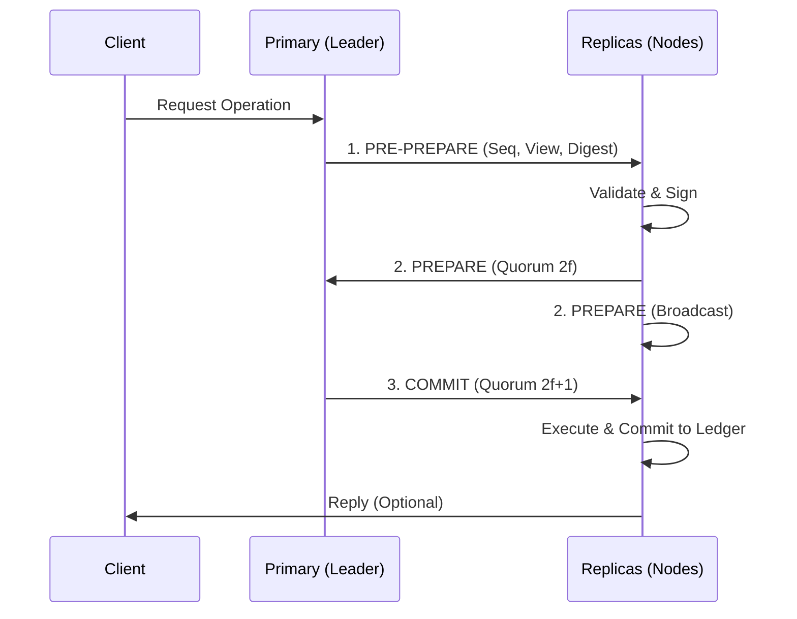

# BFT Consensus (`hierachain/consensus/bft/*`)

## Tổng quan

**BFT Consensus** là cơ chế đồng thuận chịu lỗi Byzantine cao cấp của HieraChain, cho phép hệ thống duy trì tính nhất quán ngay cả khi một phần các nút (`f`) bị lỗi hoặc có hành vi độc hại (phá hoại dữ liệu, từ chối dịch vụ). Hệ thống tuân thủ công thức `n >= 3f + 1`, đảm bảo an ninh tối đa cho các chuỗi Main Chain hoặc các liên minh doanh nghiệp (Consortium).

---

## Kiến trúc Module BFT

Hệ thống được chia nhỏ thành các thành phần chuyên biệt để đảm bảo tính module hóa và dễ bảo trì:

*   :material-gavel:{ .lg .middle } __BFT Engine__

    ---

    __File__: `consensus.py`

    Thực thi lõi giao thức **PBFT** với quy trình 3 pha (3-phase commit): **Pre-prepare**, **Prepare**, và **Commit**.

*   :material-refresh-circle:{ .lg .middle } __View Manager__

    ---

    __File__: `view_manager.py`

    Tự động phát hiện lỗi của nút Primary và kích hoạt quy trình **View Change** để bầu chọn Leader mới, đảm bảo hệ thống không bị dừng.

*   :material-swap-horizontal-bold:{ .lg .middle } __BFT Network__

    ---

    __File__: `network.py`

    Lớp truyền thông chuyên biệt sử dụng **ZeroMQ**, hỗ trợ quảng bá (Broadcast) và định tuyến thông điệp đồng thuận với độ trễ cực thấp.

*   :material-key-variant:{ .lg .middle } __BFT Crypto__

    ---

    __File__: `cryptographic.py`

    Xử lý ký số Ed25519, băm (Hashing) và xác thực bằng chứng **Zero-Knowledge (ZK)** cho từng thông điệp đồng thuận.

---

## Quy trình Đồng thuận PBFT (Protocol Flow)

Hệ thống yêu cầu sự đồng thuận của ít nhất `2f + 1` nút trước khi thực thi lệnh:

---

## Các cơ chế Bảo vệ Nâng cao

### 1. View Change Proof
Khi một nút nhận thấy Leader hiện tại không hoạt động (Timeout), nó sẽ yêu cầu thay đổi View. Quy trình này đòi hỏi bằng chứng (**Proof**) bao gồm ít nhất `2f + 1` chữ ký từ các nút khác, ngăn chặn việc đảo chính trái phép.

### 2. Sequence Number & Nonce
Mỗi thông điệp BFT đều có số thứ tự tăng dần và một giá trị ngẫu nhiên (Nonce) duy nhất để chống lại các cuộc tấn công phát lại (**Replay Attacks**).

### 3. ZK Integration
Hệ thống hỗ trợ xác thực bằng chứng Zero-Knowledge ngay trong pha `Pre-prepare`, cho phép kiểm tra tính hợp lệ của dữ liệu mà không cần tiết lộ nội dung chi tiết trong quá trình bầu chọn.

---

## Cấu hình BFT

| Tham số | Ý nghĩa | Mặc định |
| :--- | :--- | :--- |
| `f` | Số lượng lỗi tối đa có thể chịu đựng | `1` (Yêu cầu ít nhất 4 nodes) |
| `view_change_timeout` | Thời gian chờ Leader phản hồi | `30.0` giây |
| `strictness` | Mức độ kiểm tra chữ ký | `high` |
| `enable_zk_proofs` | Bật xác thực ZK trong BFT | `false` |

---

## Liên quan

*   [Mạng lưới P2P (Network)](../modules/network.md)
*   [Xác thực chữ ký (Security)](../security/encryption-keys.md)
*   [Dịch vụ sắp xếp (Ordering)](./ordering.md)
