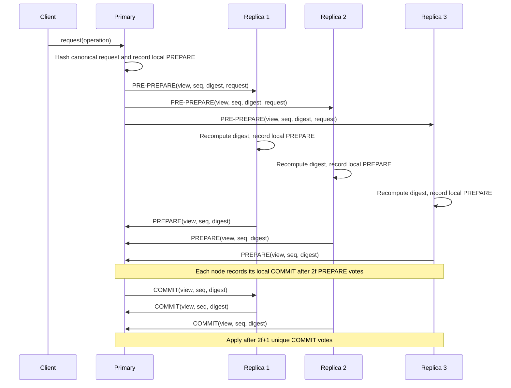

# Đồng thuận BFT (`hierachain/consensus/bft/*`)

## Phạm vi

`BFTConsensus` là thành phần thư viện riêng. MainChain và SubChain không khởi tạo nó; chạy nhiều nút API hoặc đặt `BFT_ENABLED` không nối PBFT vào các chuỗi đó. Bên gọi cung cấp khóa ký hoặc danh tính nút, khóa công khai nút đã được phê duyệt, truyền tải và tích hợp ứng dụng.

Hàm khởi tạo yêu cầu `n >= 3f + 1`, trong đó `n` là độ dài `all_nodes`. Khi `f=1`, cần bốn nút. Mọi nút phải thống nhất danh sách thành viên có thứ tự vì primary là `all_nodes[view % n]`.

## Thành phần

| Thành phần | Tệp | Trách nhiệm |
|:-----------|:----|:------------|
| `BFTConsensus` | `consensus.py` | Tiếp nhận yêu cầu, phân phối thông điệp và trạng thái đồng thuận |
| `BFTConsensusEngine` | `engine.py` | Xác thực PRE-PREPARE, phiếu các pha và ghi ứng dụng |
| `BFTViewChangeManager` | `view_change.py` | Thời gian chờ, phiếu VIEW-CHANGE và xác thực bằng chứng NEW-VIEW |
| `BFTMessageDispatcher` | `dispatcher.py` | Gửi qua nút ZeroMQ được cung cấp hoặc hàm gửi của bên gọi |
| Helper chữ ký và yêu cầu | `helpers.py`, `types.py` | Payload thông điệp có chữ ký, hash yêu cầu chuẩn hóa và kiểm tra ZK tùy chọn |

## Các pha PBFT

`request()` bắt đầu yêu cầu tại primary. Các nút khác chuyển tiếp qua hàm gửi đã cấu hình và trả về `False`; phản hồi `True` của primary xác nhận đã tiếp nhận, không xác nhận đã commit theo quorum.

Primary băm toàn bộ yêu cầu bằng `hierachain.serialization.dumps_canonical_json`. Replica tính lại digest trước khi chấp nhận PRE-PREPARE. Mã hóa chuẩn hóa sắp xếp trường, dùng dấu phân cách gọn và UTF-8 không escape, đồng thời giữ cách biểu diễn số hữu hạn của Python. Số không hữu hạn, dữ liệu vòng lặp và kiểu không được JSON hỗ trợ bị từ chối.

Mỗi nút ghi nhận đúng một phiếu PREPARE và COMMIT có chữ ký của mình trước khi phát. Phiếu được đếm theo bên gửi duy nhất, gồm phiếu cục bộ: `2f` phiếu PREPARE và `2f + 1` phiếu COMMIT. Phiếu các pha được theo dõi theo từng sequence ngay cả khi sequence khác thay đổi trạng thái đồng thuận hiển thị.

```mermaid
sequenceDiagram
    participant C as Client
    participant P as Primary
    participant R1 as Replica 1
    participant R2 as Replica 2
    participant R3 as Replica 3
    C->>P: request(operation)
    P->>P: Hash canonical request and record local PREPARE
    P->>R1: PRE-PREPARE(view, seq, digest, request)
    P->>R2: PRE-PREPARE(view, seq, digest, request)
    P->>R3: PRE-PREPARE(view, seq, digest, request)
    R1->>R1: Recompute digest, record local PREPARE
    R2->>R2: Recompute digest, record local PREPARE
    R3->>R3: Recompute digest, record local PREPARE
    R1->>P: PREPARE(view, seq, digest)
    R2->>P: PREPARE(view, seq, digest)
    R3->>P: PREPARE(view, seq, digest)
    Note over P,R3: Each node records its local COMMIT after 2f PREPARE votes
    P->>R1: COMMIT(view, seq, digest)
    R1->>P: COMMIT(view, seq, digest)
    R2->>P: COMMIT(view, seq, digest)
    Note over P,R3: Apply after 2f+1 unique COMMIT votes
```

## Áp dụng và thử lại

Khi có chuỗi ứng dụng được gắn vào, `chain.add_event()` thất bại sẽ giữ quorum COMMIT và cùng sự kiện trong bộ nhớ với `event_id` xác định. COMMIT hợp lệ được gửi lại sẽ thử ghi lại; `committed_sequence` chỉ tăng sau khi thành công. Quorum của yêu cầu sau được giữ và áp dụng liên tiếp từ sequence 1 sau khi các lần ghi trước thành công. Thông điệp gần đây được giữ; bước dọn dẹp loại các sequence cũ hơn committed sequence trên 100.

Khi không gắn chuỗi, thành phần ghi nhận commit giao thức mà không ghi sự kiện ứng dụng. Demo độc lập dùng chế độ này. Trạng thái thử lại không được lưu qua lần khởi động lại. Nếu backend đã lưu sự kiện rồi phát sinh lỗi, thử lại có thể ghi trùng trừ khi backend khử trùng theo `event_id`; `SubChain.add_event()` hiện không khử trùng bằng ID BFT này. Thành phần không bảo đảm áp dụng đúng một lần sau kết quả ghi không rõ ràng hoặc khởi động lại.

## Thay đổi view và giới hạn chống phát lại

Bộ hẹn giờ view change khởi xướng view mới khi hết thời gian. Primary mới được chọn từ danh sách nút có thứ tự, và view mới cần `2f + 1` chữ ký hợp lệ từ các nút khác nhau, gồm phiếu cục bộ nếu có.

Sequence theo dõi thứ tự yêu cầu; thông điệp ở các pha khác nhau có thể dùng cùng sequence. Nonce và timestamp của thông điệp được ký, nhưng luồng tiếp nhận không duy trì cache nonce để chống phát lại. Các bước kiểm tra chữ ký, tuổi thông điệp, view, sequence và pha được áp dụng; COMMIT hợp lệ lặp lại có thể chủ động thử áp dụng lại. Chỉ ký nonce không cung cấp cơ chế từ chối phát lại tổng quát.

## Kiểm tra ZK tùy chọn

`handle_pre_prepare()` gọi `verify_operation_zk_proof(message.data)` khi bật `HRC_ENABLE_ZK_PROOFS`. Xử lý bằng chứng thiếu dùng `HRC_ZK_REQUIRED_MAINCHAIN`. Helper đọc operation ở cấp trên cùng của dữ liệu thông điệp, còn `request()` đặt operation trong đối tượng request; helper không tự trích operation lồng bên trong. Không nên xem luồng này là bằng chứng mọi thao tác được tiếp nhận đều đã qua xác minh ZK. Mock proof là dữ liệu kiểm thử cho phát triển; tạo/xác minh production chưa được triển khai.

## Cấu hình

| Thiết lập | Vị trí | Mặc định |
|:-----------|:-------|:---------|
| `f` | Tham số hàm khởi tạo | `1` |
| `view_change_timeout` | Thuộc tính instance; hàm khởi tạo khởi chạy bộ hẹn giờ | `30.0` giây |
| `verification_strictness` | `error_config["consensus"]["bft"]["verification_strictness"]`; điều khiển việc từ chối thông điệp chậm | `high` |
| `HRC_ENABLE_ZK_PROOFS` | Thiết lập môi trường dùng chung với các luồng đồng thuận khác | `false` |
| `HRC_ZK_REQUIRED_MAINCHAIN` | Chính sách dùng chung cho bằng chứng thiếu | `false` |

Không có tùy chọn hàm khởi tạo BFT tên `enable_zk_proofs`. Nếu đổi timeout sau khi khởi tạo, hãy đặt lại bộ hẹn giờ view change để dùng khoảng thời gian mới. Gọi `shutdown()` khi đóng thành phần để hủy bộ hẹn giờ.

## Liên quan

* [Mạng](../modules/network.md)
* [Khóa và chữ ký](../security/encryption-keys.md)
* [Dịch vụ ordering](./ordering.md)
