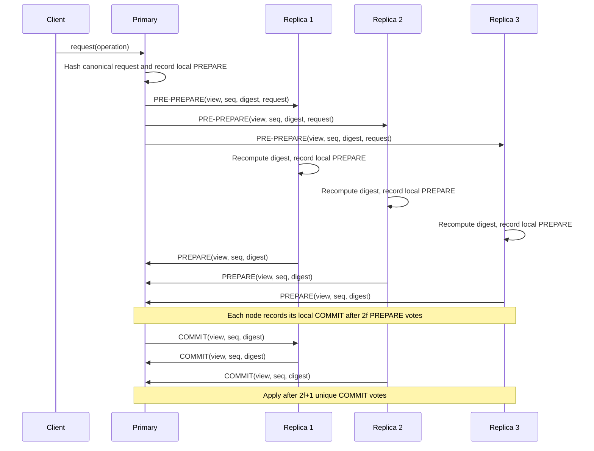

# BFT Consensus (`hierachain/consensus/bft/*`)

## Tổng quan

**BFT Consensus** là cơ chế đồng thuận chịu lỗi Byzantine của HieraChain. Giao thức dùng công thức `n >= 3f + 1` để chịu được tối đa `f` nút lỗi hoặc có hành vi độc hại như làm sai lệch dữ liệu hay từ chối dịch vụ. Triển khai này tách khỏi luồng runtime của MainChain và SubChain.

---

## Kiến trúc Module BFT

Module gồm các thành phần sau:

*   :material-gavel:{ .lg .middle } __BFT Engine__

    ---

    __Files__: `consensus.py`, `engine.py`

    `BFTConsensus.request()` khởi chạy các pha **PBFT**. `BFTConsensusEngine` xác thực PRE-PREPARE, ghi nhận phiếu bầu và áp dụng hoạt động đã cam kết khi thao tác ghi ứng dụng thành công.

*   :material-refresh-circle:{ .lg .middle } __View Manager__

    ---

    __File__: `view_change.py`

    Phát hiện khi nút Primary không phản hồi và kích hoạt **View Change** để bầu chọn Leader mới.

*   :material-swap-horizontal-bold:{ .lg .middle } __BFT Network__

    ---

    __File__: `dispatcher.py`

    Dùng **ZeroMQ** để quảng bá và định tuyến thông điệp đồng thuận.

*   :material-key-variant:{ .lg .middle } __BFT Crypto__

    ---

    __Files__: `helpers.py`, `types.py`

    Xử lý ký số Ed25519, băm (Hashing) và xác thực bằng chứng **Zero-Knowledge (ZK)** cho từng thông điệp đồng thuận.

---

## Quy trình Đồng thuận PBFT (Protocol Flow)

Thành phần BFT độc lập với luồng runtime MainChain và SubChain hiện tại. Demo và API thư viện sử dụng `BFTConsensus` một cách tường minh.

JSON chuẩn hóa của request dùng `json` chuẩn của Python thông qua `hierachain.serialization.dumps_canonical_json`. Định dạng digest BFT hiện có được giữ: sắp xếp trường, dấu phân cách gọn, văn bản UTF-8 không escape Unicode và cách biểu diễn số hữu hạn của Python. Số không hữu hạn, dữ liệu vòng lặp và kiểu không được JSON hỗ trợ bị từ chối.

```mermaid
sequenceDiagram
    participant C as Client
    participant P as Primary
    participant R1 as Replica 1
    participant R2 as Replica 2
    participant R3 as Replica 3
    C->>P: request(operation)
    P->>P: Hash canonical request and record local PREPARE
    P->>R1: PRE-PREPARE(view, seq, digest, request)

    P->>R2: PRE-PREPARE(view, seq, digest, request)
    P->>R3: PRE-PREPARE(view, seq, digest, request)
    R1->>R1: Recompute digest, record local PREPARE
    R2->>R2: Recompute digest, record local PREPARE
    R3->>R3: Recompute digest, record local PREPARE
    R1->>P: PREPARE(view, seq, digest)
    R2->>P: PREPARE(view, seq, digest)
    R3->>P: PREPARE(view, seq, digest)
    Note over P,R3: Each node records its local COMMIT after 2f PREPARE votes
    P->>R1: COMMIT(view, seq, digest)
    R1->>P: COMMIT(view, seq, digest)
    R2->>P: COMMIT(view, seq, digest)
    Note over P,R3: Apply after 2f+1 unique COMMIT votes
```

Primary băm toàn bộ request dưới dạng JSON chuẩn. Mỗi replica tính lại digest trước khi chấp nhận PRE-PREPARE, vì vậy thay đổi bất kỳ trường nào trong request mà vẫn giữ digest và chữ ký ban đầu sẽ bị từ chối. Digest được đưa vào thông điệp BFT đã ký.

Phiếu giai đoạn cục bộ được theo dõi theo từng sequence. Quorum PREPARE của một request đã nhận vẫn tạo được COMMIT cục bộ dù sequence khác đã thay đổi trạng thái consensus hiển thị.

Mỗi node ghi nhận đúng một phiếu PREPARE và COMMIT có chữ ký của chính mình trước khi phát phiếu. Quorum đếm các sender duy nhất, bao gồm phiếu cục bộ: `2f` phiếu PREPARE và `2f + 1` phiếu COMMIT.

Với node được gắn application chain, nếu `chain.add_event()` thất bại thì quorum COMMIT và event ổn định trong bộ nhớ, cùng event ID xác định, vẫn sẵn sàng để thử lại. Một COMMIT hợp lệ được gửi lại có thể ghi lại cùng event; node chỉ tăng `committed_sequence` sau khi ghi thành công. Thành phần không lưu trạng thái thử lại qua lần khởi động lại tiến trình. Các message gần đây được giữ lại; cleanup chỉ xóa message khi sequence cũ hơn committed sequence trên 100.

Khi không gắn application chain, BFT chạy ở chế độ chỉ đồng thuận và ghi nhận trạng thái consensus mà không ghi event ứng dụng. Demo độc lập sử dụng chế độ này.

Request sau không thể nâng committed sequence vượt qua request trước chưa áp dụng hoặc chưa nhận được. Việc áp dụng diễn ra liên tiếp từ sequence 1. Quorum đã nhận cho các request sau được giữ lại và thử áp dụng theo thứ tự sau khi thao tác ghi trước thành công. Trạng thái thử lại vẫn nằm trong bộ nhớ. Nếu backend đã lưu event rồi phát sinh lỗi, retry có thể ghi trùng trừ khi backend khử trùng bằng `event_id` ổn định; `SubChain.add_event()` hiện không dùng ID BFT này để khử trùng. Vì vậy thành phần không bảo đảm event được áp dụng đúng một lần khi kết quả ghi không rõ ràng hoặc qua restart.

---

## Các cơ chế Bảo vệ Nâng cao

### 1. View Change Proof
Khi một nút nhận thấy Leader hiện tại không hoạt động (Timeout), nó yêu cầu thay đổi View. View mới cần bằng chứng có ít nhất `2f + 1` chữ ký hợp lệ từ các node duy nhất, bao gồm phiếu cục bộ nếu có, nhằm ngăn chặn việc chiếm quyền trái phép.

### 2. Sequence Number & Nonce
Mỗi thông điệp BFT đều có số thứ tự tăng dần và một giá trị ngẫu nhiên (Nonce) duy nhất để chống lại các cuộc tấn công phát lại (**Replay Attacks**).

### 3. ZK Integration
Hệ thống hỗ trợ xác thực bằng chứng Zero-Knowledge ngay trong pha `Pre-prepare`, cho phép kiểm tra tính hợp lệ của dữ liệu mà không cần tiết lộ nội dung chi tiết trong quá trình bầu chọn.

---

## Cấu hình BFT

| Tham số | Ý nghĩa | Mặc định |
| :--- | :--- | :--- |
| `f` | Số lượng lỗi tối đa có thể chịu đựng | `1` (Yêu cầu ít nhất 4 nodes) |
| `view_change_timeout` | Thời gian chờ Leader phản hồi | `30.0` giây |
| `strictness` | Mức độ kiểm tra chữ ký | `high` |
| `enable_zk_proofs` | Bật xác thực ZK trong BFT | `false` |

---

## Liên quan

*   [Mạng lưới P2P (Network)](../modules/network.md)
*   [Xác thực chữ ký (Security)](../security/encryption-keys.md)
*   [Dịch vụ sắp xếp (Ordering)](./ordering.md)
