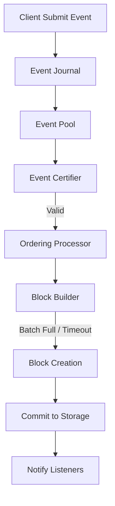

# Ordering Service (`hierachain/consensus/ordering/*`)

## Tổng quan

**Ordering Service** là thành phần trung tâm trong kiến trúc đồng thuận của HieraChain, chịu trách nhiệm nhận các sự kiện (Events) thô, sắp xếp chúng theo một thứ tự duy nhất và đóng thành khối (Blocks). Đây là cơ chế **Crash Fault Tolerance (CFT)**, đảm bảo hệ thống vẫn hoạt động ổn định khi một số nút bị sập.

---

## Kiến trúc Hệ thống

Ordering Service được thiết kế theo mô hình **Facade**, điều phối nhiều thành phần chuyên biệt:

| Thành phần | Vai trò | Tệp tin |
| :--- | :--- | :--- |
| **OrderingService** | Điểm truy cập chính, quản lý vòng đời và cấu hình. | `service.py` |
| **Processor** | Xử lý bất đồng bộ (Async), điều phối luồng sự kiện. | `processor.py` |
| **Block Builder** | Gom nhóm sự kiện (Batching) và xây dựng cấu trúc khối. | `block_builder.py` |
| **Certifier** | Xác thực chữ ký và quyền hạn của sự kiện trước khi sắp xếp. | `certifier.py` |
| **Storage** | Quản lý lưu trữ bền vững cho các sự kiện đang chờ (Pending). | `storage.py` |
| **Recovery** | Khôi phục trạng thái từ **Event Journal** sau sự cố. | `recovery.py` |

---

## Luồng xử lý Sự kiện (Ordering Pipeline)



---

## Các tính năng cốt lõi

### 1. Persistence & Durability (Tính bền vững)
Trước khi đưa vào hàng đợi xử lý, mọi sự kiện đều được ghi vào **Event Journal**. Nếu service bị dừng đột ngột, module `Recovery` sẽ đọc lại Journal để tái thiết lập trạng thái, đảm bảo không có dữ liệu nào bị mất.

### 2. Batching Strategy
Để tối ưu hiệu năng, Ordering Service không đóng khối cho từng sự kiện đơn lẻ mà sử dụng chiến lược gom nhóm:
*   `batch_size`: Số lượng sự kiện tối đa trong một khối (Mặc định: 100).
*   `batch_timeout`: Thời gian tối đa chờ đợi trước khi buộc phải đóng khối (Mặc định: 2.0 giây).

### 3. Event Certification
Module `Certifier` tích hợp chặt chẽ với hệ thống **Security** để kiểm tra:
*   Định dạng dữ liệu (Schema Validation).
*   Chữ ký số của node gửi (Identity Verification).
*   Quyền truy cập vào kênh (Policy Enforcement).

---

## Ví dụ sử dụng

```python
from hierachain.consensus.ordering.service import OrderingService

# Khởi tạo với cấu hình doanh nghiệp
config = {
    "batch_size": 200,
    "batch_timeout": 1.5,
    "storage_dir": "/data/ordering"
}

service = OrderingService(config=config)

# Gửi sự kiện vào hàng đợi
event_id = service.receive_event(
    event_data={"item": "container_45", "status": "shipped"},
    channel_id="logistics_chain",
    submitter_org="ORG_SUPPLY"
)
```

---

## Liên quan

*   [Hệ thống ghi nhật ký (Journal)](../modules/error-mitigation.md)
*   [Cấu trúc Khối (Block)](../modules/core.md)
*   [Đồng thuận BFT](./bft_consensus.md)
