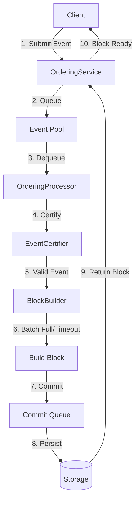

# Ordering module (`hierachain/consensus/ordering/*`)

## Mục đích

Ordering module đảm bảo thứ tự xác định (deterministic ordering) cho các Event trước khi đóng Block, cung cấp cơ chế Crash Fault Tolerance (CFT).

## Kiến trúc & khái niệm

<div class="grid cards" markdown>

* :material-sort-ascending:{ .lg .middle } __Ordering Service__

    ---

    __File__: `hierachain/consensus/ordering/service.py`

    * Điều phối các thành phần chuyên biệt để cung cấp chức năng ordering.
    * Quản lý event pool, pending events, và commit queue.
    * Tích hợp với TransactionJournal để đảm bảo persistence.

* :material-cube-outline:{ .lg .middle } __Block Builder__

    ---

    __File__: `hierachain/consensus/ordering/block_builder.py`

    * Gom batch Event theo cấu hình (batch_size, batch_timeout).
    * Tạo Block từ các Event đã được ordering.
    * Tính toán Merkle root và hash cho Block.

* :material-shield-check:{ .lg .middle } __Event Certifier__

    ---

    __File__: `hierachain/consensus/ordering/certifier.py`

    * Xác thực tính hợp lệ của Event (schema, signature, policy).
    * Kiểm tra quyền truy cập và ACL.
    * Tích hợp với Security module.

* :material-database-sync:{ .lg .middle } __Storage Handler__

    ---

    __File__: `hierachain/consensus/ordering/storage.py`

    * Quản lý persistence cho Ordering Service.
    * Lưu trữ pending events, metrics, và checkpoint.
    * Hỗ trợ recovery sau sự cố.

* :material-cog-sync:{ .lg .middle } __Ordering Processor__

    ---

    __File__: `hierachain/consensus/ordering/processor.py`

    * Xử lý logic phức tạp của ordering process.
    * Chạy trên background thread với asyncio.
    * Điều phối giữa certifier, block builder, và storage.

* :material-wrench:{ .lg .middle } __Maintenance__

    ---

    __File__: `hierachain/consensus/ordering/maintenance.py`

    * Quản lý lifecycle của Ordering Service.
    * Hỗ trợ maintenance mode, lockdown, và graceful shutdown.
    * Cleanup và garbage collection.

</div>

## Ordering Service

### API công khai (Public API)

__File__: `hierachain/consensus/ordering/service.py`

```python
from hierachain.consensus.ordering.service import OrderingService

# Khởi tạo Ordering Service
config = {
    "batch_size": 100,
    "batch_timeout": 2.0,
    "storage_dir": "./ordering_data",
    "enable_persistence": True
}
ordering_service = OrderingService(config=config, nodes=nodes)

# Submit event để ordering
event_id = ordering_service.receive_event(
    event_data={"entity_id": "ORDER-001", "action": "create"},
    channel_id="supply_chain",
    submitter_org="org1"
)

# Lấy block đã commit
block = ordering_service.get_committed_block()

# Lifecycle management
ordering_service.maintenance.enter_maintenance()
ordering_service.maintenance.exit_maintenance()
ordering_service.shutdown()
```

### Các thành phần chính

#### 1. OrderingService (Facade)

__File__: `hierachain/consensus/ordering/service.py`

Facade pattern điều phối các thành phần:

```python
class OrderingService:
    def __init__(config, nodes=None)
    def receive_event(event_data, channel_id, submitter_org) -> event_id
    def get_committed_block() -> Block | None
    def get_metrics() -> dict
    def shutdown()
```

__[INVARIANT]__ Ordering Service đảm bảo thứ tự xác định cho tất cả Events trong cùng channel.

#### 2. BlockBuilder

__File__: `hierachain/consensus/ordering/block_builder.py`

```python
class BlockBuilder:
    def __init__(config)
    def add_event(event: PendingEvent) -> bool
    def should_cut_block() -> bool
    def build_block() -> Block
    def reset()
```

Gom batch Events theo:

* `batch_size`: Số lượng events tối đa trong một block
* `batch_timeout`: Thời gian tối đa chờ đợi trước khi cut block

#### 3. EventCertifier

__File__: `hierachain/consensus/ordering/certifier.py`

```python
class EventCertifier:
    def certify_event(event: PendingEvent) -> bool
    def validate_schema(event_data) -> bool
    def verify_signature(event: PendingEvent) -> bool
    def check_policy(event: PendingEvent) -> bool
```

Xác thực Event trước khi đưa vào ordering pool.

#### 4. OrderingProcessor

__File__: `hierachain/consensus/ordering/processor.py`

```python
class OrderingProcessor:
    def __init__(service: OrderingService)
    async def run_async()
    async def process_events()
    async def commit_blocks()
```

Background processor chạy async để:

* Lấy events từ pool
* Certify events
* Build blocks
* Commit blocks

#### 5. OrderingStorageHandler

__File__: `hierachain/consensus/ordering/storage.py`

```python
class OrderingStorageHandler:
    def __init__(config)
    def save_pending_events(events: dict)
    def load_pending_events() -> dict
    def save_checkpoint(data: dict)
    def load_checkpoint() -> dict
```

#### 6. OrderingMaintenance

__File__: `hierachain/consensus/ordering/maintenance.py`

```python
class OrderingMaintenance:
    def __init__(service: OrderingService)
    def enter_maintenance()
    def exit_maintenance()
    def enter_lockdown()
    def exit_lockdown()
    def graceful_shutdown()

#### 7. Recovery

**File**: `hierachain/consensus/ordering/recovery.py`

Cơ chế khôi phục trạng thái sau khi node bị dừng đột ngột:

```python
from hierachain.consensus.ordering.recovery import OrderingRecovery

recovery = OrderingRecovery(service)

# Kiểm tra xem có cần recovery không
if recovery.needs_recovery():
    # Khôi phục các event chưa được đóng block từ Journal
    recovered_count = recovery.perform_recovery()
    print(f"Recovered {recovered_count} events from journal")
```

Cơ chế này đảm bảo tính bền vững (durability) bằng cách đọc lại `TransactionJournal` và tái lập `pending_events` pool.
```

### Luồng xử lý (Flow)



Normal Operation:

1. Client submit Event → `receive_event()`
2. Event validation → Generate event_id
3. Create PendingEvent → Add to event_pool
4. Background processor dequeue → Certify event
5. Valid event → Add to BlockBuilder
6. BlockBuilder checks `should_cut_block()`
7. Cut block → `build_block()` → Add to commit_queue
8. Commit block → Persist to storage
9. Return block to client

### Metrics và Monitoring

__File__: `hierachain/consensus/ordering/metrics.py`

```python
from hierachain.consensus.ordering.metrics import OrderingMetrics

metrics = OrderingMetrics()

# Record operations
metrics.record_received()
metrics.record_certified()
metrics.record_block_created()
metrics.record_committed()

# Get metrics
stats = metrics.get_stats()
# {
#   "received": 1000,
#   "certified": 995,
#   "blocks_created": 10,
#   "committed": 10,
#   "throughput": 500.0  # events/sec
# }
```

### Cấu hình

```python
ORDERING_CONFIG = {
    "batch_size": 100,              # Max events per block
    "batch_timeout": 2.0,            # Max wait time (seconds)
    "storage_dir": "./ordering_data",
    "enable_persistence": True,
    "certifier": {
        "require_signature": True,
        "validate_schema": True,
        "check_policy": True
    },
    "processor": {
        "poll_interval": 0.1,        # Event polling interval
        "max_concurrent": 10          # Max concurrent processing
    }
}
```

## FAQ

!!! question "Khi nào dùng Ordering Service, khi nào dùng BFT?"

    - **Ordering Service**: Môi trường đáng tin cậy, single-org, hoặc consortium với trust
    - **BFT Consensus**: Môi trường không tin cậy, multi-org, Byzantine threat model

!!! question "Có thể kết hợp Ordering và BFT không?"

    Có, BFT có thể sử dụng Ordering Service làm backend để ordering events trước khi consensus.

!!! question "Ordering Service có đảm bảo fault tolerance không?"

    Ordering Service cung cấp crash fault tolerance (CFT) qua persistence và recovery. Không chịu Byzantine faults.

## Liên quan

* Kiến trúc Consensus: [Consensus & Ordering](../architecture/consensus.md)
* Hierarchical module: [Hierarchical](../modules/hierarchical.md)
* Error Mitigation: [Error Mitigation](../modules/error-mitigation.md)
* Thuật ngữ: [Thuật ngữ](../glossary.md)

---

??? info "Thông tin kỹ thuật bổ sung (Metadata)"

    **FACT**

    - Ordering Service: `hierachain/consensus/ordering/*.py` (service, block_builder, certifier, processor, storage, maintenance, metrics, types, utils)
    - BFT Consensus: `hierachain/consensus/bft/*.py` (consensus, cryptographic, network, view_manager, types)
    - Ordering Service sử dụng facade pattern với các thành phần chuyên biệt
    - BFT implementation theo PBFT protocol với 3-phase commit

    **DECISION**

    - Ordering Service dùng asyncio cho background processing để tối ưu throughput
    - BFT dùng ZMQ cho network transport vì low latency và reliability
    - Tách biệt Ordering (CFT) và BFT để developer chọn trade-off phù hợp

    **ASSUMPTION**

    - Ordering Service: Network đáng tin cậy, không có Byzantine nodes
    - BFT: Network có bounded delays (partial synchrony), tối đa f < n/3 Byzantine nodes
    - Đồng hồ hệ thống đồng bộ đủ tốt (< 100ms skew)

    **INVARIANT**

    - Ordering Service: Events trong cùng channel có thứ tự xác định
    - BFT: Operations chỉ commit khi đạt quorum 2f+1
    - Block đã commit là immutable

    **EDGE CASES**

    - Ordering Service: Event pool overflow → backpressure mechanism
    - BFT: Concurrent view changes → only accept valid NEW_VIEW with proof
    - Network partition → Ordering service pause; BFT may trigger view change
