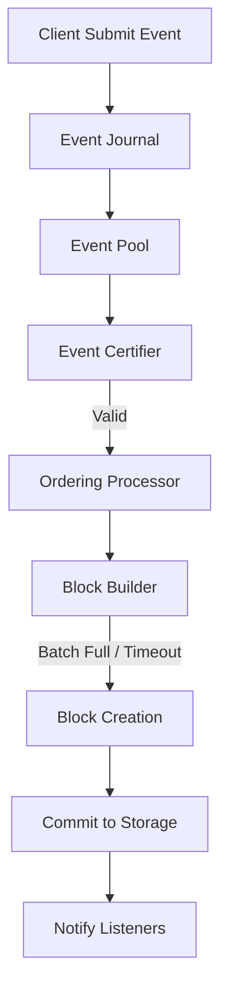

# Ordering Service (`hierachain/consensus/ordering/*`)

## Tổng quan

**Ordering Service** là thành phần trung tâm trong kiến trúc đồng thuận của HieraChain, chịu trách nhiệm nhận các sự kiện (Events) thô, sắp xếp chúng theo một thứ tự duy nhất và đóng thành khối (Blocks). Đây là cơ chế **Crash Fault Tolerance (CFT)**, đảm bảo hệ thống vẫn hoạt động ổn định khi một số nút bị sập.

---

## Kiến trúc Hệ thống

Ordering Service được thiết kế theo mô hình **Facade**, điều phối nhiều thành phần chuyên biệt:

| Thành phần | Vai trò | Tệp tin |
| :--- | :--- | :--- |
| **OrderingService** | Điểm truy cập chính, quản lý vòng đời và cấu hình. | `service.py` |
| **Processor** | Xử lý bất đồng bộ (Async), điều phối luồng sự kiện. | `processor.py` |
| **Block Builder** | Gom nhóm sự kiện (Batching) và xây dựng cấu trúc khối. | `block_builder.py` |
| **Certifier** | Xác thực chữ ký và quyền hạn của sự kiện trước khi sắp xếp. | `certifier.py` |
| **Storage** | Quản lý lưu trữ bền vững cho các sự kiện đang chờ (Pending). | `storage.py` |
| **Recovery** | Khôi phục trạng thái từ **Event Journal** sau sự cố. | `recovery.py` |

---

## Luồng xử lý Sự kiện (Ordering Pipeline)


```mermaid
graph TD
    A[Client Submit Event] --> B[Event Journal]
    B --> C[Event Pool]
    C --> D[Event Certifier]
    D -- Valid --> E[Ordering Processor]
    E --> F[Block Builder]
    F -- Batch Full / Timeout --> G[Block Creation]
    G --> H[Commit to Storage]
    H --> I[Notify Listeners]
```

---

## Các tính năng cốt lõi

### 1. Persistence & Durability (Tính bền vững)
Sự kiện được ghi đồng bộ vào **Event Journal** và fsync trước khi được đưa vào hàng đợi. Fsync luôn được bật và không thể tắt qua cấu hình. Khi khởi động lại, `Recovery` replay các entry journal và ghi các event đã khôi phục vào block storage trước khi Ordering Service hoạt động. Frame cuối chưa hoàn chỉnh trong journal đang hoạt động sẽ bị cắt bỏ trước khi mở file để ghi tiếp. Frame hoàn chỉnh nhưng chứa Arrow data lỗi khiến recovery thất bại; lỗi replay, chứng thực hoặc xử lý block giữ service ở trạng thái `MAINTENANCE` thay vì kích hoạt khi còn thiếu event.

Endpoint `GET /api/ledger/ready` trả HTTP 200 chỉ khi Ordering Service của mọi Sub-Chain đã đăng ký ở trạng thái `ACTIVE`; endpoint trả HTTP 503 khi bất kỳ service nào còn đang recovery hoặc ở trạng thái maintenance.

`lockdown()` chờ commit đang chạy hoàn tất, sau đó chặn commit tiếp theo và sự kiện mới cho đến khi gọi `resume()`. Sự kiện trong hàng đợi và batch đã cắt được giữ để xử lý khi resume; journal vẫn được giữ để phục hồi sau crash. Hoàn tất recovery không ghi đè `LOCKDOWN`, và `resume()` không thể kích hoạt lại service đã dừng.

### 2. Batching Strategy
Nhận vào hàng đợi chờ tối đa `enqueue_timeout` giây (mặc định `1.0`, cho phép giá trị lớn hơn zero đến `60`). Hàng đợi đầy hoặc shutdown gây `OrderingBackpressureError`, mang `event_id` và `journaled`. Event mới giữ chỗ trước khi ghi, nên bị từ chối tại bước này có `journaled=False`. Đưa lại event đã bền vững vào hàng đợi báo `journaled=True` và có thể thử lại cùng ID mà không ghi thêm entry. `POST /api/ledger/chains/{chain_name}/events` chuyển lỗi này thành HTTP 503 với các trường trên trong `detail`. Shutdown đánh thức producer đang chờ. Nhận event giữ condition của hàng đợi xuyên suốt fsync; độ trễ đĩa vì vậy cũng làm consumer chờ.

Để tối ưu hiệu năng, Ordering Service không đóng khối cho từng sự kiện đơn lẻ mà sử dụng chiến lược gom nhóm:
*   `OrderingService` khởi tạo trực tiếp mặc định dùng `batch_size=100` và `batch_timeout=2.0` giây.
*   SubChain mặc định dùng `block_size=50` và `batch_timeout=1.0` giây; cấu hình riêng có thể thay đổi hai giá trị này.

### 3. Event Certification
Module `Certifier` tích hợp chặt chẽ với hệ thống **Security** để kiểm tra:
*   Định dạng dữ liệu (Schema Validation).
*   Chữ ký số của node gửi (Identity Verification).
*   Quyền truy cập vào kênh (Policy Enforcement).

Certifier mặc định giữ 10.000 kết quả gần nhất (`EventCertifier(max_history=...)`). Event bị từ chối được xóa khỏi pending map. Sau khi kết quả bị loại khỏi cache, `get_event_status()` tra storage bền vững cho event đã commit và trả `ordered` không kèm kết quả certification; event bị từ chối từ lâu có thể trả `None`. Lịch sử này không phải bằng chứng certification bền vững.

---

## Ví dụ sử dụng

```python
from hierachain.consensus.ordering.service import OrderingService

# Initialize with enterprise configuration
config = {
    "batch_size": 200,
    "batch_timeout": 1.5,
    "storage_dir": "/data/ordering"
}

service = OrderingService(config=config)

# Submit event; the returned ID acknowledges journaling and enqueueing, not block finality
event_id = service.receive_event(
    event_data={"item": "container_45", "status": "shipped"},
    channel_id="logistics_chain",
    submitter_org="ORG_SUPPLY"
)
```

---

## Quyền sở hữu journal cục bộ

Mỗi đường dẫn journal cục bộ chỉ có một instance/process sở hữu tại một thời điểm, được bảo vệ bằng POSIX advisory writer lock không chờ. Owner thứ hai không mở được journal cho đến khi owner đầu đóng hoặc thoát; guard này không biến journal thành log nhiều writer dùng chung. Các thread phải dùng chung một instance `TransactionJournal`. Writer độc lập cần node identity và thư mục lưu trữ riêng, hoặc volume riêng trên filesystem hỗ trợ POSIX lock và directory fsync. Mẫu PVC theo từng pod của Kubernetes StatefulSet giúp tách journal giữa các node. Cần nâng cấp mọi process dùng đường dẫn đó trước khi ghi format journal mới; phiên bản cũ chưa lấy writer lock.

## Liên quan

*   [Hệ thống ghi nhật ký (Journal)](../modules/error-mitigation.md)
*   [Cấu trúc Khối (Block)](../modules/core.md)
*   [Đồng thuận BFT](./bft_consensus.md)
