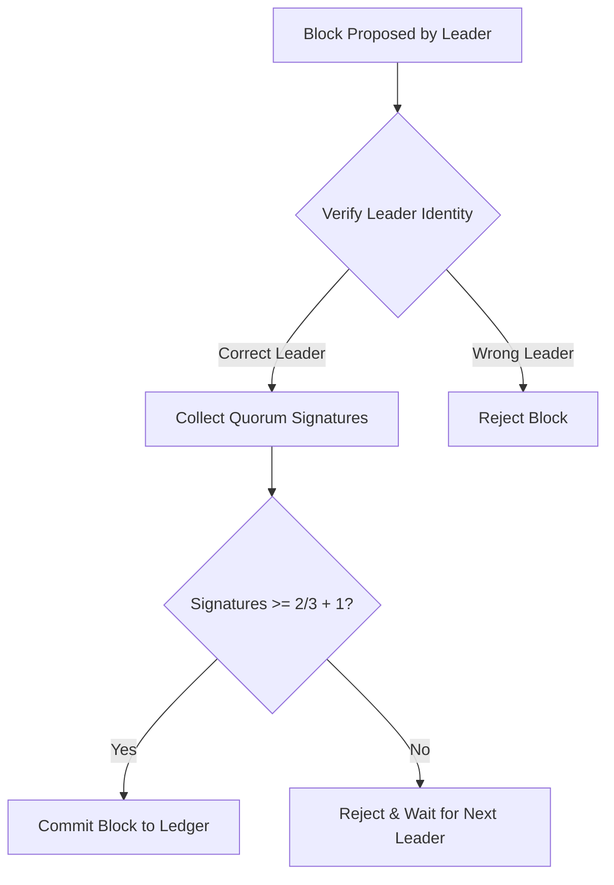

# Proof of Federation (`hierachain/consensus/proof_of_federation.py`)

## Tổng quan

**Proof of Federation (PoF)** là giao thức đồng thuận liên chuỗi (**Inter-MainChain**) được thiết kế dành riêng cho các mạng liên minh tổ chức (**Consortium Alliance**). PoF cho phép nhiều tổ chức độc lập (ví dụ: Bệnh viện A, Bệnh viện B, Bảo hiểm Z)—mỗi bên tự vận hành một MainChain riêng—có thể trao đổi, xác thực và đạt được đồng thuận trên các bằng chứng sự kiện liên tổ chức **mà không cần một RootChain trung tâm hay một thẩm quyền tối cao nào cai trị**.

---

## Vị trí Kiến trúc: PoA và PoF

| Cơ chế Đồng thuận | Phạm vi & Mục đích | Tầng Áp dụng & Mô hình Quản trị |
| :--- | :--- | :--- |
| **Proof of Authority (PoA)** | **Nội bộ Tổ chức** (Các Sub-Chain nghiệp vụ nội bộ) | **Tầng SubChain** (Mặc định cho mọi sự kiện nội bộ; kiểm soát đơn quyền) |
| **Proof of Federation (PoF)** | **Liên minh Đa Tổ chức** (Mạng liên kết MainChain P2P) | **Tầng MainChain** (Cấu hình qua `HRC_MAINCHAIN_CONSENSUS=proof_of_federation` cho liên minh đa bên) |

---

## Cơ chế Hoạt động

PoF sử dụng mô hình luân phiên liên bang ngang hàng kết hợp với xác thực đa chữ ký:
1.  **Xoay vòng Lãnh đạo (Leader Rotation)**: Leader có quyền đề xuất khối liên minh cho mỗi lượt được xác định bằng công thức toán học: `Leader = Validators[BlockIndex % TotalValidators]`. Điều này ngăn chặn bất kỳ MainChain nào thao túng độc quyền lượt tạo khối.
2.  **Biểu quyết Quorum**: Để một khối sự kiện liên tổ chức được xác nhận hợp lệ giữa các MainChain độc lập, nó cần đa chữ ký xác thực từ một ngưỡng tối thiểu các thành viên liên minh (thường là **2/3 + 1**).
3.  **Danh sách Validator Sắp xếp**: Danh sách các MainChain tham gia được tự động sắp xếp đồng bộ trên tất cả các nút để đảm bảo tính nhất quán của lịch trình tạo khối.

---

## Các tính năng nổi bật

*   :material-account-group:{ .lg .middle } __Quản trị Đa phương__

    ---

    Loại bỏ điểm yếu tập trung (Single Point of Failure). Nếu Leader hiện tại gặp sự cố, quyền tạo khối sẽ tự động chuyển cho nút tiếp theo trong chu kỳ.

*   :material-vote-outline:{ .lg .middle } __Biểu quyết Quorum__

    ---

    Cung cấp lớp bảo mật bổ sung bằng cách yêu cầu sự đồng thuận của đa số tổ chức thành viên trước khi chốt dữ liệu.

*   :material-scale-balance:{ .lg .middle } __Công bằng & Minh bạch__

    ---

    Mỗi tổ chức thành viên đều có cơ hội đóng góp và kiểm soát sổ cái ngang hàng nhau thông qua lịch trình được định sẵn.

---

## Tham số cấu hình

| Tham số | Ý nghĩa | Mặc định |
| :--- | :--- | :--- |
| `min_validators` | Số lượng nút tối thiểu để mạng hoạt động. | `3` |
| `block_interval` | Chu kỳ tạo khối mục tiêu. | `5.0` giây |
| `enforce_rotation` | Bắt buộc xoay vòng leader sau mỗi khối. | `True` |

---

## Luồng Xác thực Khối

---

## Ưu điểm và Hạn chế

*   **Ưu điểm**: Phù hợp cho mạng liên minh đa bên, chống lại sự chi phối của một nhóm nhỏ, tính sẵn sàng cao.
*   **Hạn chế**: Tốn thêm băng thông mạng để thu thập chữ ký Quorum so với PoA, hiệu năng giảm nhẹ khi số lượng Validator tăng quá lớn.

---

## Liên quan

*   [Đồng thuận dựa trên thẩm quyền (PoA)](./poa.md)
*   [Kiến trúc mạng P2P](../modules/network.md)
*   [Hệ thống bảo mật (Security)](../security/authorization-access-control.md)
