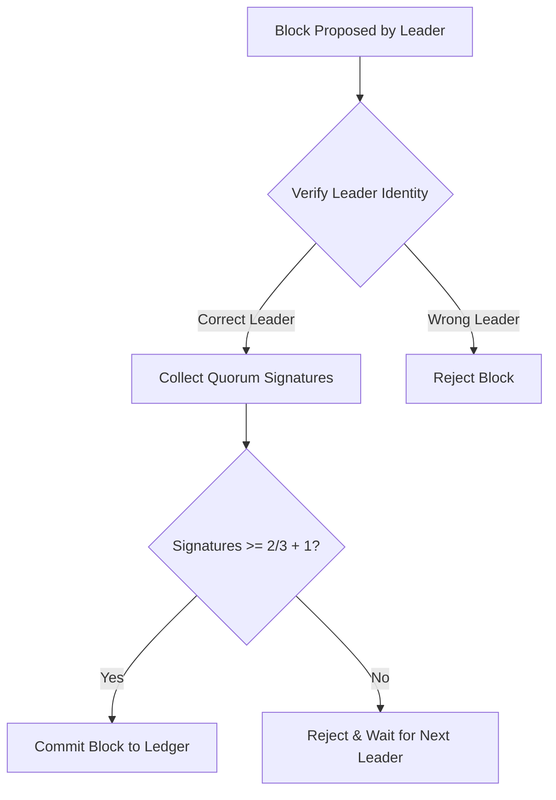

# Proof of Federation (`hierachain/consensus/proof_of_federation.py`)

## Tổng quan

**Proof of Federation (PoF)** là giao thức đồng thuận được thiết kế dành riêng cho các mạng liên minh (**Consortium**), nơi nhiều tổ chức (ngân hàng, bệnh viện, đối tác cung ứng) cùng tham gia quản trị mà không có một đơn vị nào nắm quyền kiểm soát tuyệt đối. PoF kết hợp tính hiệu năng của PoA với tính bảo mật của cơ chế biểu quyết số đông (Quorum).

---

## Cơ chế Hoạt động

PoF sử dụng mô hình luân phiên kết hợp với xác thực đa chữ ký:
1.  **Xoay vòng Lãnh đạo (Leader Rotation)**: Leader có quyền đề xuất khối được xác định bằng công thức toán học xác định: `Leader = Validators[BlockIndex % TotalValidators]`. Điều này ngăn chặn bất kỳ nút nào chiếm quyền điều hành vĩnh viễn.
2.  **Biểu quyết Quorum**: Để một khối được coi là hợp lệ, nó không chỉ cần chữ ký của Leader mà còn cần sự xác nhận của một số lượng nút tối thiểu trong liên minh (thường là **2/3 + 1**).
3.  **Danh sách Validator Sắp xếp**: Danh sách các nút tham gia được tự động sắp xếp theo ID để đảm bảo tính nhất quán của lịch trình tạo khối trên toàn mạng lưới.

---

## Các tính năng nổi bật

*   :material-account-group:{ .lg .middle } __Quản trị Đa phương__

    ---

    Loại bỏ điểm yếu tập trung (Single Point of Failure). Nếu Leader hiện tại gặp sự cố, quyền tạo khối sẽ tự động chuyển cho nút tiếp theo trong chu kỳ.

*   :material-vote-outline:{ .lg .middle } __Biểu quyết Quorum__

    ---

    Cung cấp lớp bảo mật bổ sung bằng cách yêu cầu sự đồng thuận của đa số tổ chức thành viên trước khi chốt dữ liệu.

*   :material-scale-balance:{ .lg .middle } __Công bằng & Minh bạch__

    ---

    Mỗi tổ chức thành viên đều có cơ hội đóng góp và kiểm soát sổ cái ngang hàng nhau thông qua lịch trình được định sẵn.

---

## Tham số cấu hình

| Tham số | Ý nghĩa | Mặc định |
| :--- | :--- | :--- |
| `min_validators` | Số lượng nút tối thiểu để mạng hoạt động. | `3` |
| `block_interval` | Chu kỳ tạo khối mục tiêu. | `5.0` giây |
| `enforce_rotation` | Bắt buộc xoay vòng leader sau mỗi khối. | `True` |

---

## Luồng Xác thực Khối

---

## Ưu điểm và Hạn chế

*   **Ưu điểm**: Phù hợp cho mạng liên minh đa bên, chống lại sự chi phối của một nhóm nhỏ, tính sẵn sàng cao.
*   **Hạn chế**: Tốn thêm băng thông mạng để thu thập chữ ký Quorum so với PoA, hiệu năng giảm nhẹ khi số lượng Validator tăng quá lớn.

---

## Liên quan

*   [Đồng thuận dựa trên thẩm quyền (PoA)](./poa.md)
*   [Kiến trúc mạng P2P](../modules/network.md)
*   [Hệ thống bảo mật (Security)](../security/auth-access.md)
