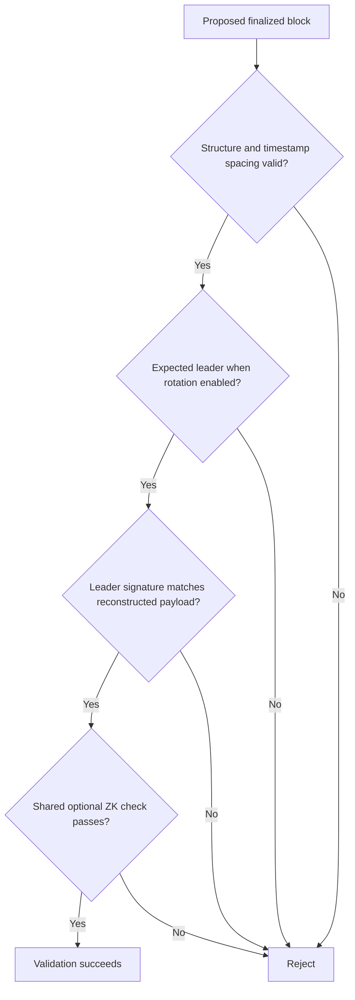

# Proof of Federation (PoF)

`hierachain/consensus/proof_of_federation.py` triển khai danh sách validator đã sắp xếp, luân phiên leader xác định và chữ ký finalization Ed25519. Chọn rõ ràng cho MainChain bằng `HRC_MAINCHAIN_CONSENSUS=proof_of_federation`. Mặc định vẫn là PoA.

## Cấu hình

| Khóa cấu hình Python | Mặc định | Ý nghĩa |
|----------------------|----------|---------|
| `min_validators` | `3` | Số thành viên tối thiểu cho `can_create_block()` |
| `block_interval` | `5.0` | Validation yêu cầu giãn cách ít nhất 80% giá trị này |
| `enforce_rotation` | `True` | Kiểm tra signer theo `validators[index % count]` |

Các khóa cấu hình này thuộc instance đồng thuận. Hàm khởi tạo MainChain/SubChain hiện không tự áp dụng `CONSENSUS_FEDERATION_CONFIG`.

Cấp public key thật của từng validator khi gọi `add_validator(validator_id, metadata={"public_key": ...})`. Các node phải thống nhất thành viên và khóa. Chỉ đặt selector không cấp đủ cấu hình federation.

## Luồng xác thực

```mermaid
flowchart TD
    A[Proposed finalized block] --> B{Structure and timestamp spacing valid?}
    B -->|Yes| C{Expected leader when rotation enabled?}
    C -->|Yes| D{Leader signature matches reconstructed payload?}
    D -->|Yes| E{Shared optional ZK check passes?}
    E -->|Yes| F[Validation succeeds]
    B -->|No| R[Reject]
    C -->|No| R
    D -->|No| R
    E -->|No| R
```

Helper `_verify_block_quorum()` thông thường kiểm tra chữ ký leader, không kiểm tra chữ ký quorum nhiều bên. Hàm riêng `verify_quorum_signatures(message, signatures, required_count=None)` đếm validator đã đăng ký khác nhau, mặc định `floor(2n/3)+1`. Hàm này không tự được gọi để thu thập phiếu khi finalize block. Class chưa triển khai failover tự động hoặc thay leader theo timeout.

Xác minh ZK là tùy chọn dùng chung với PoA. Mock proof phát triển không bảo đảm zero-knowledge; tạo/xác minh production chưa khả dụng. `HRC_BLOCK_INTERVAL` đổi giãn cách PoA và không đổi interval PoF.

## Liên quan

* [PoA](poa.md)
* [Phạm vi runtime đồng thuận](../workflows/consensus_mechanisms.md)
* [Triển khai ZK](../architecture/zk-proofs.md)
