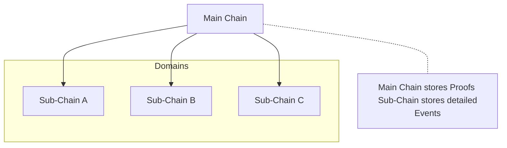
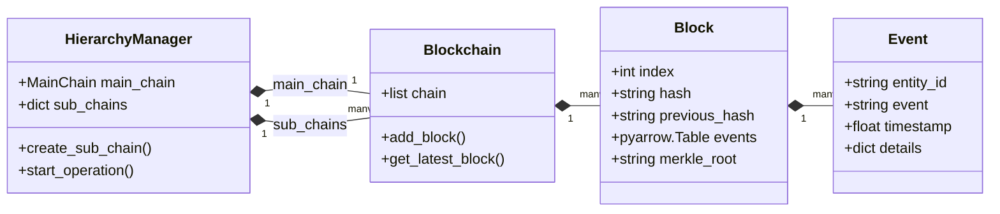

# Khái niệm cơ bản

Các khái niệm này mô tả dữ liệu và cấu trúc phân cấp của sổ cái. Xem [Thuật ngữ](../glossary.md) để tra các thuật ngữ khác.

## Các khái niệm chính

* Chain: Dãy khối liên kết bằng `previous_hash`. HieraChain có một `Main Chain` và các `Sub-Chains` theo domain.
* Block: Nhóm sự kiện lưu trong bảng Arrow, kèm header chứa chỉ số khối, timestamp, hash khối trước, nonce, Merkle root và danh tính bên tạo khối. Xem `hierachain/core/block.py`.
* Event: Bản ghi nghiệp vụ có `entity_id`, `event` và `timestamp`. Details có thể mô tả thao tác. `EVENT_SCHEMA` trong `hierachain/core/block.py` định nghĩa các cột lưu trữ; byte sự kiện chuẩn hóa giữ trường JSON và kiểu dữ liệu của details.
* Proof: Anchor chứa hash khối Sub-Chain và metadata tóm tắt, bao gồm Merkle root. Có thể kèm bằng chứng ZK theo chính sách proof đã cấu hình. Anchor này khác với inclusion proof cho từng sự kiện.
* Hierarchy: MainChain và các SubChain đã đăng ký được `HierarchyManager` điều phối.

### Cấu trúc dữ liệu

Sơ đồ biểu diễn các lớp runtime và bản ghi sự kiện ở mức khái niệm. `Block.events` là `pyarrow.Table`; snapshot sự kiện xuất ra là list các dictionary.

## Dòng chảy cơ bản

1. Gửi sự kiện đến Sub-Chain. ID sự kiện xác nhận đã tiếp nhận vào ordering; cấu hình kích thước và thời gian quyết định lúc gom sự kiện thành khối.
2. Ordering hoàn tất, ký và lưu khối bền vững. Consumer của Sub-Chain xác thực và áp dụng khối. Việc gửi proof neo hash khối đã hoàn tất cùng metadata tóm tắt lên MainChain theo lịch proof hoặc yêu cầu rõ ràng.
3. Truy vấn sự kiện đã ghi theo thực thể hoặc xem khối và thống kê chuỗi qua API.

## Tệp mã nguồn liên quan

* Core: `hierachain/core/block.py`, `hierachain/core/blockchain.py`
* Phân cấp: `hierachain/hierarchical/main_chain/base.py`, `hierachain/hierarchical/sub_chain/base.py`, `hierachain/hierarchical/hierarchy_manager/base.py`
* API: `hierachain/api/ledger/router.py`, `hierachain/api/ledger/schemas.py`
* Bảo mật: `hierachain/security/*`
* Cấu hình: `hierachain/config/settings.py`

## Liên quan

* Bắt đầu nhanh: [Bắt đầu nhanh](quickstart.md)
* Kiến trúc tổng quan: [Tổng quan](../architecture/overview.md)
* Thuật ngữ: [Thuật ngữ](../glossary.md)
