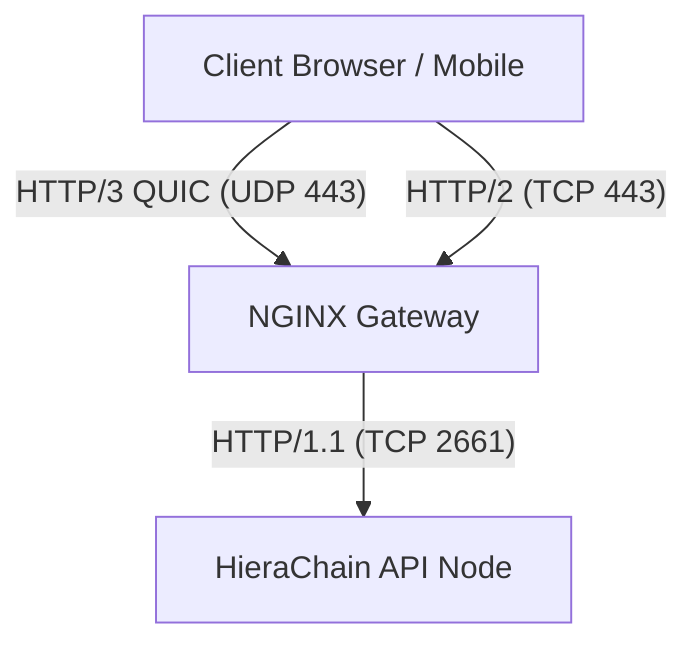

HieraChain được thiết kế để xử lý giao dịch nội bộ hiệu quả nhất bằng giao thức HTTP/1.1 thông qua `Uvicorn` (FastAPI). Để cung cấp tốc độ mạng tối đa cho người dùng cuối qua HTTP/2 và HTTP/3 (QUIC), HieraChain áp dụng mô hình **Reverse Proxy Offloading**.

## Kiến trúc Mạng Đề Xuất

Thực tiễn (Best Practice) trong các hệ thống Enterprise là **không** để server Python trực tiếp mở kết nối HTTP/2 và HTTP/3, vốn đi kèm nhiều phức tạp về mã hóa, quản lý chứng chỉ SSL, và xử lý gói tin UDP ở tầng User-space.

Thay vào đó, bạn nên đặt một **Reverse Proxy** mạnh mẽ như NGINX, Traefik, hoặc AWS ALB ở phía trước (Edge Gateway).



## Lợi ích của Kiến Trúc này

1. **Hiệu suất mã hóa**: NGINX (viết bằng C) giải mã TLS và đàm phán HTTP/3 cực kỳ nhanh mà không chiếm dụng CPU của Python.
2. **Quản lý SSL tập trung**: Dễ dàng tích hợp certbot/Let's Encrypt tại một điểm duy nhất.
3. **Tính ổn định của Blockchain**: HieraChain API Server cực kỳ tinh gọn và chỉ tập trung xử lý Transaction / Block, ngăn chặn các nguy cơ tấn công từ chối dịch vụ (DDoS) thông qua đường hầm QUIC.

## Cấu Hình Tham Khảo (NGINX)

Dưới đây là cấu hình máy chủ NGINX mẫu để phục vụ HTTP/2 và HTTP/3, đồng thời proxy ngược về HieraChain đang chạy ở cổng `2661`.

### 1. Chuẩn bị file `nginx.conf`

```nginx
server {
    # Hỗ trợ HTTP/2 trên TLS
    listen 443 ssl http2;
    listen [::]:443 ssl http2;

    # Hỗ trợ HTTP/3 (QUIC) trên UDP
    listen 443 quic reuseport;
    listen [::]:443 quic reuseport;

    server_name api.hierachain.io;

    # Chứng chỉ SSL hợp lệ (Bắt buộc cho HTTP/2 và 3)
    ssl_certificate /etc/nginx/ssl/cert.pem;
    ssl_certificate_key /etc/nginx/ssl/key.pem;

    # Thông báo cho trình duyệt Client nâng cấp lên HTTP/3
    add_header Alt-Svc 'h3=":443"; ma=86400';

    location / {
        # Địa chỉ IP của Container/Máy chủ HieraChain
        proxy_pass http://hierachain_api:2661;
        proxy_http_version 1.1;

        # Truyền chính xác IP thực của Client xuống cho HieraChain
        proxy_set_header Host $host;
        proxy_set_header X-Real-IP $remote_addr;
        proxy_set_header X-Forwarded-For $proxy_add_x_forwarded_for;
        proxy_set_header X-Forwarded-Proto $scheme;
    }
}
```

### 2. Cấu hình HieraChain Tin Tưởng Proxy

Khi đứng sau NGINX, HieraChain sẽ thấy mọi Request đều có IP xuất phát từ NGINX (ví dụ `127.0.0.1` hoặc IP của Docker Gateway). Để các tính năng như **Rate Limiting** (Giới hạn truy cập) và **Audit Logging** (Ghi dấu vết kiểm toán) hoạt động chuẩn xác với IP người dùng thật, bạn phải định nghĩa các Proxy được tin tưởng.

Thêm biến môi trường sau vào HieraChain (ví dụ trong file `.env`):

```env
# Mặc định là 127.0.0.1
HRC_TRUSTED_PROXIES=127.0.0.1,192.168.1.100
```

*(Nếu hệ thống NGINX chạy khác máy chủ, hãy điền IP của máy NGINX vào đây hoặc dùng `*` nếu mạng nội bộ hoàn toàn khép kín).*

Lớp bảo mật này tự động sử dụng tùy chọn `forwarded_allow_ips` của Uvicorn để chấp nhận Header `X-Forwarded-For`. All done! Hệ thống của bạn đã đạt chuẩn doanh nghiệp.

---

??? info "Thông tin kỹ thuật bổ sung (Metadata)"

    **FACT**

    * Uvicorn chỉ hỗ trợ HTTP/1.1 và WebSockets, không hỗ trợ native HTTP/2 & HTTP/3.
    * Khai báo Proxy Headers đi qua cấu hình môi trường `HRC_TRUSTED_PROXIES` trong `hierachain/config/settings.py`.

    **DECISION**

    * KHÔNG nhúng Hypercorn/aioquic trực tiếp vào API nhằm giữ code base ổn định, thay vào đó áp dụng mô hình Reverse Proxy Offloading.

    **ASSUMPTION**

    * Cơ sở hạ tầng cloud / firewall của doanh nghiệp có cho phép lưu lượng UDP Port 443 khi muốn bật HTTP/3 QUIC.
    * Proxy (ví dụ NGINX) luôn được cấp tải chứng chỉ TLS (SSL Certificate) hợp lệ cho tên miền dịch vụ.

    **INVARIANT**

    * Các headers proxy như `X-Forwarded-For` luôn phải bị từ chối nếu bị spoofed từ mạng Internet bên ngoài. API Server chỉ phân giải proxy origin (Client IP) từ các node được khai báo tường minh trong `HRC_TRUSTED_PROXIES`.

    **EDGE CASES**

    * Cổng UDP 443 bị block bới IPS/IDS: Client sẽ liên tục timeout. Phương thức chống chịu là browser sẽ tự động fallback về HTTP/2 hoặc HTTP/1.1 thông qua TCP. Lỗi hạ tầng ko ảnh hưởng đến Blockchain ledger.
