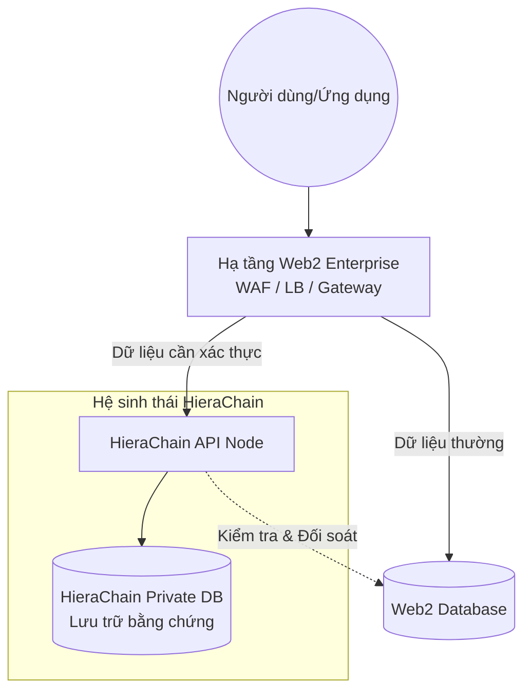

## Tổng quan

HieraChain được thiết kế như một **Plugin Layer** chuyên biệt cho doanh nghiệp, tập trung vào tính bất biến và xác thực dữ liệu thay vì thay thế các hạ tầng Web2 hiện có. Do đó, HieraChain có những quy định nghiêm ngặt về giao thức truyền tải.

## Tại sao không hỗ trợ HTTP/2 và HTTP/3?

HieraChain **không hỗ trợ** và **không có kế hoạch hỗ trợ** trực tiếp các giao thức HTTP/2 hoặc HTTP/3 (QUIC) từ bên trong nhân (core). Điều này xuất phát từ triết lý thiết kế "Không tái phát minh bánh xe" (Don't reinvent the wheel) và tối ưu hóa hiệu năng Python.

### 1. Vị trí trong kiến trúc hệ thống

HieraChain không thay thế Cơ sở dữ liệu hiện có mà hoạt động **song song** như một lớp xác thực bổ trợ. Dữ liệu được phân luồng dựa trên nhu cầu về tính bất biến:

* **Dữ liệu thường**: Đi thẳng vào DB Web2 để đạt tốc độ tối đa.
* **Dữ liệu cần xác thực**: Đi qua HieraChain để tạo bằng chứng số trước khi đồng bộ.

### 2. Triết lý "Plugin Layer"

HieraChain được xây dựng để **chạy song hành** và bổ sung giá trị blockchain cho các hệ thống Enterprise Web2 sẵn có:

* **Tách biệt luồng dữ liệu**: Không phải mọi dữ liệu đều cần blockchain. HieraChain chỉ xử lý các "sự kiện" (events) quan trọng cần tính bất biến, giúp hệ thống chính không bị quá tải.
* **Cơ sở dữ liệu riêng biệt**: HieraChain duy trì một DB riêng (World State/Ledger) để lưu trữ bằng chứng phân tán, tách biệt hoàn toàn với DB nghiệp vụ của Web2.
* **Khả năng kiểm tra chéo**: HieraChain có cơ chế kết nối (read-only) vào DB Web2 để đối soát tính toàn vẹn giữa dữ liệu nghiệp vụ và bằng chứng trên chuỗi.
* **Bảo mật cổng HTTP**: Việc bảo mật tại cổng giao tiếp (Port 80/443) vẫn được giao cho hạ tầng mạng Web2 đảm nhiệm.

### 3. Lý do sử dụng HTTP/1.1

* **Tốc độ trong mạng nội bộ**: Trong môi trường mạng tin cậy (Trusted Network) giữa Reverse Proxy và HieraChain, HTTP/1.1 là giao thức đơn giản nhất, ít overhead nhất và đạt hiệu suất cao nhất cho các tác vụ API.
* **Khả năng tương thích**: 100% các giải pháp API Gateway và Load Balancer hiện nay đều hỗ trợ chuyển tiếp xuống HTTP/1.1 một cách hoàn hảo.
* **Tập trung tài nguyên**: Thay vì tốn CPU cho việc đàm phán kết nối phức tạp, HieraChain dành toàn bộ tài nguyên cho:

    * Xác thực chữ ký sự kiện (Event signatures).
    * Đồng thuận BFT.
    * Đảm bảo tính toàn vẹn của sổ cái.

## Cách triển khai chuẩn Enterprise

Nếu hệ thống của bạn yêu cầu các tính năng hiện đại như HTTP/2, HTTP/3 hoặc gRPC để tối ưu hóa kết nối từ Client, bạn **bắt buộc** phải sử dụng mô hình **Reverse Proxy Offloading**.

1. **Tầng Web2 (NGINX/Traefik/F5)**: Tiếp nhận kết nối HTTPS (HTTP/2 hoặc HTTP/3 QUIC) từ người dùng, giải mã SSL.
2. **Tầng HieraChain**: Tiếp nhận yêu cầu đã được giải mã từ Proxy thông qua kết nối HTTP/1.1 siêu tốc.

!!! important

    HieraChain sẽ không bao giờ thay thế cho hạ tầng Web2 hiện có. HieraChain được xây dựng để chạy **bên dưới** các hệ thống đó, mang lại khả năng kiểm toán và tính bất biến mà các cơ sở dữ liệu truyền thống còn thiếu.

## Lưu ý về Bảo mật

Dù chỉ chạy HTTP/1.1, HieraChain vẫn duy trì các lớp bảo mật nội tại:

* **API Key Verification**: Xác thực quyền truy cập ở mức ứng dụng.
* **Trusted Proxies**: Chỉ chấp nhận yêu cầu từ các IP của Load Balancer được định nghĩa trước (qua biến `HRC_TRUSTED_PROXIES`).
* **Payload Sanitization**: Làm sạch dữ liệu đầu vào để chống các cuộc tấn công tầng ứng dụng.
