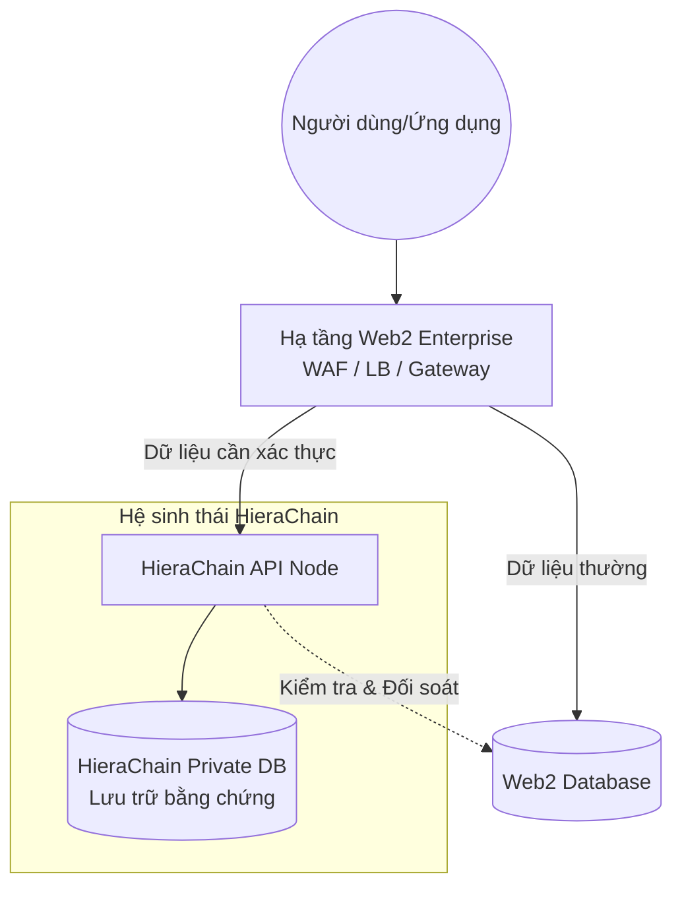

## Tổng quan

HieraChain chạy cùng hạ tầng Web2 doanh nghiệp như một lớp hỗ trợ tính bất biến và xác minh dữ liệu. Tài liệu này mô tả giao thức mà core hỗ trợ và cách đặt proxy phía trước.

## Tại sao không hỗ trợ HTTP/2 và HTTP/3?

Core HieraChain hiện hỗ trợ HTTP/1.1. Core không trực tiếp phục vụ HTTP/2 hoặc HTTP/3 (QUIC); hãy kết thúc các kết nối này tại reverse proxy rồi chuyển tiếp request tới HieraChain qua HTTP/1.1.

### 1. Vị trí trong kiến trúc hệ thống

HieraChain không thay thế Cơ sở dữ liệu hiện có mà hoạt động **song song** như một lớp xác thực bổ trợ. Dữ liệu được phân luồng dựa trên nhu cầu về tính bất biến:

* **Dữ liệu thường**: Đi thẳng vào database Web2.
* **Dữ liệu cần xác thực**: Đi qua HieraChain để tạo bằng chứng số trước khi đồng bộ.

```mermaid
graph TD
    User((Người dùng/Ứng dụng)) --> Web2[Hạ tầng Web2 Enterprise<br/>WAF / LB / Gateway]
    
    Web2 -- "Dữ liệu cần xác thực" --> HC[HieraChain API Node]
    Web2 -- "Dữ liệu thường" --> DB_Web2[(Web2 Database)]
    
    subgraph HieraChain_Internal [Hệ sinh thái HieraChain]
        HC --> DB_HC[(HieraChain Private DB<br/>Lưu trữ bằng chứng)]
    end
    
    HC -. "Kiểm tra & Đối soát" .-> DB_Web2
```

### 2. Triết lý "Plugin Layer"

HieraChain chạy cùng các hệ thống Web2 doanh nghiệp:

* **Tách biệt luồng dữ liệu**: HieraChain xử lý các event cần tính bất biến; dữ liệu khác có thể tiếp tục ở hệ thống Web2.
* **Cơ sở dữ liệu riêng biệt**: HieraChain duy trì một DB riêng (World State/Ledger) để lưu trữ bằng chứng phân tán, tách biệt hoàn toàn với DB nghiệp vụ của Web2.
* **Khả năng kiểm tra chéo**: HieraChain có cơ chế kết nối (read-only) vào DB Web2 để đối soát tính toàn vẹn giữa dữ liệu nghiệp vụ và bằng chứng trên chuỗi.
* **Bảo mật cổng HTTP**: Hạ tầng mạng Web2 xử lý bảo mật tại cổng 80 và 443.

### 3. Lý do sử dụng HTTP/1.1

* **Mạng nội bộ**: Reverse proxy chuyển tiếp request API tới HieraChain qua HTTP/1.1.
* **Khả năng tương thích**: API gateway và load balancer có thể chuyển tiếp request tới upstream HTTP/1.1.
* **Xử lý request**: HieraChain có thể dùng tài nguyên cho:

    * Xác thực chữ ký sự kiện (Event signatures).
    * Đồng thuận trong thành phần BFT triển khai riêng.
    * Kiểm tra tính toàn vẹn của sổ cái.

## Cách triển khai chuẩn Enterprise

Nếu hệ thống cần HTTP/2 hoặc HTTP/3 cho kết nối từ client, hãy dùng mô hình **Reverse Proxy Offloading**.

1. **Tầng Web2 (NGINX/Traefik/F5)**: Tiếp nhận kết nối HTTPS (HTTP/2 hoặc HTTP/3 QUIC) từ người dùng, giải mã SSL.
2. **Tầng HieraChain**: Nhận request đã giải mã từ proxy qua HTTP/1.1.

!!! important

    Trong mô hình này, HieraChain chạy cùng hạ tầng Web2 và cung cấp khả năng kiểm toán, tính bất biến cho dữ liệu được chuyển qua nó.

## Lưu ý về Bảo mật

Dù chỉ chạy HTTP/1.1, HieraChain vẫn duy trì các lớp bảo mật nội tại:

* **API Key Verification**: Xác thực quyền truy cập ở mức ứng dụng.
* **Trusted Proxies**: Chỉ chấp nhận yêu cầu từ các IP của Load Balancer được định nghĩa trước (qua biến `HRC_TRUSTED_PROXIES`).
* **Payload Sanitization**: Làm sạch dữ liệu đầu vào để chống các cuộc tấn công tầng ứng dụng.
