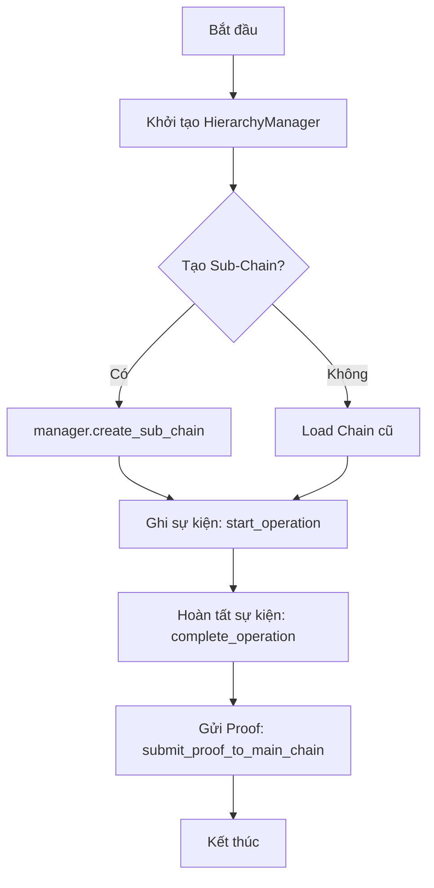

# Tạo Sub-Chain

## Mục đích

Tạo một Sub-Chain (chuỗi theo domain) và vận hành vòng đời cơ bản: khởi tạo → ghi sự kiện → gửi bằng chứng (proof) lên Main Chain.

## Yêu cầu

* Đã cài đặt gói và kích hoạt môi trường theo [Getting Started](../getting-started/install.md).
* Có thể chạy API server: `python -m hierachain.api.server` (mặc định `http://localhost:2661`).

## Cách 1: Dùng Python API (HierarchyManager)



```python
from hierachain.hierarchical import HierarchyManager

# 1. Tạo manager (khởi tạo Main Chain ngầm)
manager = HierarchyManager()

# 2. Tạo Sub-Chain theo domain
ok = manager.create_sub_chain("supply_chain", domain_type="supply_chain")
assert ok, "Tên sub-chain đã tồn tại?"

# 3. Ghi nhận một thao tác/sự kiện domain
manager.start_operation(
    sub_chain_name="supply_chain",
    entity_id="PROD-001",
    operation_type="production_start",
    details={"batch": "BATCH-001"}
)
manager.complete_operation(
    sub_chain_name="supply_chain",
    entity_id="PROD-001",
    operation_type="production_start",
    result={"status": "ok"}
)

# 4. (Tuỳ chọn) Gửi proof lên Main Chain
manager.submit_proof_to_main_chain("supply_chain")

# 5. Thống kê hệ thống
print(manager.get_system_overview())
```

Ghi chú: Các phương thức ở trên bám sát `hierachain/hierarchical/hierarchy_manager.py`:

* `create_sub_chain(name, domain_type, metadata=None)`
* `start_operation(...)`, `complete_operation(...)`
* `submit_proof_to_main_chain(sub_chain_name)`

## Cách 2: Dùng REST API v1

Giả sử API server đã chạy tại `http://localhost:2661`:

```bash
# 1. Tạo sub-chain (POST)
curl -X POST "http://localhost:2661/api/v1/chains/production/create"

# 2. Ghi sự kiện vào sub-chain
curl -X POST "http://localhost:2661/api/v1/chains/production/events" \
  -H "Content-Type: application/json" \
  -d '{
    "entity_id": "PROD-001",
    "event_type": "quality_check",
    "details": {"result": "pass"}
  }'

# 3. Gửi proof
curl -X POST "http://localhost:2661/api/v1/chains/production/submit-proof"

# 4. Xem block của sub-chain
curl "http://localhost:2661/api/v1/chains/production/blocks?limit=5&offset=0"

# 5. Truy vết theo entity
curl "http://localhost:2661/api/v1/entities/PROD-001/trace?chain_name=production"
```

Tham chiếu chữ ký và status code: xem [Reference: API v1](../reference/api-v1.md).

## Lỗi thường gặp & khắc phục

* 404 `Sub-chain 'X' not found` → Bạn cần tạo sub-chain trước khi gửi sự kiện/proof.
* 500 `Failed to add event/submit proof/...` → Kiểm tra log server để biết chi tiết; kiểm tra payload hợp lệ theo schema.
* Không thấy sub-chain trong danh sách → thử `GET /api/v1/chains` để xác minh và xem `block_count`.

## Liên quan

* Kiến trúc phân cấp: [Tổng quan](../architecture/overview.md)
* Mô-đun Hierarchical: [Hierarchical](../modules/hierarchical.md)
* Tham chiếu API v1: [API v1](../reference/api-v1.md)
