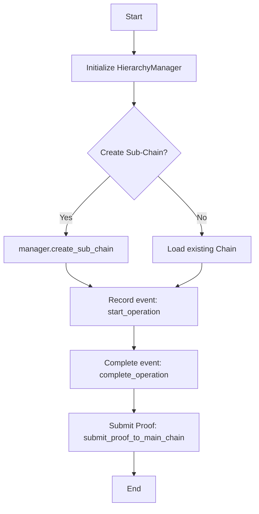

# Tạo Sub-Chain

## Mục đích

Dùng Python `HierarchyManager` để tạo `DomainChain`, hoặc dùng REST để tạo `SubChain` generic, sau đó ghi sự kiện và gửi proof. Luồng Python cung cấp kiểm tra hợp lệ của `DomainChain` và hành vi participant 2PC.

## Yêu cầu

* Đã cài đặt gói và kích hoạt môi trường theo [Getting Started](../getting-started/install.md).
* Có thể chạy API server: `python -m hierachain` (mặc định `http://localhost:2661`).


Thiết lập identity ký, trusted key và storage theo [Bắt đầu nhanh](../getting-started/quickstart.md). Ví dụ Python dùng ledger mới và cần đăng ký entity trước operation.

## Cách 1: Dùng Python API (HierarchyManager)


```mermaid
flowchart TD
    Start[Start] --> Init[Initialize HierarchyManager]
    Init --> Create{Create Sub-Chain?}
    Create -- Yes --> NewChain[manager.create_sub_chain]
    Create -- No --> LoadChain[Load existing Chain]
    NewChain --> Op[Record event: start_operation]
    LoadChain --> Op
    Op --> Complete[Complete event: complete_operation]
    Complete --> Proof[Submit Proof: submit_proof_to_main_chain]
    Proof --> End[End]
```

```python
from hierachain.hierarchical import HierarchyManager

# 1. Create manager (implicitly initializes Main Chain)
manager = HierarchyManager()

# 2. Create Sub-Chain by domain
ok = manager.create_sub_chain("supply_chain", domain_type="supply_chain")
assert ok, "Sub-chain name already exists?"
chain = manager.get_sub_chain("supply_chain")
assert chain.register_entity("PROD-001", {"batch": "BATCH-001"})

# 3. Record a domain operation/event
manager.start_operation(
    sub_chain_name="supply_chain",
    entity_id="PROD-001",
    operation_type="production_start",
    details={"batch": "BATCH-001"}
)
manager.complete_operation(
    sub_chain_name="supply_chain",
    entity_id="PROD-001",
    operation_type="production_start",
    result={"status": "ok"}
)

# 4. (Optional) Submit proof to Main Chain
chain.flush_pending_and_finalize(timeout=10.0)
assert manager.submit_proof_to_main_chain("supply_chain")

# 5. System overview
print(manager.get_system_overview())
manager.close()
```

Ghi chú: Các phương thức ở trên bám sát `hierachain/hierarchical/hierarchy_manager/base.py`:

* `create_sub_chain(name, domain_type, metadata=None)`
* `start_operation(...)`, `complete_operation(...)`
* `submit_proof_to_main_chain(sub_chain_name)`

## Cách 2: Dùng REST API Ledger

Giả sử API server đã chạy tại `http://localhost:2661`:

Endpoint REST tạo lớp `SubChain` cơ sở và mặc định `chain_type` là `generic`; endpoint này không tạo `DomainChain`. Dùng cách Python ở trên khi cần kiểm tra hợp lệ của `DomainChain` hoặc hành vi participant 2PC.

```bash
# 1. Create sub-chain (POST)
curl -X POST "http://localhost:2661/api/ledger/chains/production/create"

# 2. Record event in sub-chain
curl -X POST "http://localhost:2661/api/ledger/chains/production/events" \
  -H "Content-Type: application/json" \
  -d '{
    "entity_id": "PROD-001",
    "event_type": "quality_check",
    "details": {"result": "pass"}
  }'

# 3. Submit proof
curl -X POST "http://localhost:2661/api/ledger/chains/production/submit-proof"

# 4. View sub-chain blocks
curl "http://localhost:2661/api/ledger/chains/production/blocks?limit=5&offset=0"

# 5. Trace by entity
curl "http://localhost:2661/api/ledger/entities/PROD-001/trace?chain_name=production"
```

Tham chiếu chữ ký và status code: xem [Reference: API Ledger](../reference/api-ledger.md).

## Lỗi thường gặp & khắc phục

* 404 `Sub-chain 'X' not found` → Bạn cần tạo sub-chain trước khi gửi sự kiện/proof.
* 500 `Failed to add event/submit proof/...` → Kiểm tra log server để biết chi tiết; kiểm tra payload hợp lệ theo schema.
* Không thấy sub-chain trong danh sách → thử `GET /api/ledger/chains` để xác minh và xem `block_count`.

## Liên quan

* Kiến trúc phân cấp: [Tổng quan](../architecture/overview.md)
* Mô-đun Hierarchical: [Hierarchical](../modules/hierarchical.md)
* Tham chiếu API Ledger: [API Ledger](../reference/api-ledger.md)
