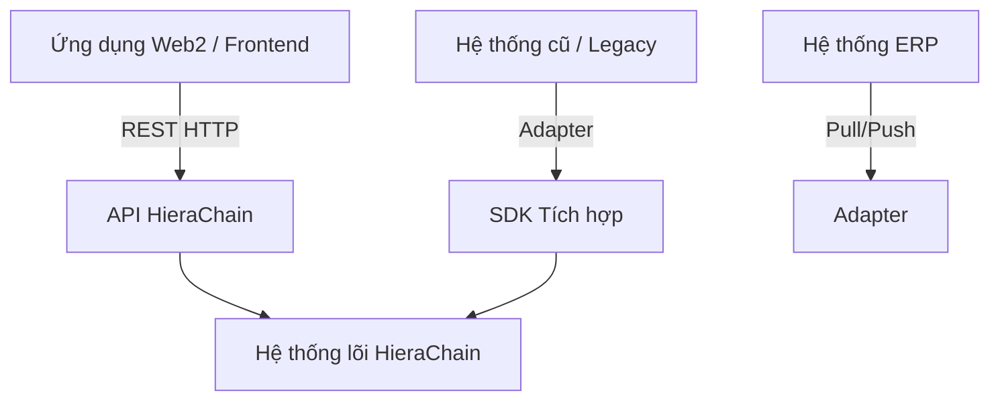
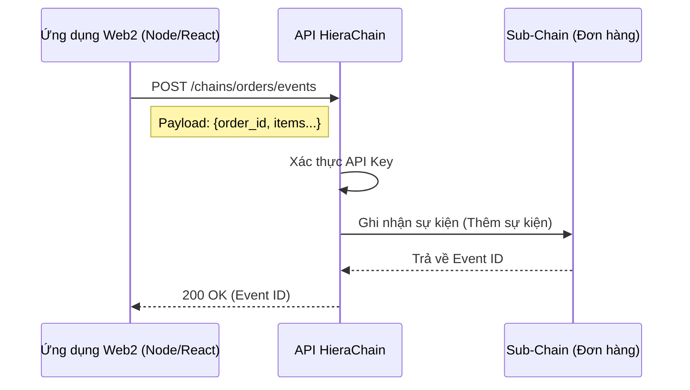
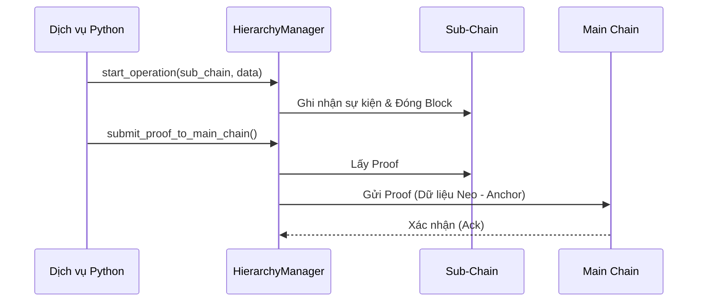

# Tích hợp Web2 & Hệ thống Hiện hữu

## Mục đích

Hướng dẫn các mô hình kết nối ứng dụng Web2 truyền thống (Node.js, Java, PHP, v.v.) hoặc các hệ thống ERP hiện hữu với mạng lưới HieraChain.

## Mô hình Tích hợp

Có 3 mô hình tích hợp chính:

1. **REST API (Liên kết lỏng - Loose Coupling)**: Phổ biến nhất, được dùng cho Ứng dụng Web/Mobile.
2. **Integration SDK (Hiệu năng cao)**: Dùng cho các dịch vụ backend viết bằng Python cần hiệu năng cao.
3. **ERP Adapter (Doanh nghiệp)**: Dùng cho các hệ thống ERP (SAP, Oracle) yêu cầu đồng bộ hóa dữ liệu định kỳ.



## Cách 1: Sử dụng REST API (Khuyên dùng)

Đây là phương thức đơn giản nhất, sử dụng giao thức HTTP tiêu chuẩn.

### Kịch bản

Bạn có một Website Thương mại điện tử (Node.js/React) và muốn ghi nhận thông tin truy xuất nguồn gốc sản phẩm lên HieraChain khi một đơn hàng hoàn thành.



### Ví dụ Triển khai (Python/Requests)

```python
import requests
import json

API_URL = "http://localhost:2661/api/v1"
API_KEY = "your-api-key-here"  # Nếu có bật xác thực API Key

def log_order_to_chain(order_id, items):
    # 1. Tạo Sub-Chain cho đơn hàng (hoặc dùng chung chuỗi 'orders' đã có)
    # Giả định dùng chung chuỗi 'orders'
    
    # 2. Gửi sự kiện
    payload = {
        "entity_id": order_id,
        "event_type": "order_completed",
        "details": {
            "items_count": len(items),
            "total_value": sum(i['price'] for i in items)
        }
    }
    
    headers = {
        "Content-Type": "application/json",
        "X-API-Key": API_KEY
    }
    
    try:
        response = requests.post(
            f"{API_URL}/chains/orders/events", 
            json=payload, 
            headers=headers,
            timeout=5
        )
        response.raise_for_status()
        print(f"Thành công: {response.json()}")
        return response.json().get("event_id")
    except requests.exceptions.RequestException as e:
        print(f"Lỗi khi lưu vào blockchain: {e}")
        return None
```

### Ví dụ Triển khai (JavaScript/Fetch)

```javascript
const API_URL = "http://localhost:2661/api/v1";

async function logOrder(orderId, items) {
  try {
    const response = await fetch(`${API_URL}/chains/orders/events`, {
      method: "POST",
      headers: {
        "Content-Type": "application/json",
        // "X-API-Key": "your-key"
      },
      body: JSON.stringify({
        entity_id: orderId,
        event_type: "order_completed",
        details: { count: items.length }
      })
    });
    
    if (!response.ok) throw new Error(`Lỗi HTTP! Trạng thái: ${response.status}`);
    const result = await response.json();
    console.log("Đã ghi nhận sự kiện:", result.event_id);
    return result.event_id;
    
  } catch (error) {
    console.error("Lỗi tích hợp Blockchain:", error);
  }
}
```

## Cách 2: Sử dụng SDK Tích hợp (Python Backend)

Nếu bạn đang xây dựng một dịch vụ Python trong cùng mạng nội bộ hoặc cluster, việc sử dụng trực tiếp SDK sẽ mang lại hiệu năng cao hơn (bỏ qua hao phí xử lý HTTP).



```python
from hierachain.hierarchical import HierarchyManager

# Khởi tạo manager (kết nối trực tiếp tới DB hoặc qua ZMQ nội bộ)
manager = HierarchyManager()

def process_batch_data(batch_items):
    # Ghi trực tiếp vào hàng đợi xử lý
    for item in batch_items:
        manager.start_operation(
            sub_chain_name="supply_chain",
            entity_id=item["id"],
            operation_type="ingest",
            details=item["metadata"]
        )
    
    # Kích hoạt gửi proof ngay lập tức lên Main Chain (tùy chọn)
    manager.submit_proof_to_main_chain("supply_chain")
```

## Cách 3: ERP Adapter

Sử dụng sổ cái tích hợp `hierachain/integration` để xây dựng các adapter đồng bộ dữ liệu hai chiều.

Xem chi tiết tại: [Mô-đun Tích hợp](../modules/integration.md).

## Lưu ý Quan trọng

1. **Bảo mật**: Luôn luôn sử dụng HTTPS và API Key (hoặc OAuth nếu triển khai tùy biến) khi kết nối qua mạng công cộng.
2. **Bất đồng bộ (Asynchronous)**: Tác vụ ghi lên Blockchain có thể chậm hơn ghi DB thông thường. Hãy sử dụng hàng đợi tin nhắn (ví dụ: RabbitMQ, Kafka) ở phía ứng dụng Web2 để gửi yêu cầu đến các worker HieraChain, tránh làm nghẽn giao diện người dùng.
3. **Xử lý lỗi**: Thiết kế cơ chế Thử lại (Retry) phòng trường hợp API HieraChain tạm thời không phản hồi (lỗi 503, timeout).

## Liên quan

* Tài liệu API v1: [API v1](../reference/api-v1.md)
* Mô-đun Tích hợp: [Integration](../modules/integration.md)
