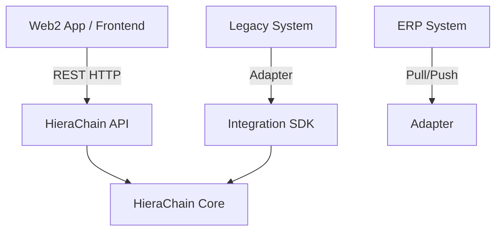
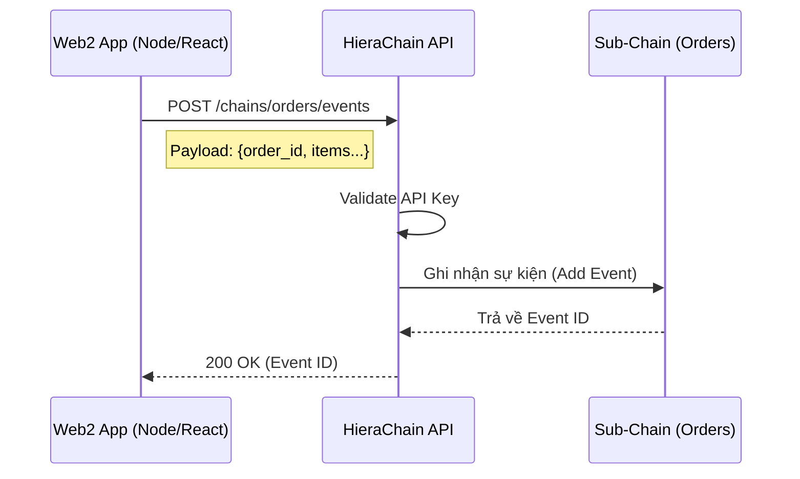
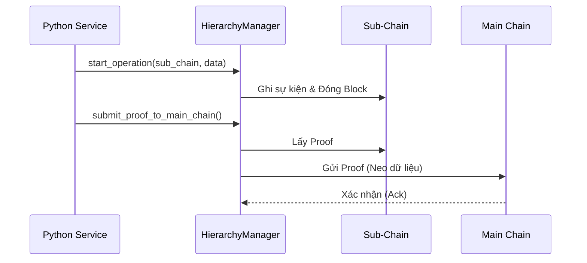

# Tích hợp Web2 & Hệ thống có sẵn

## Mục đích

Hướng dẫn các mô hình (patterns) để kết nối ứng dụng Web2 truyền thống (Node.js, Java, PHP,...) hoặc hệ thống ERP cũ với mạng lưới HieraChain.

## Các mô hình tích hợp

Có 3 mô hình chính để tích hợp:

1. **REST API (Loose Coupling)**: Phổ biến nhất, dùng cho Web/Mobile App.
2. **Integration SDK (High Performance)**: Dùng cho các service Python backend cần hiệu năng cao.
3. **ERP Adapter (Enterprise)**: Dùng cho các hệ thống ERP (SAP, Oracle) cần đồng bộ dữ liệu định kỳ.



## Cách 1: Sử dụng REST API (Khuyên dùng)

Đây là cách đơn giản nhất, sử dụng giao thức HTTP tiêu chuẩn.

### Kịch bản

Bạn có một Website E-commerce (Node.js/React) và muốn ghi lại dấu vết sản phẩm (traceability) lên Blockchain khi đơn hàng hoàn tất.



### Ví dụ triển khai (Python/Requests)

```python
import requests
import json

API_URL = "http://localhost:2661/api/v1"
API_KEY = "your-api-key-here"  # Nếu bật AUTH

def log_order_to_chain(order_id, items):
    # 1. Tạo Sub-Chain cho đơn hàng (hoặc dùng chain 'orders' chung)
    # Giả sử dùng chain chung 'orders'
    
    # 2. Gửi sự kiện
    payload = {
        "entity_id": order_id,
        "event_type": "order_completed",
        "details": {
            "items_count": len(items),
            "total_value": sum(i['price'] for i in items)
        }
    }
    
    headers = {
        "Content-Type": "application/json",
        "X-API-Key": API_KEY
    }
    
    try:
        response = requests.post(
            f"{API_URL}/chains/orders/events", 
            json=payload, 
            headers=headers,
            timeout=5
        )
        response.raise_for_status()
        print(f"Success: {response.json()}")
        return response.json().get("event_id")
    except requests.exceptions.RequestException as e:
        print(f"Error logging to blockchain: {e}")
        return None
```

### Ví dụ triển khai (JavaScript/Fetch)

```javascript
const API_URL = "http://localhost:2661/api/v1";

async function logOrder(orderId, items) {
  try {
    const response = await fetch(`${API_URL}/chains/orders/events`, {
      method: "POST",
      headers: {
        "Content-Type": "application/json",
        // "X-API-Key": "your-key"
      },
      body: JSON.stringify({
        entity_id: orderId,
        event_type: "order_completed",
        details: { count: items.length }
      })
    });
    
    if (!response.ok) throw new Error(`HTTP error! status: ${response.status}`);
    const result = await response.json();
    console.log("Logged event:", result.event_id);
    return result.event_id;
    
  } catch (error) {
    console.error("Blockchain integration error:", error);
  }
}
```

## Cách 2: Integration SDK (Python Backend)

Nếu bạn đang xây dựng một service Python nằm trong cùng mạng nội bộ hoặc cluster, việc sử dụng trực tiếp SDK sẽ cho hiệu năng cao hơn (bỏ qua overhead HTTP).



```python
from hierachain.hierarchical import HierarchyManager

# Khởi tạo manager (kết nối DB trực tiếp hoặc qua ZMQ nội bộ)
manager = HierarchyManager()

def process_batch_data(batch_items):
    # Ghi trực tiếp vào hàng đợi xử lý
    for item in batch_items:
        manager.start_operation(
            sub_chain_name="supply_chain",
            entity_id=item["id"],
            operation_type="ingest",
            details=item["metadata"]
        )
    
    # Trigger gửi proof ngay lập tức (tuỳ chọn)
    manager.submit_proof_to_main_chain("supply_chain")
```

## Cách 3: ERP Adapter

Sử dụng Ledger `hierachain/integration` để xây dựng adapter đồng bộ dữ liệu hai chiều.

Xem chi tiết tại: [Integration Module](../modules/integration.md).

## Lưu ý quan trọng

1. **Bảo mật**: Luôn sử dụng HTTPS và API Key (hoặc OAuth nếu triển khai custom) khi kết nối qua mạng công cộng.
2. **Bất đồng bộ**: Ghi blockchain có thể chậm hơn ghi DB thường. Nên dùng hàng đợi (Queue) ở phía Web2 app (ví dụ: RabbitMQ, Kafka) để gửi request sang HieraChain worker, tránh block UI người dùng.
3. **Xử lý lỗi**: Thiết kế cơ chế Retry (thử lại) nếu HieraChain API tạm thời không phản hồi (503, timeout).

## Liên quan

* Tham chiếu API v1: [API v1](../reference/api-v1.md)
* Integration Module: [Integration](../modules/integration.md)

---

??? info "Thông tin kỹ thuật bổ sung (Metadata)"

    **FACT**

    * Giao tiếp qua REST API (HTTP) hoặc Integration SDK (Python).
    * API mặc định chạy tại cổng 2661; endpoints chính bắt đầu bằng `/api/v1`.
    * `HierarchyManager` là entry-point chính khi dùng SDK.

    **DECISION**

    * Sử dụng REST API cho các ứng dụng Web/Mobile (Web2) để đảm bảo Loose Coupling.
    * Sử dụng SDK cho các service nội bộ cần hiệu năng cao (High Performance).
    * Khuyến nghị mô hình Async/Queue cho các thao tác ghi dữ liệu từ Web2.

    **ASSUMPTION**

    * Ứng dụng Web2 tự quản lý xác thực người dùng cuối (End-User Auth).
    * API Key được bảo vệ an toàn phía server-side (không lộ ở client-side code).
    * Mạng kết nối giữa Web2 App và HieraChain Node ổn định.

    **INVARIANT**

    * Dữ liệu đã ghi vào Block là bất biến.
    * Sub-Chain phải được khởi tạo trước khi ghi sự kiện.

    **EDGE CASES**

    * Mất kết nối mạng/Timeout: Cần cơ chế Retry.
    * Sai format dữ liệu: API trả về 400 Bad Request.
    * Quá tải hệ thống: API có thể trả về 429 hoặc 503.
