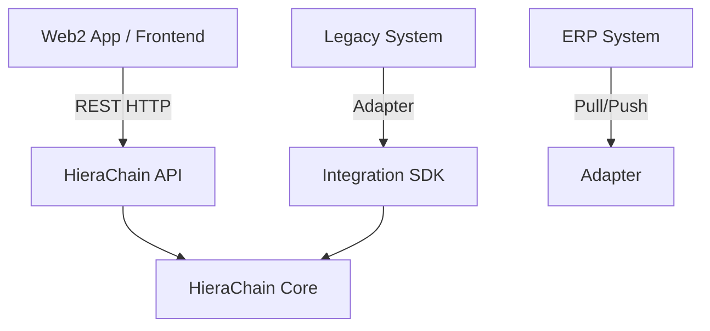
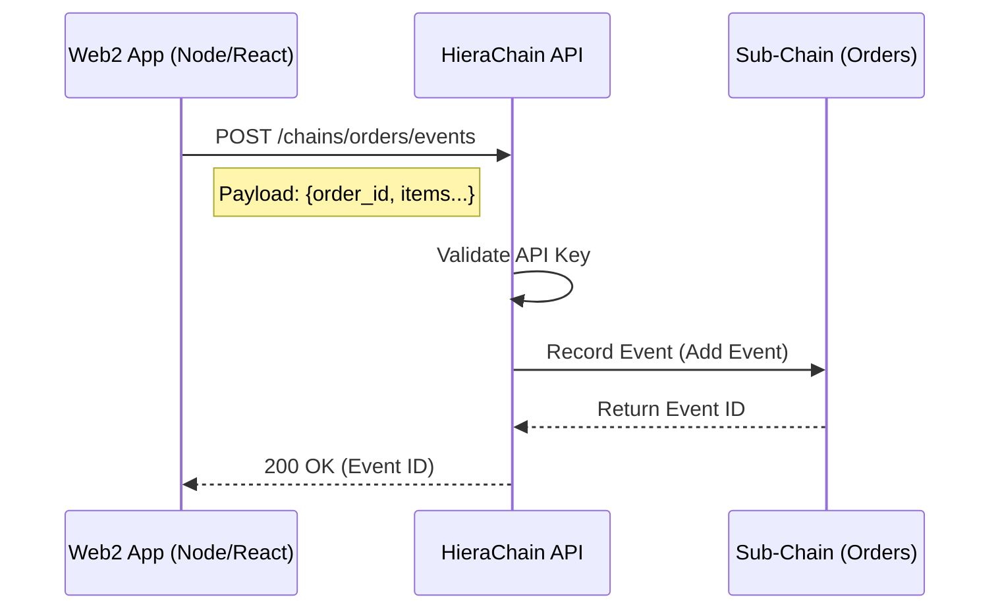
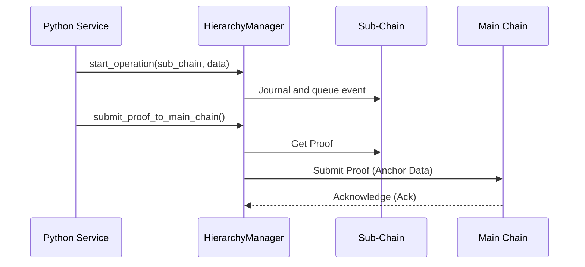

# Tích hợp Web2 & Hệ thống Hiện hữu

## Mục đích

Hướng dẫn các mô hình kết nối ứng dụng Web2 truyền thống (Node.js, Java, PHP, v.v.) hoặc các hệ thống ERP hiện hữu với mạng lưới HieraChain.

## Mô hình Tích hợp

Có 3 mô hình tích hợp chính:

1. **REST API (Liên kết lỏng - Loose Coupling)**: Phổ biến nhất, được dùng cho Ứng dụng Web/Mobile.
2. **Integration SDK (Hiệu năng cao)**: Dùng cho các dịch vụ backend viết bằng Python cần hiệu năng cao.
3. **ERP Adapter (Doanh nghiệp)**: Dùng cho các hệ thống ERP (SAP, Oracle) yêu cầu đồng bộ hóa dữ liệu định kỳ.


```mermaid
graph TD
    Web2[Web2 App / Frontend] -->|REST HTTP| API[HieraChain API]
    Legacy[Legacy System] -->|Adapter| SDK[Integration SDK]
    ERP[ERP System] -->|Pull/Push| Adapter

    API --> Core[HieraChain Core]
    SDK --> Core
```

## Cách 1: Sử dụng REST API (Khuyên dùng)

Đây là phương thức đơn giản nhất, sử dụng giao thức HTTP tiêu chuẩn.

### Kịch bản

Bạn có một Website Thương mại điện tử (Node.js/React) và muốn ghi nhận thông tin truy xuất nguồn gốc sản phẩm lên HieraChain khi một đơn hàng hoàn thành.


```mermaid
sequenceDiagram
    participant Web as Web2 App (Node/React)
    participant API as HieraChain API
    participant Sub as Sub-Chain (Orders)

    Web->>API: POST /chains/orders/events
    Note right of Web: Payload: {order_id, items...}
    API->>API: Validate API Key
    API->>Sub: Record Event (Add Event)
    Sub-->>API: Return Event ID
    API-->>Web: 200 OK (Event ID)
```

### Ví dụ Triển khai (Python/Requests)

```python
import requests
import json

API_URL = "http://localhost:2661/api/ledger"
API_KEY = "your-api-key-here"  # If AUTH is enabled

def log_order_to_chain(order_id, items):
    # 1. Create Sub-Chain for orders (or use shared 'orders' chain)
    # Assuming using shared 'orders' chain

    # 2. Submit event
    payload = {
        "entity_id": order_id,
        "event_type": "order_completed",
        "details": {
            "items_count": len(items),
            "total_value": sum(i['price'] for i in items)
        }
    }

    headers = {
        "Content-Type": "application/json",
        "X-API-Key": API_KEY
    }

    try:
        response = requests.post(
            f"{API_URL}/chains/orders/events",
            json=payload,
            headers=headers,
            timeout=5
        )
        response.raise_for_status()
        print(f"Success: {response.json()}")
        return response.json().get("event_id")
    except requests.exceptions.RequestException as e:
        print(f"Error logging to blockchain: {e}")
        return None
```

### Ví dụ Triển khai (JavaScript/Fetch)

```javascript
const API_URL = "http://localhost:2661/api/ledger";

async function logOrder(orderId, items) {
  try {
    const response = await fetch(`${API_URL}/chains/orders/events`, {
      method: "POST",
      headers: {
        "Content-Type": "application/json",
        // "X-API-Key": "your-key"
      },
      body: JSON.stringify({
        entity_id: orderId,
        event_type: "order_completed",
        details: { count: items.length }
      })
    });

    if (!response.ok) throw new Error(`HTTP error! status: ${response.status}`);
    const result = await response.json();
    console.log("Logged event:", result.event_id);
    return result.event_id;

  } catch (error) {
    console.error("Blockchain integration error:", error);
  }
}
```

Thiết lập identity ký và SQL storage theo [Bắt đầu nhanh](../getting-started/quickstart.md) trước khi dùng `HierarchyManager`. SDK HTTP trong `hierachain/sdk/` là lựa chọn khác với lời gọi thư viện trực tiếp dưới đây.

## Cách 2: Tích hợp thư viện trực tiếp trong cùng process (Python Backend)

Ví dụ này import và gọi trực tiếp `HierarchyManager` trong process của dịch vụ. Dùng `HieraChainClient` khi dịch vụ cần gọi API qua SDK HTTP.


```mermaid
sequenceDiagram
    participant Service as Python Service
    participant Manager as HierarchyManager
    participant Sub as Sub-Chain
    participant Main as Main Chain

    Service->>Manager: start_operation(sub_chain, data)
    Manager->>Sub: Journal and queue event
    Service->>Manager: submit_proof_to_main_chain()
    Manager->>Sub: Get Proof
    Manager->>Main: Submit Proof (Anchor Data)
    Main-->>Manager: Acknowledge (Ack)
```

```python
from hierachain.hierarchical import HierarchyManager

manager = HierarchyManager()
try:
    assert manager.create_sub_chain("supply_chain", "supply_chain")
    chain = manager.get_sub_chain("supply_chain")
    assert chain.register_entity("PROD-001", {"product": "sample"})
    assert manager.start_operation(
        "supply_chain", "PROD-001", "production_start", {"quantity": 100}
    )
    chain.flush_pending_and_finalize(timeout=10.0)
    assert any(
        event["event"] == "operation_start"
        for event in chain.get_events_by_entity("PROD-001")
    )
    assert manager.submit_proof_to_main_chain("supply_chain")
finally:
    manager.close()
```

## Cách 3: ERP Adapter

Dùng thư viện mapping/scheduler với adapter ERP do ứng dụng cấp. Connector vendor có sẵn chỉ mô phỏng.

Xem chi tiết tại: [Mô-đun Tích hợp](../modules/integration.md).

## Lưu ý Quan trọng

1. **Bảo mật**: Luôn luôn sử dụng HTTPS và API Key (hoặc OAuth nếu triển khai tùy biến) khi kết nối qua mạng công cộng.
2. **Bất đồng bộ (Asynchronous)**: Tác vụ ghi lên Blockchain có thể chậm hơn ghi DB thông thường. Hãy sử dụng hàng đợi tin nhắn (ví dụ: RabbitMQ, Kafka) ở phía ứng dụng Web2 để gửi yêu cầu đến các worker HieraChain, tránh làm nghẽn giao diện người dùng.
3. **Xử lý lỗi**: Thiết kế cơ chế Thử lại (Retry) phòng trường hợp API HieraChain tạm thời không phản hồi (lỗi 503, timeout).

## Liên quan

* Tài liệu API Ledger: [API Ledger](../reference/api-ledger.md)
* Mô-đun Tích hợp: [Integration](../modules/integration.md)
