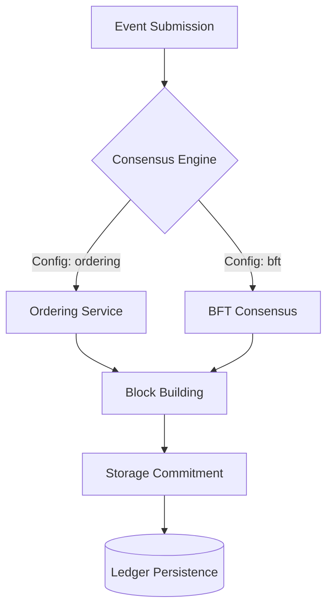

# Consensus Module (`hierachain/consensus/*`)

## Tổng quan

Module **Consensus** chịu trách nhiệm đảm bảo tính nhất quán (Consistency) và thứ tự xác định (Deterministic Ordering) của dữ liệu trên toàn bộ mạng lưới HieraChain. Hệ thống cung cấp các cơ chế đồng thuận linh hoạt, cho phép doanh nghiệp lựa chọn giữa hiệu năng cực cao trong môi trường tin cậy hoặc bảo mật tuyệt đối trong môi trường có rủi ro tấn công.

---

## Các giao thức đồng thuận hỗ trợ

HieraChain tích hợp sẵn 3 loại giao thức chính, có thể cấu hình qua `HRC_CONSENSUS_TYPE`:

*   :material-order-bool-ascending:{ .lg .middle } __Ordering Service (CFT)__

    ---

    * Phù hợp cho mạng Consortium hoặc Single-org.
    * Chịu lỗi sập nút (**Crash Fault Tolerance**).
    * Hiệu năng cực cao với cơ chế batching.
    * [:octicons-arrow-right-24: Chi tiết](../consensus/ordering.md)

*   :material-shield-key:{ .lg .middle } __BFT Consensus (PBFT)__

    ---

    * Phù hợp cho môi trường không tin cậy hoàn toàn.
    * Chịu lỗi Byzantine (**Byzantine Fault Tolerance**) với điều kiện `n >= 3f + 1`.
    * Đảm bảo tính toàn vẹn ngay cả khi có node bị tấn công.
    * [:octicons-arrow-right-24: Chi tiết](../consensus/bft_consensus.md)

*   :material-account-tie:{ .lg .middle } __Proof of Authority / Federation__

    ---

    * **PoA**: Các nút có thẩm quyền (Authorized Nodes) ký xác nhận khối.
    * **PoF**: Cơ chế xoay vòng lãnh đạo trong liên minh.
    * Phù hợp cho các chuỗi con (Sub-Chains) yêu cầu xử lý nhanh.

---

## Kiến trúc Tổng thể

---

## Tích hợp vào Hierarchy

Trong mô hình phân cấp của HieraChain:

1.  **Main Chain**: Thường sử dụng **BFT Consensus** để đảm bảo tính an toàn cao nhất cho toàn bộ hệ thống.
2.  **Sub-Chains**: Có thể sử dụng **Ordering Service** hoặc **PoA** để đạt tốc độ xử lý giao dịch cao, sau đó định kỳ gửi bằng chứng (Proofs) lên Main Chain.

---

## Liên quan

*   [Mô hình phân cấp (Hierarchical)](./hierarchical.md)
*   [Hệ thống mạng (Network)](./network.md)
*   [Xử lý lỗi (Error Mitigation)](./error-mitigation.md)
