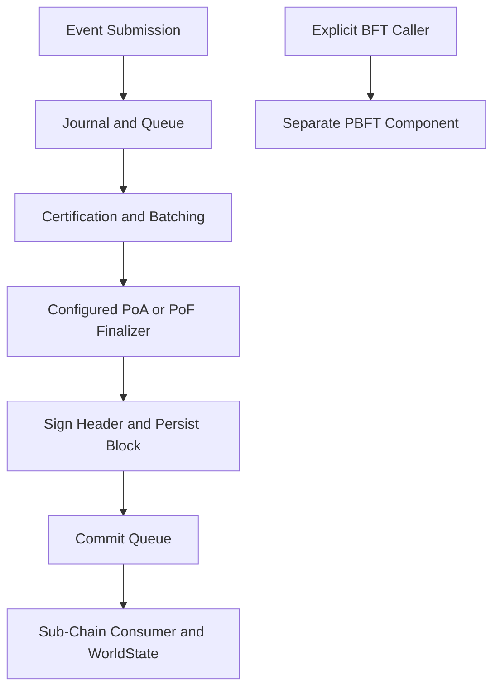

# Module đồng thuận (`hierachain/consensus/*`)

## Phạm vi

Module cung cấp cơ chế hoàn tất khối PoA và PoF, dịch vụ sắp thứ tự sự kiện và thư viện BFT riêng. Các thành phần có quy tắc xác thực và yêu cầu tích hợp khác nhau.

## Thành phần

| Thành phần | Hành vi | Tham chiếu |
|:-----------|:--------|:-----------|
| Ordering Service | Ghi nhật ký, xếp hàng, chứng nhận và gom lô sự kiện cục bộ; ký và lưu khối trước khi xếp hàng cho consumer | [Ordering](../consensus/ordering.md) |
| PoA | Kiểm tra thành viên authority đã đăng ký, chữ ký khối và giãn cách timestamp tùy chọn | [PoA](../consensus/poa.md) |
| PoF | Kiểm tra thành viên liên minh, leader theo lịch và chữ ký hoàn tất của leader; xác minh chữ ký quorum là helper riêng | [PoF](../consensus/pof.md) |
| BFT | Chạy các pha PBFT với `n >= 3f + 1`; bên gọi cung cấp khóa ký, truyền tải và tích hợp ứng dụng | [BFT](../consensus/bft_consensus.md) |

Khôi phục ordering dùng nhật ký cục bộ bền vững. Nó không bầu chọn cụm orderer nhân bản hay tự động chuyển dịch vụ khi lỗi. Các thiết lập đồng thuận MainChain/Sub-Chain không chọn BFT.

## Luồng ordering

```mermaid
graph TD
    A[Event Submission] --> B[Journal and Queue]
    B --> C[Certification and Batching]
    C --> D[Configured PoA or PoF Finalizer]
    D --> E[Sign Header and Persist Block]
    E --> F[Commit Queue]
    F --> G[Sub-Chain Consumer and WorldState]
    H[Explicit BFT Caller] --> I[Separate PBFT Component]
```

ID lần gửi xác nhận nhật ký/hàng đợi đã tiếp nhận. Consumer xác thực và áp dụng khối đã lưu sau đó; phản hồi tiếp nhận không xác nhận khối đã hoàn tất.

## Cấu hình phân cấp

MainChain mặc định dùng PoA. `HRC_MAINCHAIN_CONSENSUS` chọn PoA hoặc PoF và dùng `HRC_CONSENSUS_TYPE` khi không được đặt. Sub-Chain mặc định dùng PoA và dùng `config` Python riêng để chọn PoF. `BFT_ENABLED` không nối BFT vào luồng của hai loại chuỗi.

Cấp danh tính ký đầy đủ và khóa khối tin cậy đã được phê duyệt trước khi tạo chuỗi. PoF còn cần thống nhất thành viên liên minh và khóa công khai validator giữa các nút. Xem [Cơ chế đồng thuận](../workflows/consensus_mechanisms.md) và [Khởi động nhanh](../getting-started/quickstart.md).

## Liên quan

* [Module phân cấp](./hierarchical.md)
* [Mạng](./network.md)
* [Giảm thiểu lỗi](./error-mitigation.md)
