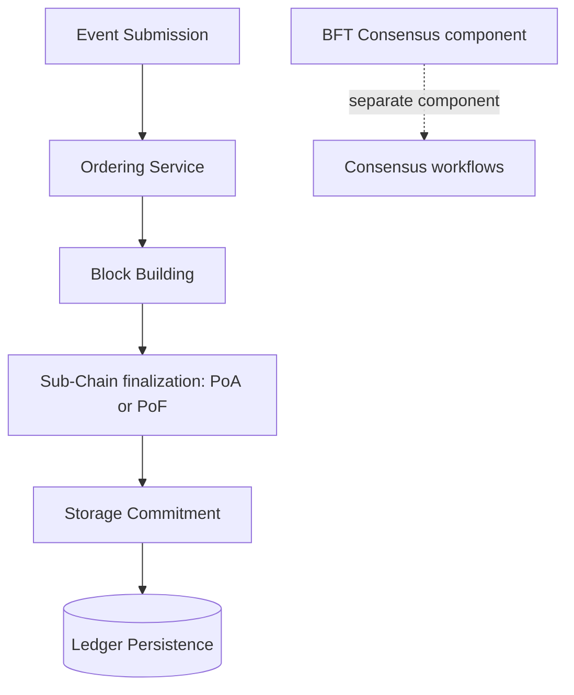

# Consensus Module (`hierachain/consensus/*`)

## Tổng quan

Module **Consensus** cung cấp các thành phần sắp xếp event và finalize block cho HieraChain.

---

## Các giao thức đồng thuận hỗ trợ

Ordering Service gom event thành batch; PoA và PoF finalize block của Sub-Chain. Repository cũng có thành phần BFT riêng. `HRC_CONSENSUS_TYPE` chọn `proof_of_authority` hoặc `proof_of_federation`, không chọn BFT:

*   :material-order-bool-ascending:{ .lg .middle } __Ordering Service (CFT)__

    ---

    * Phù hợp cho mạng Consortium hoặc Single-org.
    * Chịu lỗi sập nút (**Crash Fault Tolerance**).
    * Hiệu năng cực cao với cơ chế batching.
    * [:octicons-arrow-right-24: Chi tiết](../consensus/ordering.md)

*   :material-shield-key:{ .lg .middle } __BFT Consensus (PBFT)__

    ---

    * Phù hợp cho môi trường không tin cậy hoàn toàn.
    * Chịu lỗi Byzantine (**Byzantine Fault Tolerance**) với điều kiện `n >= 3f + 1`.
    * Đảm bảo tính toàn vẹn ngay cả khi có node bị tấn công.
    * [:octicons-arrow-right-24: Chi tiết](../consensus/bft_consensus.md)

*   :material-account-tie:{ .lg .middle } __Proof of Authority / Federation__

    ---

    * **PoA**: Các nút có thẩm quyền (Authorized Nodes) ký xác nhận khối.
    * **PoF**: Cơ chế xoay vòng lãnh đạo trong liên minh.
    * Phù hợp cho các chuỗi con (Sub-Chains) yêu cầu xử lý nhanh.

---

## Kiến trúc Tổng thể

```mermaid
graph TD
    A[Event Submission] --> B[Ordering Service]
    B --> C[Block Building]
    C --> D[Sub-Chain finalization: PoA or PoF]
    D --> E[Storage Commitment]
    E --> F[(Ledger Persistence)]
    G[BFT Consensus component] -. separate component .-> H[Consensus workflows]
```

---

## Tích hợp vào Hierarchy

Trong mô hình phân cấp của HieraChain:

1.  **Main Chain**: Mặc định dùng **PoA**, có thể cấu hình **PoF** qua `HRC_MAINCHAIN_CONSENSUS`. BFT là thành phần riêng; `MainChain` không chọn BFT làm mặc định.
2.  **Sub-Chains**: Dùng **Ordering Service** để gom batch và có thể finalize block bằng consensus đã cấu hình (mặc định PoA). Sau đó có thể gửi proof lên Main Chain.

---

## Liên quan

*   [Mô hình phân cấp (Hierarchical)](./hierarchical.md)
*   [Hệ thống mạng (Network)](./network.md)
*   [Xử lý lỗi (Error Mitigation)](./error-mitigation.md)
